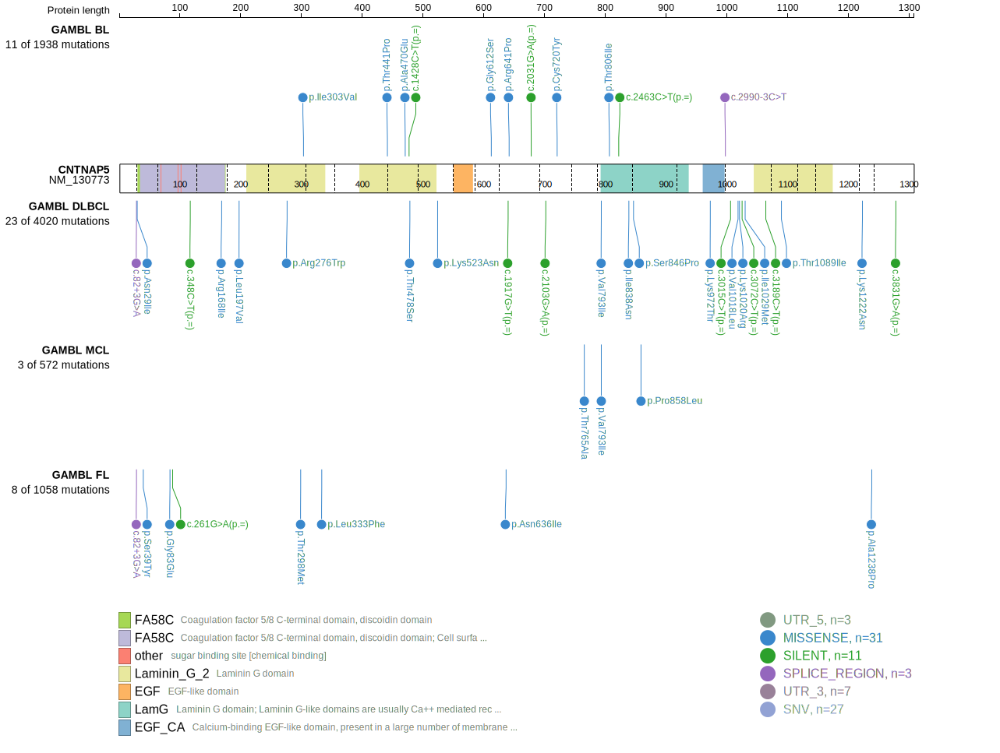

# [CNTNAP5]

## Mutation tier

|Entity|Tier|Description                              |
|:------:|:----:|-----------------------------------------|
|DLBCL |2   |relevance in DLBCL not firmly established|
## Mutation incidence

|Entity|source        |frequency (%)|
|:------:|:--------------:|:-------------:|
|DLBCL |GAMBL genomes |5.16         |
|DLBCL |Schmitz cohort|8.72         |
|DLBCL |Reddy cohort  |4.00         |
|DLBCL |Chapuy cohort |4.27         |

## Mutation pattern

|Entity|aSHM|Significant selection|dN/dS (missense)|dN/dS (nonsense)|
|:------:|:----:|:---------------------:|:----------------:|:----------------:|
|BL    |No  |No                   |1.357           |0.000           |
|DLBCL |No  |No                   |1.375           |2.662           |
|FL    |No  |No                   |2.893           |0.000           |

> [!NOTE]
> First described in DLBCL in 2013 by [Morin RD](https://pubmed.ncbi.nlm.nih.gov/23699601)

View coding variants in ProteinPaint [hg19](https://www.bcgsc.ca/downloads/morinlab/GAMBL/test/genes/CNTNAP5_protein.html)  or [hg38](https://www.bcgsc.ca/downloads/morinlab/GAMBL/test/genes/CNTNAP5_protein_hg38.html)

View all variants in GenomePaint [hg19](https://www.bcgsc.ca/downloads/morinlab/GAMBL/test/genes/CNTNAP5.html)  or [hg38](https://www.bcgsc.ca/downloads/morinlab/GAMBL/test/genes/CNTNAP5_hg38.html)

