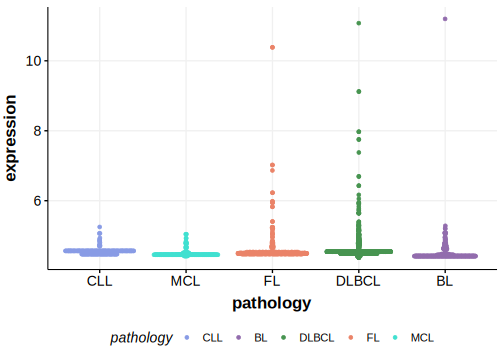

[[_TOC_]]

## Overview

Mutations in this gene were first described in DLBCL in 2013 by Morin et al.[@morinMutationalStructuralAnalysis2013]

## Relevance tier by entity

|Entity|Tier|Description                              |
|:------:|:----:|-----------------------------------------|
| |2   |relevance in DLBCL not firmly established[@morinMutationalStructuralAnalysis2013]|

## Mutation incidence in large patient cohorts (GAMBL reanalysis)

|Entity|source        |frequency (%)|
|:------:|:--------------:|:-------------:|
|DLBCL |GAMBL genomes |5.16         |
|DLBCL |Schmitz cohort|8.72         |
|DLBCL |Reddy cohort  |4.00         |
|DLBCL |Chapuy cohort |4.27         |

## Mutation pattern and selective pressure estimates

[[include:dnds_CNTNAP5.md]]

[[include:browser_CNTNAP5.md]]

## Expression

## All Mutations[@morinMutationalStructuralAnalysis2013]

[RG014](https://www.bcgsc.ca/downloads/morinlab/GAMBL/Morin_2013/RG014.html)
[RG054](https://www.bcgsc.ca/downloads/morinlab/GAMBL/Morin_2013/RG054.html)
[RG115](https://www.bcgsc.ca/downloads/morinlab/GAMBL/Morin_2013/RG115.html)
[RG136](https://www.bcgsc.ca/downloads/morinlab/GAMBL/Morin_2013/RG136.html)

[[include:mermaid_CNTNAP5.md]]

## References

<!-- ORIGIN: morinMutationalStructuralAnalysis2013 -->
<!-- DLBCL: morinMutationalStructuralAnalysis2013 -->
