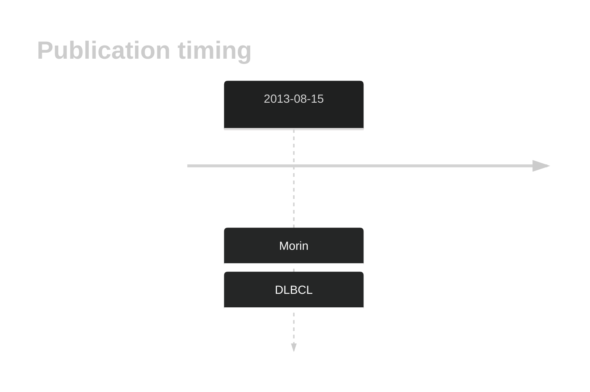

# CNTNAP5

## History
Mutations in this gene were first described in DLBCL in 2013 by Morin et al.1

## Relevance tier by entity

|Entity|Tier|Description                              |
|:------:|:----:|-----------------------------------------|
| |2   |relevance in DLBCL not firmly established[@morinMutationalStructuralAnalysis2013]|

## Mutation incidence in large patient cohorts (GAMBL reanalysis)

|Entity|source        |frequency (%)|
|:------:|:--------------:|:-------------:|
|DLBCL |GAMBL genomes |5.16         |
|DLBCL |Schmitz cohort|8.72         |
|DLBCL |Reddy cohort  |4.00         |
|DLBCL |Chapuy cohort |4.27         |

## Mutation pattern and selective pressure estimates

|Entity|aSHM|Significant selection|dN/dS (missense)|dN/dS (nonsense)|
|:------:|:----:|:---------------------:|:----------------:|:----------------:|
|BL    |No  |No                   |1.357           |0.000           |
|DLBCL |No  |No                   |1.375           |2.662           |
|FL    |No  |No                   |2.893           |0.000           |

View coding variants in ProteinPaint [hg19](https://morinlab.github.io/LLMPP/GAMBL/CNTNAP5_protein.html)  or [hg38](https://morinlab.github.io/LLMPP/GAMBL/CNTNAP5_protein_hg38.html)

View all variants in GenomePaint [hg19](https://morinlab.github.io/LLMPP/GAMBL/CNTNAP5.html)  or [hg38](https://morinlab.github.io/LLMPP/GAMBL/CNTNAP5_hg38.html)

## CNTNAP5 Expression

## References

<!-- ORIGIN: morinMutationalStructuralAnalysis2013 -->
<!-- DLBCL: morinMutationalStructuralAnalysis2013 -->
