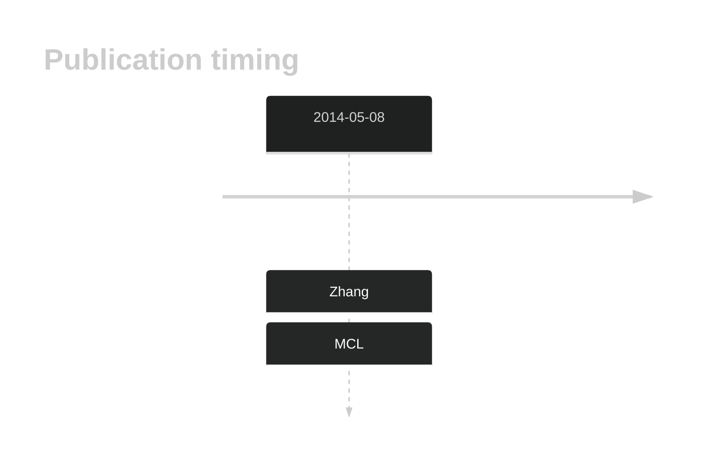

# COL11A1
## History

## Relevance tier by entity

|Entity|Tier|Description                            |
|:------:|:----:|---------------------------------------|
|   |2   |relevance in MCL not firmly established|

## Mutation incidence in large patient cohorts (GAMBL reanalysis)

|Entity|source       |frequency (%)|
|:------:|:-------------:|:-------------:|
|MCL   |GAMBL genomes|0.47         |

## Mutation pattern and selective pressure estimates

|Entity|aSHM|Significant selection|dN/dS (missense)|dN/dS (nonsense)|
|:------:|:----:|:---------------------:|:----------------:|:----------------:|
|BL    |No  |No                   |1.881           |2.674           |
|DLBCL |No  |No                   |4.904           |2.190           |
|FL    |No  |No                   |0.628           |0.000           |

> [!NOTE]
> First described in MCL in 2014 by [Zhang J](https://pubmed.ncbi.nlm.nih.gov/24682267)

View coding variants in ProteinPaint [hg19](https://morinlab.github.io/LLMPP/GAMBL/COL11A1_protein.html)  or [hg38](https://morinlab.github.io/LLMPP/GAMBL/COL11A1_protein_hg38.html)

View all variants in GenomePaint [hg19](https://morinlab.github.io/LLMPP/GAMBL/COL11A1.html)  or [hg38](https://morinlab.github.io/LLMPP/GAMBL/COL11A1_hg38.html)

## COL11A1 Expression

<!-- ORIGIN: zhangGenomicLandscapeMantle2014 -->
<!-- MCL: zhangGenomicLandscapeMantle2014 -->
## References
1.  Zhang J, Jima D, Moffitt AB, Liu Q, Czader M, Hsi ED, Fedoriw Y, Dunphy CH, Richards KL, Gill JI, Sun Z, Love C, Scotland P, Lock E, Levy S, Hsu DS, Dunson D, Dave SS. The genomic landscape of mantle cell lymphoma is related to the epigenetically determined chromatin state of normal B cells. Blood. 2014 May 8;123(19):2988–2996. 
