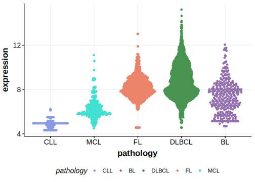

[[_TOC_]]

## Relevance tier by entity

|Entity|Tier|Description                            |
|:------:|:----:|---------------------------------------|
|   |2   |relevance in MCL not firmly established[@zhangGenomicLandscapeMantle2014]|

## Mutation incidence in large patient cohorts (GAMBL reanalysis)

|Entity|source       |frequency (%)|
|:------:|:-------------:|:-------------:|
|MCL   |GAMBL genomes|0.95         |

## Mutation pattern and selective pressure estimates

|Entity|aSHM|Significant selection|dN/dS (missense)|dN/dS (nonsense)|
|:------:|:----:|:---------------------:|:----------------:|:----------------:|
|BL    |No  |No                   |1.703           |0.000           |
|DLBCL |No  |No                   |1.319           |2.178           |
|FL    |No  |No                   |0.000           |0.000           |

[[include:browser_COL16A1.md]]

## Expression

<!-- ORIGIN: zhangGenomicLandscapeMantle2014 -->
<!-- MCL: zhangGenomicLandscapeMantle2014 -->

[[include:mermaid_COL16A1.md]]

## References
