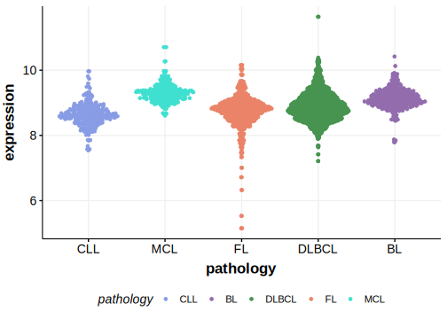

[[_TOC_]]

## Relevance tier by entity

[[include:table1_COQ7.md]]

## Mutation incidence in large patient cohorts (GAMBL reanalysis)

|Entity|source        |frequency (%)|
|:------:|:--------------:|:-------------:|
|DLBCL |GAMBL genomes |0.38         |
|DLBCL |Schmitz cohort|0.64         |
|DLBCL |Reddy cohort  |0.50         |
|DLBCL |Chapuy cohort |0.43         |

## Mutation pattern and selective pressure estimates

[[include:tables/dnds_COQ7.md]]

[[include:browser_COQ7.md]]

## Expression

<!-- ORIGIN: chapuyMolecularSubtypesDiffuse2018b -->
<!-- DLBCL: chapuyMolecularSubtypesDiffuse2018b -->

## All Mutations

[DLBCL-RICOVER_1032-Tumor](https://bcgsc.ca/downloads/morinlab/GAMBL/Chapuy_2018/DLBCL-RICOVER_1032-Tumor.html)
[DLBCL-RICOVER_181-Tumor](https://bcgsc.ca/downloads/morinlab/GAMBL/Chapuy_2018/DLBCL-RICOVER_181-Tumor.html)

[[include:tables/mermaid_COQ7.md]]

## References
