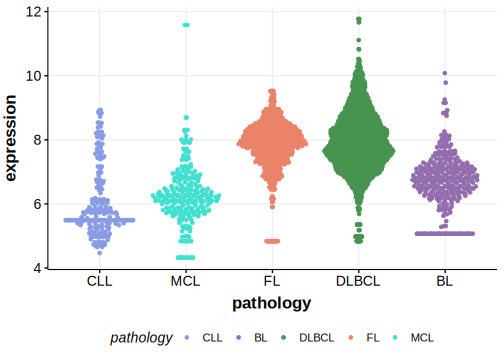

[[_TOC_]]

## Overview

Mutations in this gene were first described in FL in 2021 by Hübschmann et al.[@hubschmannMutationalMechanismsShaping2021]

## Relevance tier by entity

[[include:table1_CPNE8.md]]

## Mutation incidence in large patient cohorts (GAMBL reanalysis)

|Entity|source       |frequency (%)|
|:------:|:-------------:|:-------------:|
|FL    |GAMBL genomes|2.08         |

## Mutation pattern and selective pressure estimates

[[include:tables/dnds_CPNE8.md]]

[[include:browser_CPNE8.md]]

## Expression

## All Mutations

[SP192870](https://www.bcgsc.ca/downloads/morinlab/GAMBL/MALY/SP192870.html)
[SP116694](https://www.bcgsc.ca/downloads/morinlab/GAMBL/MALY/SP116694.html)
[SP193954](https://www.bcgsc.ca/downloads/morinlab/GAMBL/MALY/SP193954.html)
[SP193150](https://www.bcgsc.ca/downloads/morinlab/GAMBL/MALY/SP193150.html)
[SP116720](https://www.bcgsc.ca/downloads/morinlab/GAMBL/MALY/SP116720.html)

[[include:tables/mermaid_CPNE8.md]]

## References

<!-- ORIGIN: hubschmannMutationalMechanismsShaping2021b -->
<!-- FL: hubschmannMutationalMechanismsShaping2021b -->
