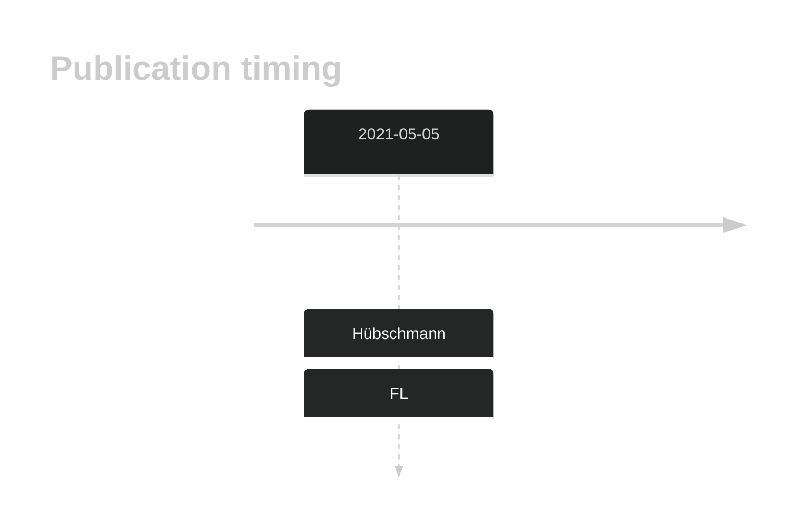
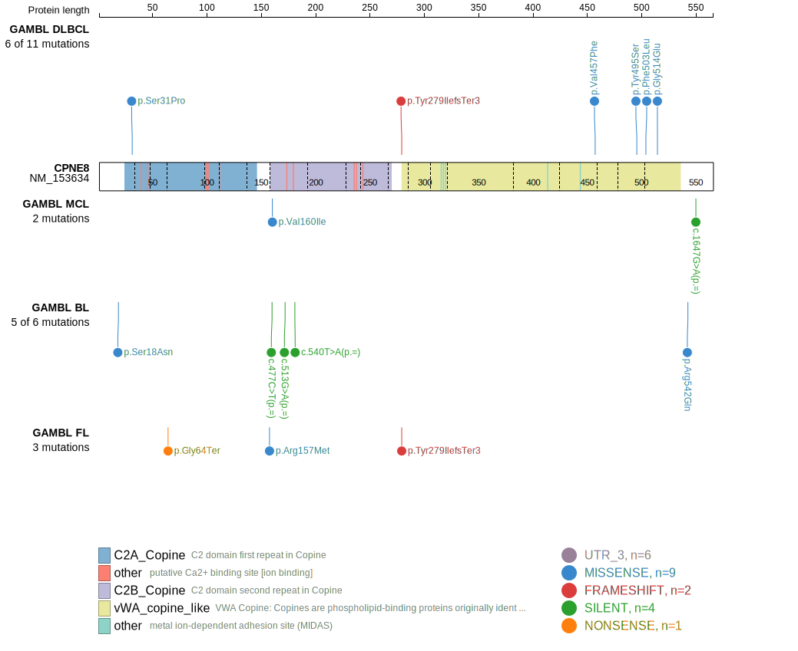
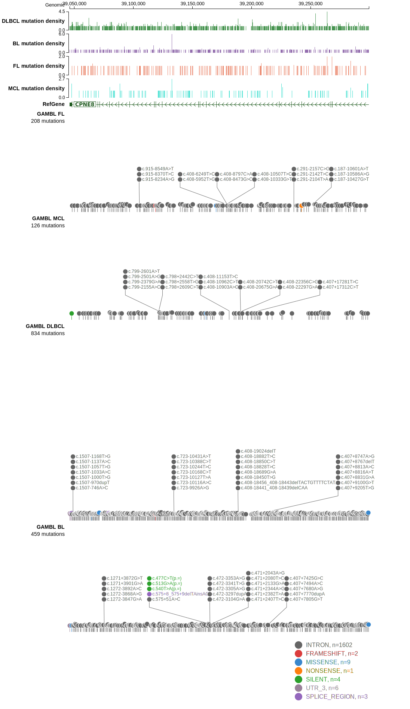

# CPNE8

## History
Mutations in this gene were first described in FL in 2021 by Hübschmann et al.1

## Relevance tier by entity

|Entity|Tier|Description                           |
|:------:|:----:|--------------------------------------|
|    |2   |relevance in FL not firmly established[@hubschmannMutationalMechanismsShaping2021b]|

## Mutation incidence in large patient cohorts (GAMBL reanalysis)

|Entity|source       |frequency (%)|
|:------:|:-------------:|:-------------:|
|FL    |GAMBL genomes|2.08         |

## Mutation pattern and selective pressure estimates

|Entity|aSHM|Significant selection|dN/dS (missense)|dN/dS (nonsense)|
|:------:|:----:|:---------------------:|:----------------:|:----------------:|
|BL    |No  |No                   |0.932           | 0.000          |
|DLBCL |No  |No                   |2.398           | 0.000          |
|FL    |No  |No                   |1.808           |12.601          |

View coding variants in ProteinPaint [hg19](https://morinlab.github.io/LLMPP/GAMBL/CPNE8_protein.html)  or [hg38](https://morinlab.github.io/LLMPP/GAMBL/CPNE8_protein_hg38.html)

View all variants in GenomePaint [hg19](https://morinlab.github.io/LLMPP/GAMBL/CPNE8.html)  or [hg38](https://morinlab.github.io/LLMPP/GAMBL/CPNE8_hg38.html)

## CPNE8 Expression

## All Mutations

[SP192870](https://www.bcgsc.ca/downloads/morinlab/GAMBL/MALY/SP192870.html)
[SP116694](https://www.bcgsc.ca/downloads/morinlab/GAMBL/MALY/SP116694.html)
[SP193954](https://www.bcgsc.ca/downloads/morinlab/GAMBL/MALY/SP193954.html)
[SP193150](https://www.bcgsc.ca/downloads/morinlab/GAMBL/MALY/SP193150.html)
[SP116720](https://www.bcgsc.ca/downloads/morinlab/GAMBL/MALY/SP116720.html)

## References

<!-- ORIGIN: hubschmannMutationalMechanismsShaping2021b -->
<!-- FL: hubschmannMutationalMechanismsShaping2021b -->
