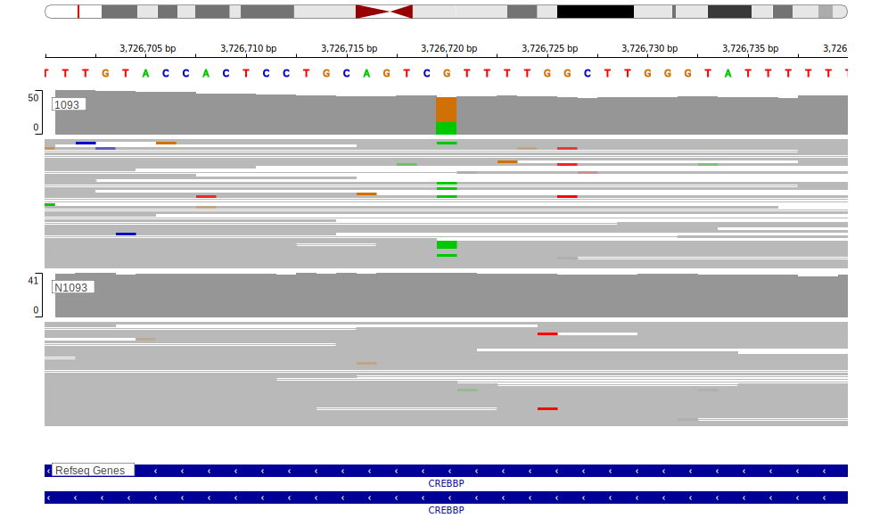

# CREBBP

[[_TOC_]]

## Overview
CREBBP mutations are highly prevalent in both DLBCL and FL.[@pasqualucciInactivatingMutationsAcetyltransferase2011] 
This gene has some recurrent sites of mutations (hotspots), mostly in the HAT domain. The pattern of mutations in DLBCL is distinct from FL with the latter having more HAT domain mutations relative to truncating mutations.[@drevalGeneticSubdivisionsFollicular2023]  

## Experimental Evidence
CREBBP missense mutations often affect the histone acetyltransferase (HAT) domain, crucial for regulating gene expression through chromatin modification, or generate a truncated protein.[@pasqualucciInactivatingMutationsAcetyltransferase2011] 
In a transgenic mouse model, CREBBP loss cooperated with BCL2 overexpression to promote B-cell lymphomagenesis.[@garcia-ramirezCrebbpLossCooperates2017]
Mutations in CREBBP and EP300 affect a common pathway and have been described as mutually exclusive due to some functional redundancy.[@pasqualucciInactivatingMutationsAcetyltransferase2011; @veazeyCARM1InhibitionReduces2020] Studies using genome-wide CRISPR-Cas9 screens have identified synthetic lethal interactions between CREBBP and EP300, suggesting that targeting one may affect the viability of cells with mutations in the other.[@nieGenomewideCRISPRScreens2021]

## Relevance tier by entity

|Entity|Tier|Description                           |
|:------:|:----:|--------------------------------------|
||2|relevance in MZL not firmly established[@parryWholeExomeSequencing2013] |
||1|high-confidence PMBL/cHL/GZL gene[@dunsCharacterizationDLBCLPMBL2021] |
| |1   |high-confidence DLBCL gene supported by functional data[@pasqualucciInactivatingMutationsAcetyltransferase2011]            |
|    |1   |high-confidence FL gene supported by functional data[@pasqualucciInactivatingMutationsAcetyltransferase2011]               |
|    |2   |association with BL is tenuous[@loveGeneticLandscapeMutations2012]|

## Mutation incidence in large patient cohorts (GAMBL reanalysis)

[[include:DLBCL_CREBBP.md]]
[[include:FL_CREBBP.md]]
[[include:BL_CREBBP.md]]

## Mutation pattern and selective pressure estimates

[[include:dnds_CREBBP.md]]

## CREBBP Hotspots

| Chromosome |Coordinate (hg19) | ref>alt | HGVSp | 
 | :---:| :---: | :--: | :---: |
| chr16 | 3788618 | G>A | R1446C |
| chr16 | 3788617 | C>T | R1446H |
| chr16 | 3788617 | C>A | R1446L |
| chr16 | 3788606 | A>T | Y1450N |
| chr16 | 3788606 | A>C | Y1450D |
| chr16 | 3788605 | T>G | Y1450S |
| chr16 | 3788605 | T>C | Y1450C |
| chr16 | 3788596 | A>G | I1453T |
| chr16 | 3788594 | G>T | L1454I |
| chr16 | 3788593 | A>C | L1454R |
| chr16 | 3786715 | A>T | L1499Q |
| chr16 | 3786715 | A>G | L1499P |
| chr16 | 3786715 | A>C | L1499R |
| chr16 | 3786710 | C>A | E1501* |
| chr16 | 3786707 | A>T | W1502R |
| chr16 | 3786707 | A>G | W1502R |
| chr16 | 3786705 | C>T | W1502* |
| chr16 | 3786705 | C>G | W1502C |
| chr16 | 3786705 | C>A | W1502C |
| chr16 | 3786704 | A>T | Y1503N |
| chr16 | 3786704 | A>G | Y1503H |
| chr16 | 3786704 | A>C | Y1503D |
| chr16 | 3786703 | T>G | Y1503S |
| chr16 | 3786703 | T>A | Y1503F |
| chr16 | 3786691 | A>G | L1507P |

View coding variants in ProteinPaint [hg19](https://morinlab.github.io/LLMPP/GAMBL/CREBBP_protein.html)  or [hg38](https://morinlab.github.io/LLMPP/GAMBL/CREBBP_protein_hg38.html)

View all variants in GenomePaint [hg19](https://morinlab.github.io/LLMPP/GAMBL/CREBBP.html)  or [hg38](https://morinlab.github.io/LLMPP/GAMBL/CREBBP_hg38.html)

## CREBBP Expression

<!-- ORIGIN: pasqualucciInactivatingMutationsAcetyltransferase2011a -->
<!-- FL: pasqualucciInactivatingMutationsAcetyltransferase2011a -->
<!-- BL: loveGeneticLandscapeMutations2012 -->
<!-- BL: loveGeneticLandscapeMutations2012 -->
<!-- DLBCL: pasqualucciInactivatingMutationsAcetyltransferase2011a -->
<!-- MZL: parryWholeExomeSequencing2013 -->

## Representative Mutations

### BL[@loveGeneticLandscapeMutations2012]

**Rating**
&starf; &starf; &starf; &starf; &star;

## All Mutations

### BL

[1093](https://www.bcgsc.ca/downloads/morinlab/GAMBL/Love/1093_reports.html)
[322](https://www.bcgsc.ca/downloads/morinlab/GAMBL/Love/322_reports.html)
[324](https://www.bcgsc.ca/downloads/morinlab/GAMBL/Love/324_reports.html)
[515](https://www.bcgsc.ca/downloads/morinlab/GAMBL/Love/515_reports.html)
[677](https://www.bcgsc.ca/downloads/morinlab/GAMBL/Love/677_reports.html)
[745](https://www.bcgsc.ca/downloads/morinlab/GAMBL/Love/745_reports.html)
[851](https://www.bcgsc.ca/downloads/morinlab/GAMBL/Love/851_reports.html)

[[include:mermaid_CREBBP.md]]

# References

<!-- PMBL: dunsCharacterizationDLBCLPMBL2021b -->
