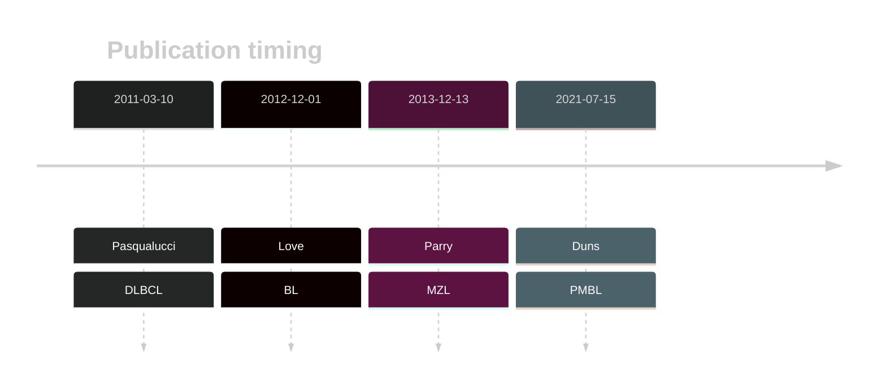
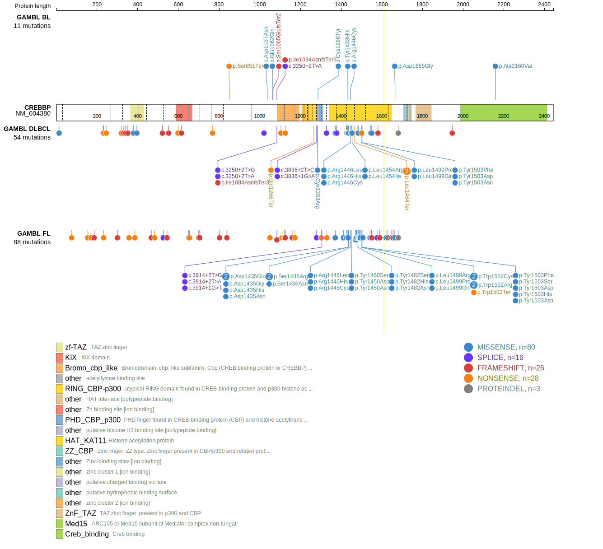
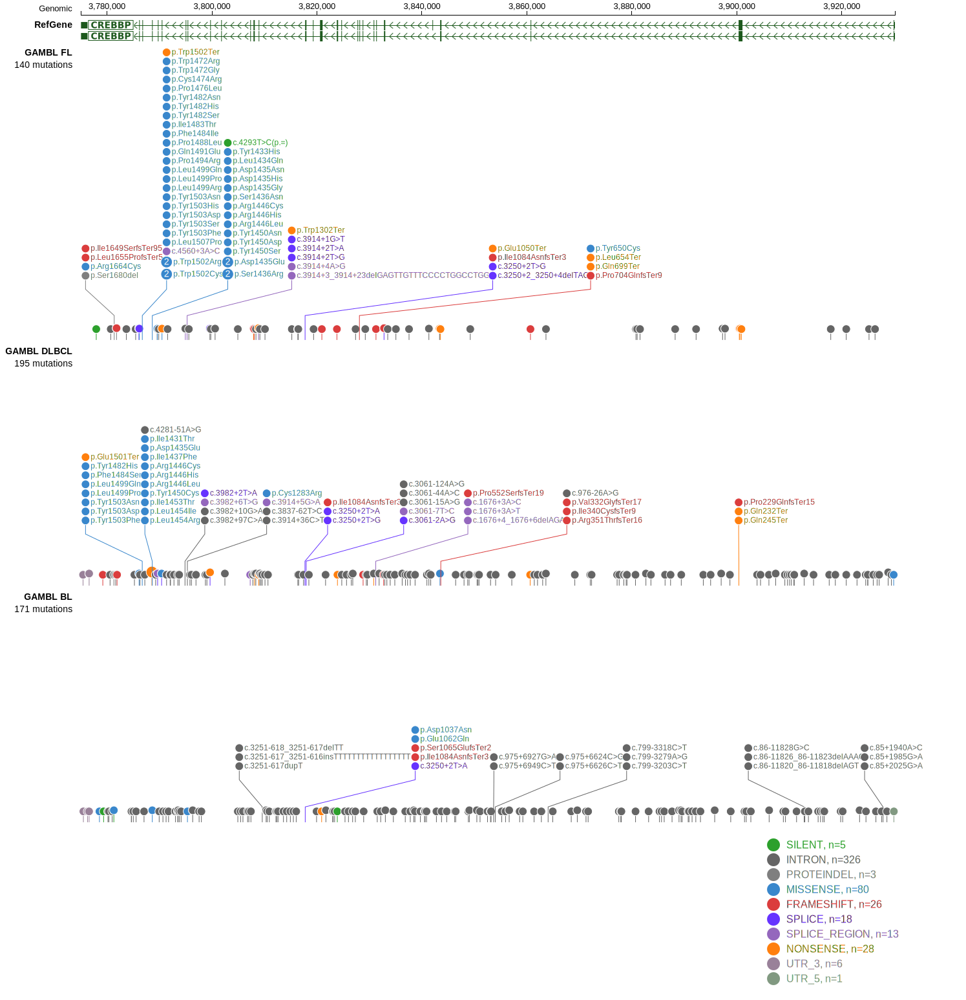
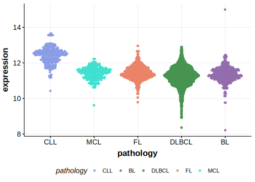

# CREBBP
## Overview
CREBBP mutations are highly prevalent in both DLBCL and FL. These mutations often affect the histone acetyltransferase (HAT) domain, crucial for regulating gene expression through chromatin modification, or generate a truncated protein.1 This gene has some recurrent sites of mutations (hotspots), mostly in the HAT domain. The pattern of mutations in DLBCL is distinct from FL with the latter having more HAT domain mutations relative to truncating mutations.2  

## History

## Relevance tier by entity

|Entity|Tier|Description                           |
|:------:|:----:|--------------------------------------|
||2|relevance in MZL not firmly established|
||1|high-confidence PMBL/cHL/GZL gene|
| |1   |high-confidence DLBCL gene            |
|    |1   |high-confidence FL gene               |
|    |2   |association with BL is tenuous|

## Mutation incidence in large patient cohorts (GAMBL reanalysis)

|Entity|source               |frequency (%)|
|:------:|:---------------------:|:-------------:|
|DLBCL |GAMBL genomes        |25.81        |
|DLBCL |Schmitz cohort       |17.87        |
|DLBCL |Reddy cohort         |12.11        |
|DLBCL |Chapuy cohort        |16.67        |
|FL    |GAMBL genomes        |65.13        |
|BL    |GAMBL genomes+capture| 6.00        |
|BL    |Thomas cohort        | 3.00        |
|BL    |Panea cohort         |12.90        |

## Mutation pattern and selective pressure estimates

|Entity|aSHM|Significant selection|dN/dS (missense)|dN/dS (nonsense)|
|:------:|:----:|:---------------------:|:----------------:|:----------------:|
|BL    |No  |No                   | 1.357          |  3.999         |
|DLBCL |No  |Yes                  |13.231          | 65.302         |
|FL    |No  |Yes                  |43.869          |112.938         |

 ## CREBBP Hotspots

| Chromosome |Coordinate (hg19) | ref>alt | HGVSp | 
 | :---:| :---: | :--: | :---: |
| chr16 | 3788618 | G>A | R1446C |
| chr16 | 3788617 | C>T | R1446H |
| chr16 | 3788617 | C>A | R1446L |
| chr16 | 3788606 | A>T | Y1450N |
| chr16 | 3788606 | A>C | Y1450D |
| chr16 | 3788605 | T>G | Y1450S |
| chr16 | 3788605 | T>C | Y1450C |
| chr16 | 3788596 | A>G | I1453T |
| chr16 | 3788594 | G>T | L1454I |
| chr16 | 3788593 | A>C | L1454R |
| chr16 | 3786715 | A>T | L1499Q |
| chr16 | 3786715 | A>G | L1499P |
| chr16 | 3786715 | A>C | L1499R |
| chr16 | 3786710 | C>A | E1501* |
| chr16 | 3786707 | A>T | W1502R |
| chr16 | 3786707 | A>G | W1502R |
| chr16 | 3786705 | C>T | W1502* |
| chr16 | 3786705 | C>G | W1502C |
| chr16 | 3786705 | C>A | W1502C |
| chr16 | 3786704 | A>T | Y1503N |
| chr16 | 3786704 | A>G | Y1503H |
| chr16 | 3786704 | A>C | Y1503D |
| chr16 | 3786703 | T>G | Y1503S |
| chr16 | 3786703 | T>A | Y1503F |
| chr16 | 3786691 | A>G | L1507P |

View coding variants in ProteinPaint [hg19](https://morinlab.github.io/LLMPP/GAMBL/CREBBP_protein.html)  or [hg38](https://morinlab.github.io/LLMPP/GAMBL/CREBBP_protein_hg38.html)

View all variants in GenomePaint [hg19](https://morinlab.github.io/LLMPP/GAMBL/CREBBP.html)  or [hg38](https://morinlab.github.io/LLMPP/GAMBL/CREBBP_hg38.html)

## CREBBP Expression

<!-- ORIGIN: pasqualucciInactivatingMutationsAcetyltransferase2011a -->
<!-- FL: pasqualucciInactivatingMutationsAcetyltransferase2011a -->
<!-- BL: loveGeneticLandscapeMutations2012 -->
<!-- BL: loveGeneticLandscapeMutations2012 -->
<!-- DLBCL: pasqualucciInactivatingMutationsAcetyltransferase2011a -->
<!-- MZL: parryWholeExomeSequencing2013 -->

## References
1. *Pasqualucci, L., Dominguez-Sola, D., Chiarenza, A., Fabbri, G., Grunn, A., Trifonov, V., Kasper, L., Lerach, S., Tang, H., Ma, J., Rossi, D., Chadburn, A., Murty, V., Mullighan, C., Gaidano, G., Rabadán, R., Brindle, P., & Dalla-Favera, R. (2010). Inactivating mutations of acetyltransferase genes in B-cell lymphoma. Nature, 471, 189 - 195. https://doi.org/10.1038/nature09730.*
2. *Dreval K, Hilton LK, Cruz M, Shaalan H, Ben-Neriah S, Boyle M, Collinge B, Coyle KM, Duns G, Farinha P, Grande BM, Meissner B, Pararajalingam P, Rushton CK, Slack GW, Wong J, Mungall AJ, Marra MA, Connors JM, Steidl C, Scott DW, Morin RD. Genetic subdivisions of follicular lymphoma defined by distinct coding and noncoding mutation patterns. Blood. 2023 Aug 10;142(6):561-573. doi: 10.1182/blood.2022018719. PMID: 37084389; PMCID: PMC10644066.*

<!-- PMBL: dunsCharacterizationDLBCLPMBL2021b -->
