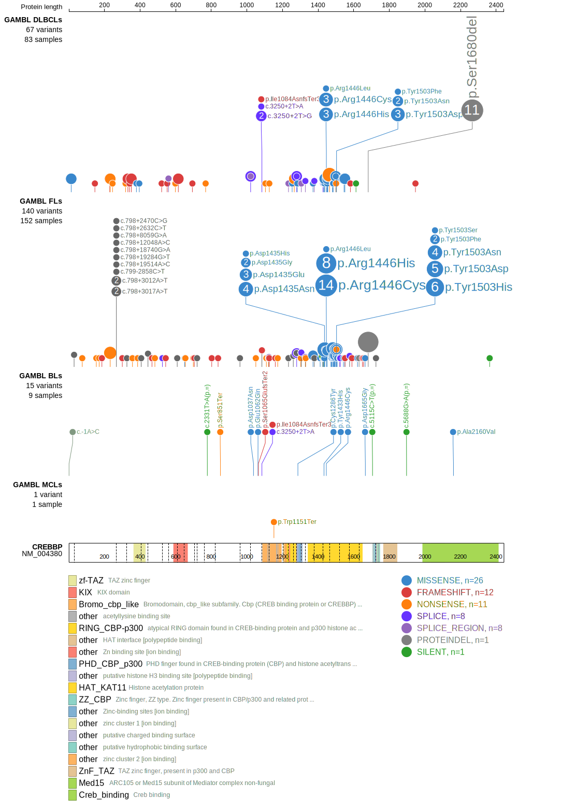

# [CREBBP]

## Mutation tier

|Entity|Tier|Description                           |
|:------:|:----:|--------------------------------------|
|BL    |2   |relevance in BL not firmly established|
|DLBCL |1   |high-confidence DLBCL gene            |
|FL    |1   |high-confidence FL gene               |
## Mutation incidence

|Entity|source               |frequency (%)|
|:------:|:---------------------:|:-------------:|
|BL    |GAMBL genomes+capture| 6.00        |
|BL    |Thomas cohort        | 3.00        |
|BL    |Panea cohort         |12.90        |
|DLBCL |GAMBL genomes        |25.81        |
|DLBCL |Schmitz cohort       |17.90        |
|DLBCL |Reddy cohort         |12.10        |
|DLBCL |Chapuy cohort        |16.70        |
|FL    |GAMBL genomes        |65.13        |

## Mutation pattern

|Entity|aSHM|Significant selection|dN/dS (missense)|dN/dS (nonsense)|
|:------:|:----:|:---------------------:|:----------------:|:----------------:|
|BL    |No  |No                   | 1.357          |  3.999         |
|DLBCL |No  |Yes                  |13.231          | 65.302         |
|FL    |No  |Yes                  |43.869          |112.938         |

> [!NOTE]
> First described in BL in 2012 by [Love C](https://pubmed.ncbi.nlm.nih.gov/23143597). First described in FL in 2011 by [Morin RD](https://pubmed.ncbi.nlm.nih.gov/21796119)

View coding variants in ProteinPaint [hg19](https://www.bcgsc.ca/downloads/morinlab/GAMBL/test/genes/CREBBP_protein.html)  or [hg38](https://www.bcgsc.ca/downloads/morinlab/GAMBL/test/genes/CREBBP_protein_hg38.html)

View all variants in GenomePaint [hg19](https://www.bcgsc.ca/downloads/morinlab/GAMBL/test/genes/CREBBP.html)

