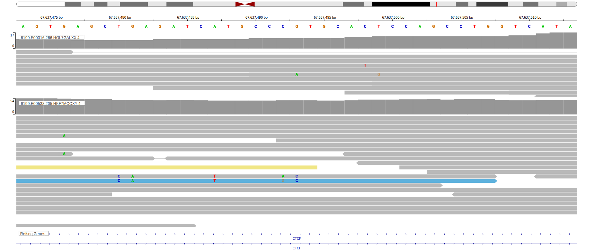

[[_TOC_]]

## Relevance tier by entity

[[include:tables/table1_CTCF.md]]

## Warnings

<<Warn("The variants reported in this gene in BL failed QC")>>

## Mutation incidence in large patient cohorts (GAMBL reanalysis)

|Entity|source               |frequency (%)|
|:------:|:---------------------:|:-------------:|
|BL    |GAMBL genomes+capture|3.0          |
|BL    |Thomas cohort        |1.7          |
|BL    |Panea cohort         |6.9          |

## Mutation pattern and selective pressure estimates

[[include:tables/dnds_CTCF.md]]

[[include:browser_CTCF.md]]

## Expression

<!-- ORIGIN: paneaWholeGenomeLandscape2019 -->
<!-- BL: paneaWholeGenomeLandscape2019 -->

## Representative Mutations

**Rating**
&starf; &star; &star; &star; &star;

**Rating**
&starf; &star; &star; &star; &star;

[[include:tables/mermaid_CTCF.md]]

## References
