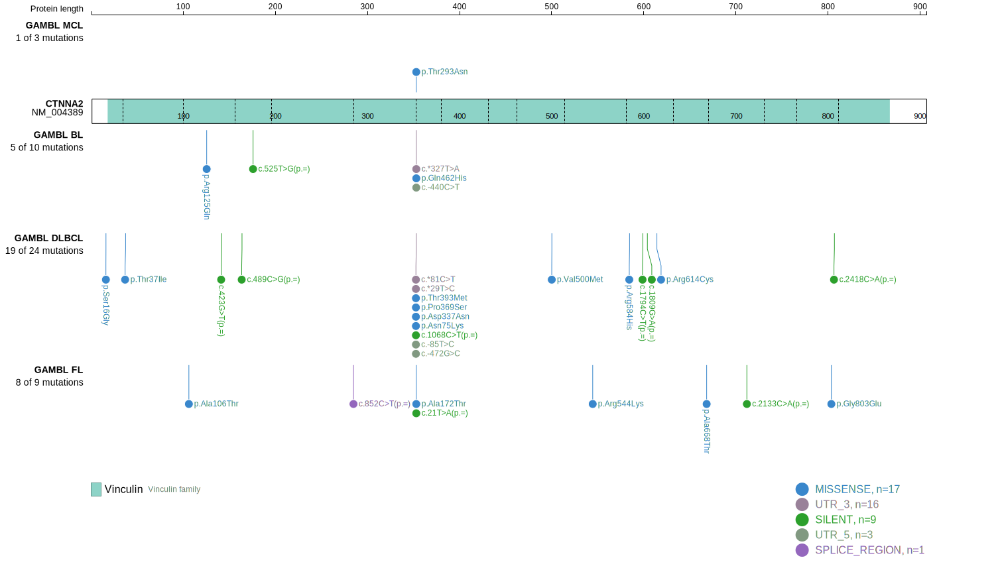
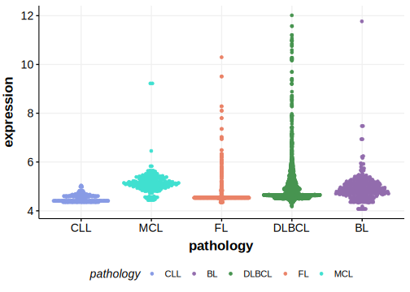

# CTNNA2

## Relevance tier by entity

|Entity|Tier|Description                            |
|:------:|:----:|---------------------------------------|
|MCL   |2   |relevance in MCL not firmly established|

## Mutation incidence in large patient cohorts (GAMBL reanalysis)

|Entity|source       |frequency (%)|
|:------:|:-------------:|:-------------:|
|MCL   |GAMBL genomes|0            |

## Mutation pattern and selective pressure estimates

|Entity|aSHM|Significant selection|dN/dS (missense)|dN/dS (nonsense)|
|:------:|:----:|:---------------------:|:----------------:|:----------------:|
|BL    |No  |No                   |0.458           |0.000           |
|DLBCL |No  |No                   |1.173           |2.351           |
|FL    |No  |No                   |2.047           |0.000           |

> [!NOTE]
> First described in MCL in 2014 by [Zhang J](https://pubmed.ncbi.nlm.nih.gov/24682267)

View coding variants in ProteinPaint [hg19](https://morinlab.github.io/LLMPP/GAMBL/CTNNA2_protein.html)  or [hg38](https://morinlab.github.io/LLMPP/GAMBL/CTNNA2_protein_hg38.html)

View all variants in GenomePaint [hg19](https://morinlab.github.io/LLMPP/GAMBL/CTNNA2.html)  or [hg38](https://morinlab.github.io/LLMPP/GAMBL/CTNNA2_hg38.html)

## CTNNA2 Expression

