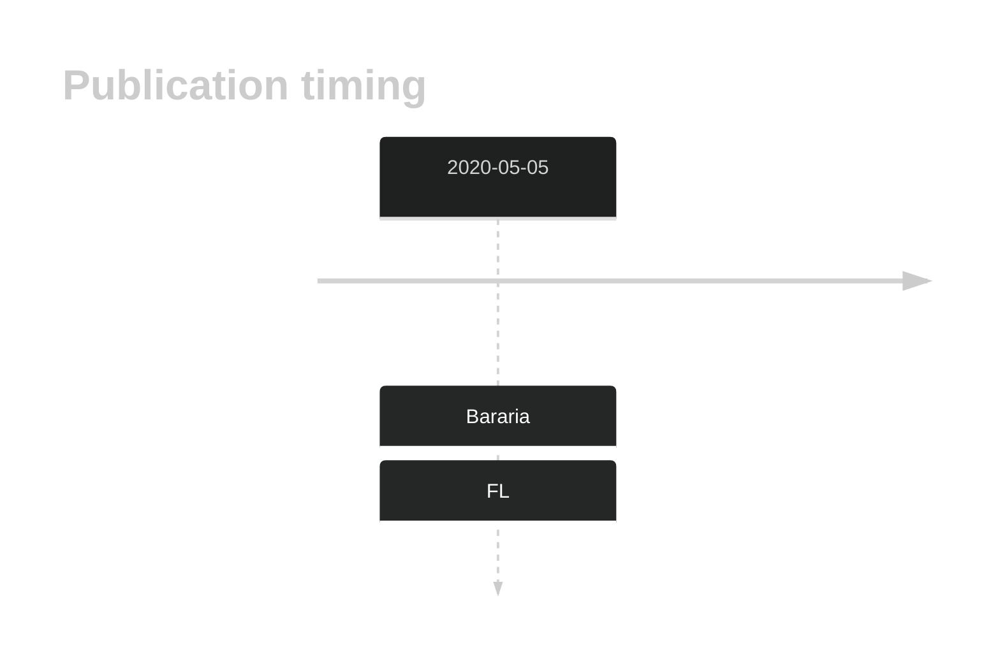

# CTSS

## History

## Relevance tier by entity

|Entity|Tier|Description            |
|:------:|:----:|-----------------------|
|    |1   |high-confidence FL gene|

## Mutation incidence in large patient cohorts (GAMBL reanalysis)

|Entity|source       |frequency (%)|
|:------:|:-------------:|:-------------:|
|FL    |GAMBL genomes|3.93         |

## Mutation pattern and selective pressure estimates

|Entity|aSHM|Significant selection|dN/dS (missense)|dN/dS (nonsense)|
|:------:|:----:|:---------------------:|:----------------:|:----------------:|
|BL    |No  |No                   | 0.000          | 0.000          |
|DLBCL |No  |No                   | 2.851          | 0.000          |
|FL    |No  |Yes                  |71.282          |54.511          |

## CTSS Hotspots

| Chromosome |Coordinate (hg19) | ref>alt | HGVSp | 
 | :---:| :---: | :--: | :---: |
| chr1 | 150727482 | A>C | Y132D |
| chr1 | 150727482 | A>T | Y132N |

View coding variants in ProteinPaint [hg19](https://morinlab.github.io/LLMPP/GAMBL/CTSS_protein.html)  or [hg38](https://morinlab.github.io/LLMPP/GAMBL/CTSS_protein_hg38.html)

View all variants in GenomePaint [hg19](https://morinlab.github.io/LLMPP/GAMBL/CTSS.html)  or [hg38](https://morinlab.github.io/LLMPP/GAMBL/CTSS_hg38.html)

## CTSS Expression

<!-- ORIGIN: barariaCathepsinAlterationsInduce2020c -->
<!-- FL: barariaCathepsinAlterationsInduce2020c -->

## References
1.  Bararia D, Hildebrand JA, Stolz S, Haebe S, Alig S, Trevisani CP, Osorio-Barrios F, Bartoschek MD, Mentz M, Pastore A, Gaitzsch E, Heide M, Jurinovic V, Rautter K, Gunawardana J, Sabdia MB, Szczepanowski M, Richter J, Klapper W, Louissaint A, Ludwig C, Bultmann S, Leonhardt H, Eustermann S, Hopfner KP, Hiddemann W, von Bergwelt-Baildon M, Steidl C, Kridel R, Tobin JWD, Gandhi MK, Weinstock DM, Schmidt-Supprian M, Sárosi MB, Rudelius M, Passerini V, Mautner J, Weigert O. Cathepsin S Alterations Induce a Tumor-Promoting Immune Microenvironment in Follicular Lymphoma. Cell Rep. 2020 May 5;31(5):107522. PMID: 32330423
