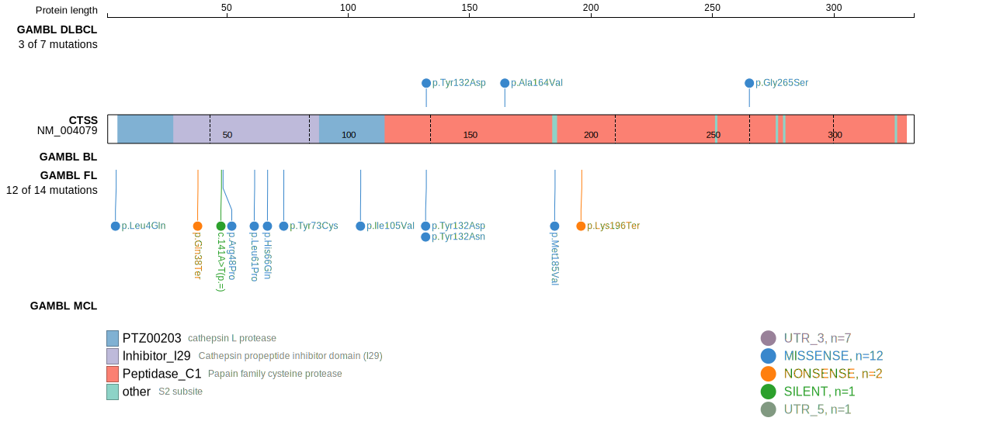
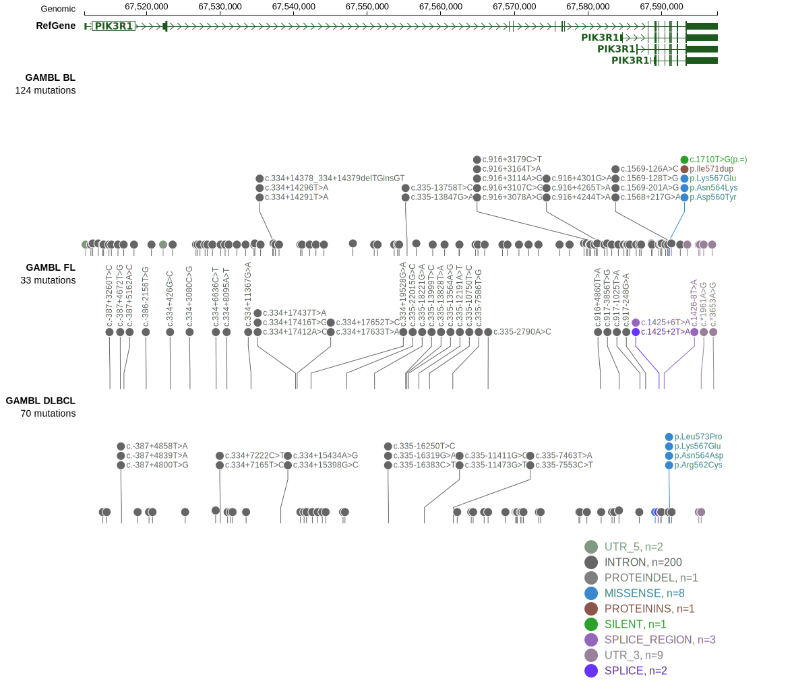
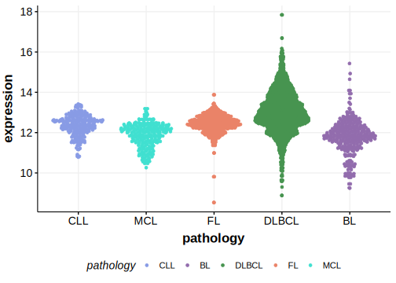

[[_TOC_]]

## Relevance tier by entity

|Entity|Tier|Description            |
|:------:|:----:|-----------------------|
|    |1   |high-confidence FL gene[@barariaCathepsinAlterationsInduce2020]|

## Mutation incidence in large patient cohorts (GAMBL reanalysis)

[[include:DLBCL_CTSS.md]]
[[include:FL_CTSS.md]]

## Mutation pattern and selective pressure estimates

[[include:dnds_CTSS.md]]

## CTSS Hotspots

| Chromosome |Coordinate (hg19) | ref>alt | HGVSp | 
 | :---:| :---: | :--: | :---: |
| chr1 | 150727482 | A>C | Y132D |
| chr1 | 150727482 | A>T | Y132N |

View coding variants in ProteinPaint [hg19](https://morinlab.github.io/LLMPP/GAMBL/CTSS_protein.html)  or [hg38](https://morinlab.github.io/LLMPP/GAMBL/CTSS_protein_hg38.html)

View all variants in GenomePaint [hg19](https://morinlab.github.io/LLMPP/GAMBL/CTSS.html)  or [hg38](https://morinlab.github.io/LLMPP/GAMBL/CTSS_hg38.html)

## CTSS Expression

<!-- ORIGIN: barariaCathepsinAlterationsInduce2020c -->
<!-- FL: barariaCathepsinAlterationsInduce2020c -->

[[include:mermaid_CTSS.md]]

## References
