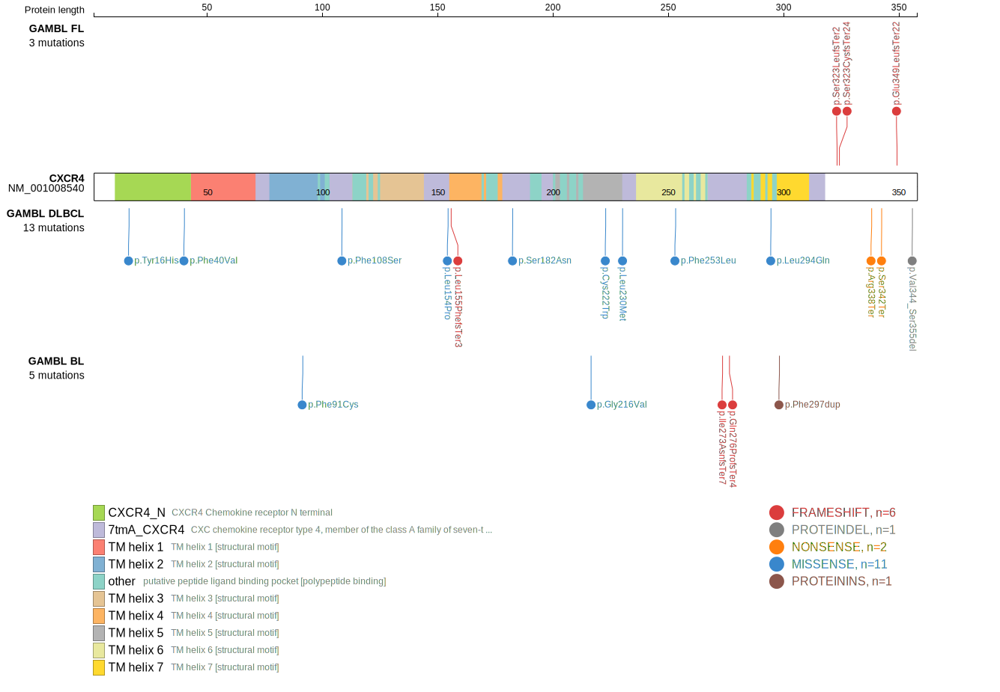
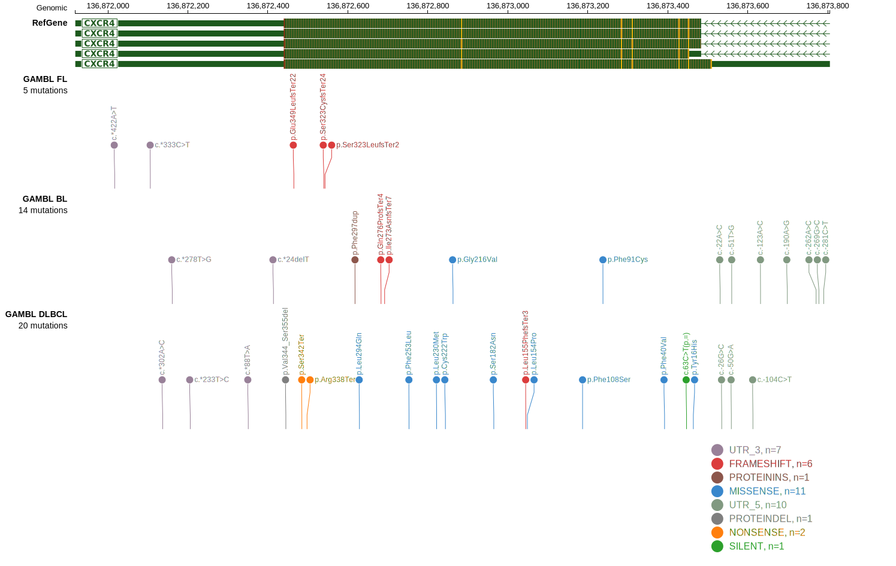

# CXCR4
CXCR4 is one of [a number of genes](https://github.com/morinlab/LLMPP/wiki/ashm) affected by aberrant somatic hypermutation in B-cell lymphomas, which complicates the interpretation of mutations at this locus.

## Mutation tier

|Entity|Tier|Description                           |
|:------:|:----:|--------------------------------------|
|BL    |2-a | aSHM target; Although recurrent, the relevance of mutations in BL is tenuous |
|DLBCL |1-a | aSHM target and high-confidence DLBCL gene            |
|FL    |2-a | aSHM target; Although recurrent, the relevance of mutations in FL is tenuous |
## Mutation incidence

|Entity|source               |frequency (%)|
|:------:|:---------------------:|:-------------:|
|BL    |GAMBL genomes+capture|2.08         |
|BL    |Thomas cohort        |2.10         |
|BL    |Panea cohort         |2.00         |
|DLBCL |GAMBL genomes        |2.87         |
|DLBCL |Schmitz cohort       |2.55         |
|DLBCL |Reddy cohort         |1.50         |
|DLBCL |Chapuy cohort        |2.56         |
|FL    |GAMBL genomes        |3.46         |

## Mutation pattern

|Entity|aSHM|Significant selection|dN/dS (missense)|dN/dS (nonsense)|
|:------:|:----:|:---------------------:|:----------------:|:----------------:|
|BL    |Yes |No                   |4.603           | 0.000          |
|DLBCL |Yes |No                   |3.731           |18.727          |
|FL    |Yes |No                   |0.000           | 0.000          |

## aSHM regions

|chr_name|hg19_start|hg19_end |region                                                                                        |regulatory_comment|
|:--------:|:----------:|:---------:|:----------------------------------------------------------------------------------------------:|:------------------:|
|chr2    |136874728 |136875461|[intron](https://genome.ucsc.edu/s/rdmorin/GAMBL%20hg19?position=chr2%3A136874728%2D136875461)|weak_promoter     |

> [!NOTE]
> First described in BL in 2019 by [Panea RI](https://pubmed.ncbi.nlm.nih.gov/31558468). First described in DLBCL in 2012 by [Khodabakhshi AH](https://pubmed.ncbi.nlm.nih.gov/23131835). First described in FL in 2021 by [Hübschmann D](https://pubmed.ncbi.nlm.nih.gov/33953289)

View coding variants in ProteinPaint [hg19](https://www.bcgsc.ca/downloads/morinlab/GAMBL/test/genes/CXCR4_protein.html)  or [hg38](https://www.bcgsc.ca/downloads/morinlab/GAMBL/test/genes/CXCR4_protein_hg38.html)

View all variants in GenomePaint [hg19](https://www.bcgsc.ca/downloads/morinlab/GAMBL/test/genes/CXCR4.html)  or [hg38](https://www.bcgsc.ca/downloads/morinlab/GAMBL/test/genes/CXCR4_hg38.html)

