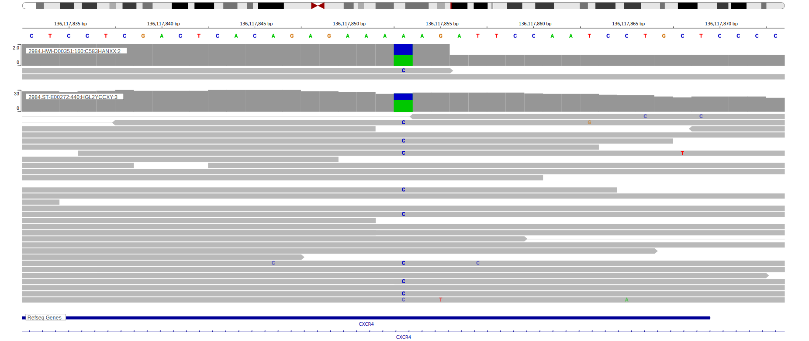

# CXCR4

## Overview

CXCR4 is one of [a number of genes](https://github.com/morinlab/LLMPP/wiki/ashm) affected by aberrant somatic hypermutation in B-cell lymphomas, which complicates the interpretation of mutations at this locus. No notable hot spots have been described in this gene in the context of the cancers listed below. The mutation pattern in DLBCL implies the preferential accumulation of *inactivating mutations*.

## History
Mutations in this gene were first described in DLBCL in 2012 by Khodabakhshi et al,1 in FL in 2021 by Hübschmann et al2 and in BL in 2019 by Panea et al.3

## Relevance tier by entity

|Entity|Tier|Description                           |
|:------:|:----:|--------------------------------------|
||1|high-confidence MZL gene|
| |1 | aSHM target and high-confidence DLBCL gene            [@khodabakhshiRecurrentTargetsAberrant2012]|
|    |2 | aSHM target; Although recurrent, the relevance of mutations in FL is tenuous [@krysiakRecurrentSomaticMutations2017b]|
|    |2 | aSHM target; Although recurrent, the relevance of mutations in BL is tenuous [@paneaWholeGenomeLandscape2019]|

## Mutation incidence in large patient cohorts (GAMBL reanalysis)

|Entity|source               |frequency (%)|
|:------:|:---------------------:|:-------------:|
|BL    |GAMBL genomes+capture|2.08         |
|BL    |Thomas cohort        |2.10         |
|BL    |Panea cohort         |2.00         |
|DLBCL |GAMBL genomes        |2.87         |
|DLBCL |Schmitz cohort       |2.55         |
|DLBCL |Reddy cohort         |1.50         |
|DLBCL |Chapuy cohort        |2.56         |
|FL    |GAMBL genomes        |3.46         |

## Mutation pattern and selective pressure estimates

|Entity|aSHM|Significant selection|dN/dS (missense)|dN/dS (nonsense)|
|:------:|:----:|:---------------------:|:----------------:|:----------------:|
|BL    |Yes |No                   |4.603           | 0.000          |
|DLBCL |Yes |No                   |3.731           |18.727          |
|FL    |Yes |No                   |0.000           | 0.000          |

## aSHM regions

|chr_name|hg19_start|hg19_end |region                                                                                        |regulatory_comment|
|:--------:|:----------:|:---------:|:----------------------------------------------------------------------------------------------:|:------------------:|
|chr2    |136874728 |136875461|[intron](https://genome.ucsc.edu/s/rdmorin/GAMBL%20hg19?position=chr2%3A136874728%2D136875461)|weak_promoter     |

View coding variants in ProteinPaint [hg19](https://morinlab.github.io/LLMPP/GAMBL/CXCR4_protein.html)  or [hg38](https://morinlab.github.io/LLMPP/GAMBL/CXCR4_protein_hg38.html)

View all variants in GenomePaint [hg19](https://morinlab.github.io/LLMPP/GAMBL/CXCR4.html)  or [hg38](https://morinlab.github.io/LLMPP/GAMBL/CXCR4_hg38.html)

## CXCR4 Expression

## Representative Mutations

### BL

**Rating**
&starf; &starf; &starf; &starf; &starf;

## References

<!-- ORIGIN: khodabakhshiRecurrentTargetsAberrant2012 -->

<!-- DLBCL: khodabakhshiRecurrentTargetsAberrant2012 -->
<!-- BL: paneaWholeGenomeLandscape2019 -->
<!-- FL: krysiakRecurrentSomaticMutations2017b -->
