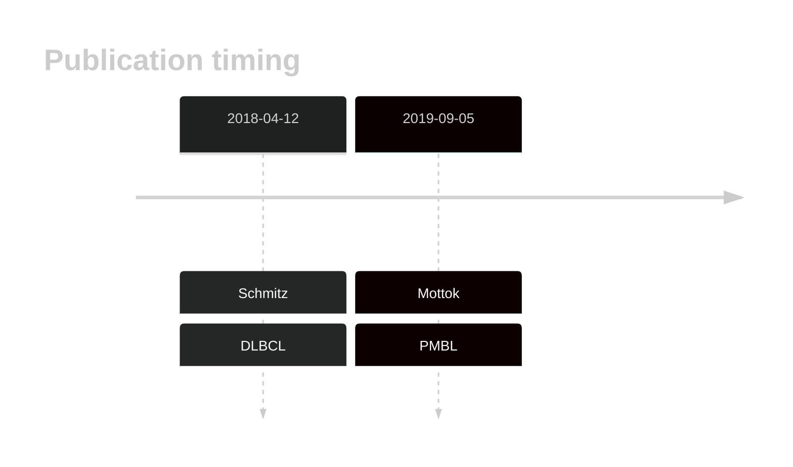
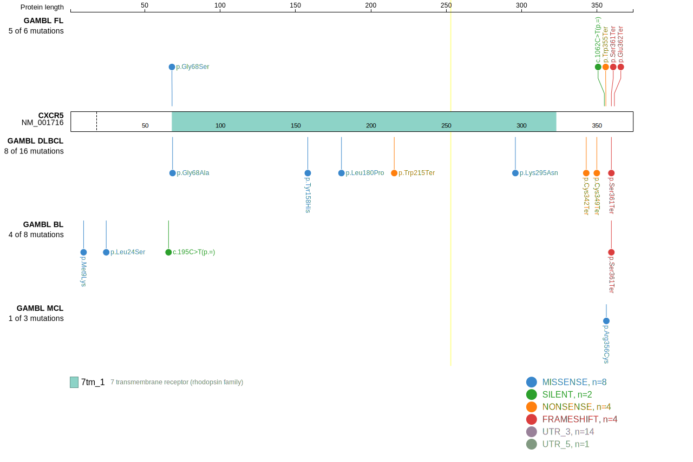
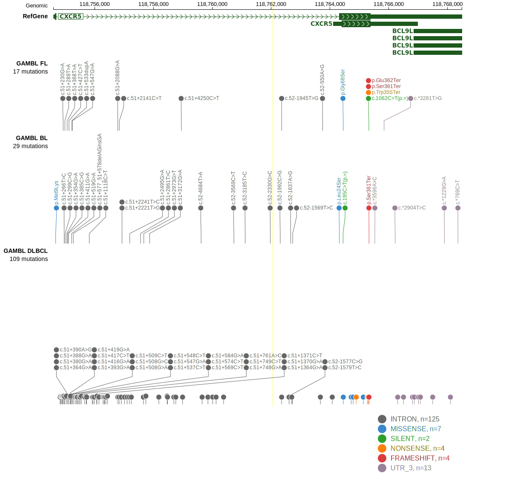

# CXCR5

## Overview
CXCR5 is one of [a number of genes](https://github.com/morinlab/LLMPP/wiki/ashm) affected by aberrant somatic hypermutation in B-cell lymphomas, which complicates the interpretation of mutations at this locus. No notable hot spots have been described in this gene in the context of the cancers listed below. The mutation pattern in DLBCL and FL implies the preferential accumulation of *inactivating mutations*.

## History

## Relevance tier by entity

|Entity|Tier|Description               |
|:------:|:----:|--------------------------|
||2|relevance in PMBL/cHL/GZL not firmly established[@mottokIntegrativeGenomicAnalysis2019b]|
| |1-a | aSHM target and high-confidence DLBCL gene[@schmitzGeneticsPathogenesisDiffuse2018a]|

## Mutation incidence in large patient cohorts (GAMBL reanalysis)

|Entity|source        |frequency (%)|
|:------:|:--------------:|:-------------:|
|DLBCL |GAMBL genomes |1.91         |
|DLBCL |Schmitz cohort|4.04         |
|DLBCL |Reddy cohort  |2.10         |
|DLBCL |Chapuy cohort |1.71         |

## Mutation pattern and selective pressure estimates

|Entity|aSHM|Significant selection|dN/dS (missense)|dN/dS (nonsense)|
|:------:|:----:|:---------------------:|:----------------:|:----------------:|
|BL    |Yes |No                   |2.351           | 0.000          |
|DLBCL |Yes |No                   |1.785           | 0.000          |
|FL    |Yes |No                   |2.934           |76.955          |

## aSHM regions

|chr_name|hg19_start|hg19_end |region                                                                                      |regulatory_comment|
|:--------:|:----------:|:---------:|:--------------------------------------------------------------------------------------------:|:------------------:|
|chr11   |118754458 |118756514|[TSS](https://genome.ucsc.edu/s/rdmorin/GAMBL%20hg19?position=chr11%3A118754458%2D118756514)|NA                |

View coding variants in ProteinPaint [hg19](https://morinlab.github.io/LLMPP/GAMBL/CXCR5_protein.html)  or [hg38](https://morinlab.github.io/LLMPP/GAMBL/CXCR5_protein_hg38.html)

View all variants in GenomePaint [hg19](https://morinlab.github.io/LLMPP/GAMBL/CXCR5.html)  or [hg38](https://morinlab.github.io/LLMPP/GAMBL/CXCR5_hg38.html)

## CXCR5 Expression

<!-- ORIGIN: schmitzGeneticsPathogenesisDiffuse2018a -->
<!-- PMBL: mottokIntegrativeGenomicAnalysis2019b -->
<!-- DLBCL: schmitzGeneticsPathogenesisDiffuse2018a -->

## References

