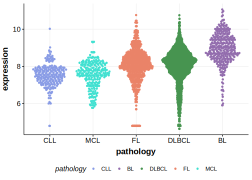

[[_TOC_]]

## Relevance tier by entity

[[include:table1_CYB5D1.md]]

## Warnings

<<Warn("The variants reported in this gene failed QC")>>

## Mutation incidence in large patient cohorts (GAMBL reanalysis)

|Entity|source               |frequency (%)|
|:------:|:---------------------:|:-------------:|
|BL    |GAMBL genomes+capture|0.23         |
|BL    |Thomas cohort        |  NA         |
|BL    |Panea cohort         |  NA         |

## Mutation pattern and selective pressure estimates

[[include:tables/dnds_CYB5D1.md]]

[[include:browser_CYB5D1.md]]

## Expression

<!-- ORIGIN: loveGeneticLandscapeMutations2012 -->
<!-- BL: loveGeneticLandscapeMutations2012 -->

## Representative Mutation

**Rating**
&starf; &starf; &star; &star; &star;

## All Mutations

[513](https://www.bcgsc.ca/downloads/morinlab/GAMBL/Love/513_reports.html)
[670](https://www.bcgsc.ca/downloads/morinlab/GAMBL/Love/670_reports.html)

[[include:tables/mermaid_CYB5D1.md]]

## References
