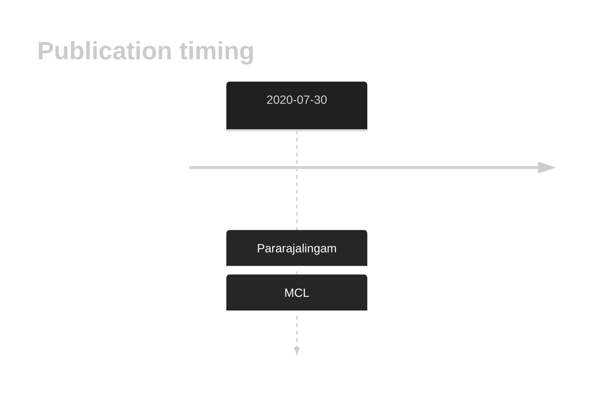
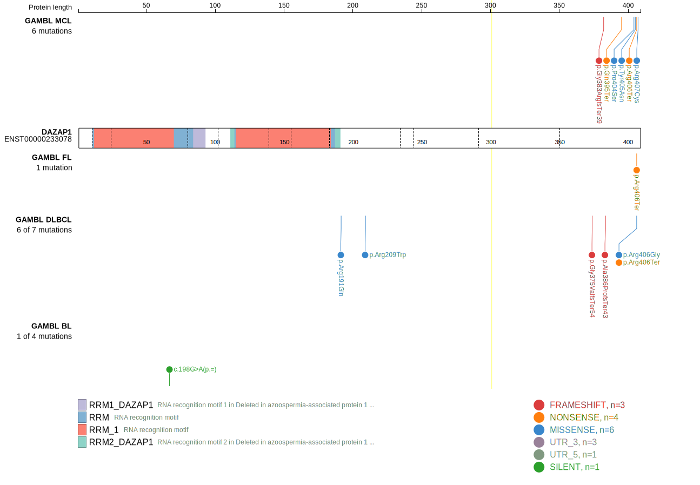
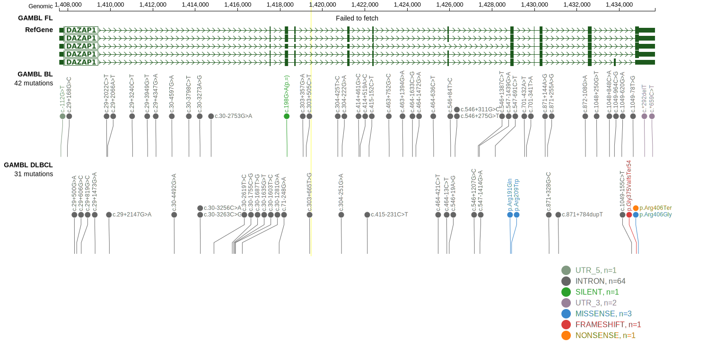
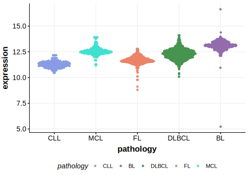

# DAZAP1

## Overview
This gene has some recurrent sites of mutations (hot spots). The mutation pattern in DLBCL and FL implies the preferential accumulation of *inactivating mutations* however the pattern is notable. These mutations often result in truncations affecting the DAZAP1 C-terminus, which are predicted to alter protein sub-cellular localization and disrupt protein-protein interactions.1

## History

## Relevance tier by entity

|Entity|Tier|Description               |
|:------:|:----:|--------------------------|
| |1   |high-confidence DLBCL gene[@pararajalingamCodingNoncodingDrivers2020]|
|   |1   |high-confidence MCL gene  [@pararajalingamCodingNoncodingDrivers2020]|

## Mutation incidence in large patient cohorts (GAMBL reanalysis)

|Entity|source        |frequency (%)|
|:------:|:--------------:|:-------------:|
|DLBCL |GAMBL genomes |1.91         |
|DLBCL |Schmitz cohort|5.32         |
|DLBCL |Reddy cohort  |1.60         |
|DLBCL |Chapuy cohort |0.43         |
|MCL   |GAMBL genomes |4.27         |

## Mutation pattern and selective pressure estimates

|Entity|aSHM|Significant selection|dN/dS (missense)|dN/dS (nonsense)|
|:------:|:----:|:---------------------:|:----------------:|:----------------:|
|BL    |No  |No                   |0               | 0.000          |
|DLBCL |No  |No                   |0               |35.642          |
|FL    |No  |No                   |0               |53.351          |

## DAZAP1 Hotspots

| Chromosome |Coordinate (hg19) | ref>alt | HGVSp | 
 | :---:| :---: | :--: | :---: |
| chr19 | 1434897 | C>T | P404S |
| chr19 | 1434900 | T>A | Y405N |
| chr19 | 1434903 | C>G | R406G |
| chr19 | 1434903 | C>T | R406* |
| chr19 | 1434906 | C>T | R407C |

View coding variants in ProteinPaint [hg19](https://morinlab.github.io/LLMPP/GAMBL/DAZAP1_protein.html)  or [hg38](https://morinlab.github.io/LLMPP/GAMBL/DAZAP1_protein_hg38.html)

View all variants in GenomePaint [hg19](https://morinlab.github.io/LLMPP/GAMBL/DAZAP1.html)  or [hg38](https://morinlab.github.io/LLMPP/GAMBL/DAZAP1_hg38.html)

## DAZAP1 Expression

## References

<!-- ORIGIN: pararajalingamCodingNoncodingDrivers2020 -->
<!-- DLBCL: pararajalingamCodingNoncodingDrivers2020 -->
<!-- MCL: pararajalingamCodingNoncodingDrivers2020 -->
