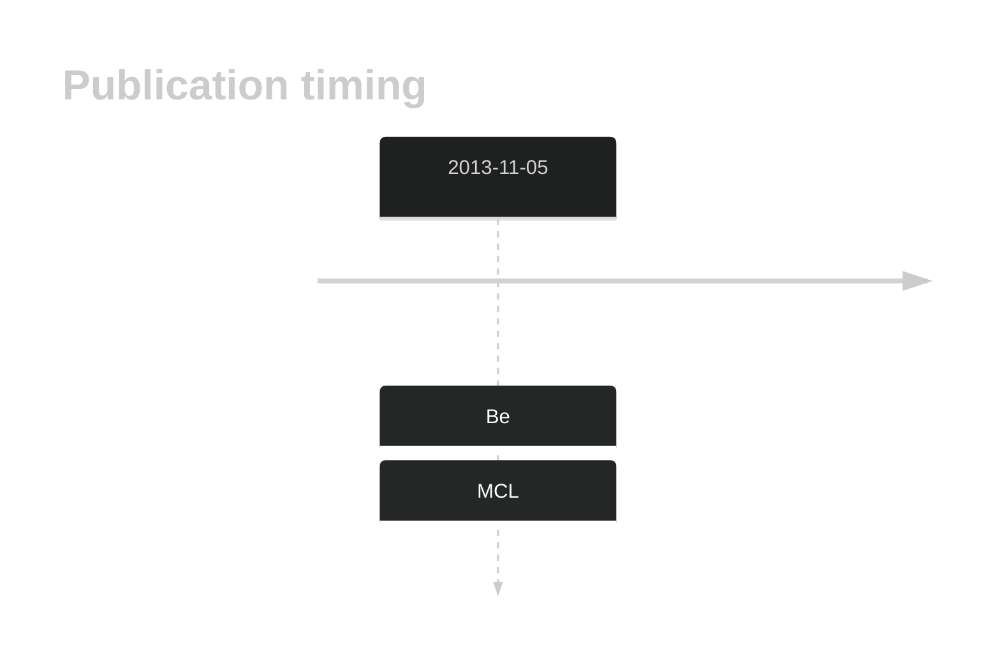

# DCP1B

## History

## Relevance tier by entity

|Entity|Tier|Description|
|:------:|:----:|--------------------------------------|
||2|relevance in MCL not firmly established[@beaLandscapeSomaticMutations2013]|

## Mutation incidence in large patient cohorts (GAMBL reanalysis)

|Entity|source |frequency (%)|
|:------:|:----:|:----:|
|BL|GAMBL Exome |1.724 |
|BL|GAMBL Genome |0.386 |
|DLBCL|GAMBL Exome |0.539 |
|DLBCL|GAMBL Genome |0.376 |
|MCL|GAMBL Genome |0.585 |

## References

