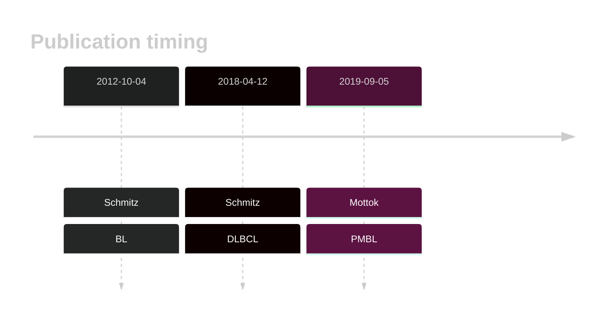
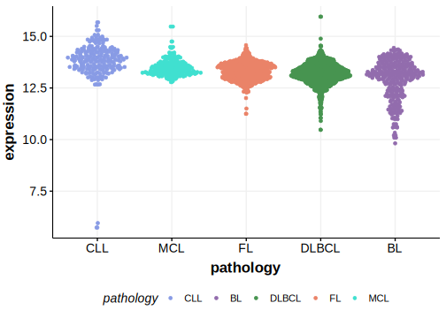

# DDX3X
## Overview
Mutations in the DDX3X gene, which encodes an RNA helicase involved in various aspects of RNA metabolism, have significant implications in B-cell lymphomas, including BL, DLBCL, and other related malignancies and are particularly enriched within MYC-translocated tumors and those expressing the dark zone signature (DZsig).1 These mutations are predominantly loss-of-function (LOF) mutations, affecting the helicase domain of the protein.2 Missense mutations are predominantly found in male patients and rarely in females, hence showing a sex-specific pattern.3 
## History

## Relevance tier by entity

|Entity|Tier|Description                           |
|:------:|:----:|--------------------------------------|
||1|high-confidence PMBL/cHL/GZL gene|
|    |1 | high-confidence BL gene               |
| |1 | high-confidence DLBCL gene            |
|    |2 | Although recurrent, the relevance of mutations in FL is tenuous |

## Mutation incidence in large patient cohorts (GAMBL reanalysis)

|Entity|source               |frequency (%)|
|:------:|:---------------------:|:-------------:|
|BL    |GAMBL genomes+capture|44.34        |
|BL    |Thomas cohort        |48.70        |
|BL    |Panea cohort         |39.60        |
|DLBCL |GAMBL genomes        | 8.80        |
|DLBCL |Schmitz cohort       | 4.68        |
|DLBCL |Reddy cohort         | 4.50        |
|DLBCL |Chapuy cohort        | 5.56        |
|FL    |GAMBL genomes        | 2.54        |

## Mutation pattern and selective pressure estimates

|Entity|aSHM|Significant selection|dN/dS (missense)|dN/dS (nonsense)|
|:------:|:----:|:---------------------:|:----------------:|:----------------:|
|BL    |Yes |Yes                  |19.270          |125.826         |
|DLBCL |Yes |No                   | 3.193          |  8.744         |
|FL    |Yes |No                   |11.136          | 21.489         |

## aSHM regions

|chr_name|hg19_start|hg19_end|region                                                                                          |regulatory_comment|
|:--------:|:----------:|:--------:|:------------------------------------------------------------------------------------------------:|:------------------:|
|chrX    |42800580  |42804184|[intergenic](https://genome.ucsc.edu/s/rdmorin/GAMBL%20hg19?position=chrX%3A42800580%2D42804184)|NA                |

> [!NOTE]
> First described in BL in 2012 by [Schmitz R](https://pubmed.ncbi.nlm.nih.gov/22885699). First described in DLBCL in 2018 by [Schmitz R](https://pubmed.ncbi.nlm.nih.gov/29641966). First described in FL in 2023 by [Dreval K](https://pubmed.ncbi.nlm.nih.gov/37084389)

View coding variants in ProteinPaint [hg19](https://morinlab.github.io/LLMPP/GAMBL/DDX3X_protein.html)  or [hg38](https://morinlab.github.io/LLMPP/GAMBL/DDX3X_protein_hg38.html)

View all variants in GenomePaint [hg19](https://morinlab.github.io/LLMPP/GAMBL/DDX3X.html)  or [hg38](https://morinlab.github.io/LLMPP/GAMBL/DDX3X_hg38.html)

## References
1. *Ennishi D, Jiang A, Boyle M, Collinge B, Grande BM, Ben-Neriah S, Rushton C, Tang J, Thomas N, Slack GW, Farinha P, Takata K, Miyata-Takata T, Craig J, Mottok A, Meissner B, Saberi S, Bashashati A, Villa D, Savage KJ, Sehn LH, Kridel R, Mungall AJ, Marra MA, Shah SP, Steidl C, Connors JM, Gascoyne RD, Morin RD, Scott DW. Double-Hit Gene Expression Signature Defines a Distinct Subgroup of Germinal Center B-Cell-Like Diffuse Large B-Cell Lymphoma. J Clin Oncol. 2019 Jan 20;37(3):190-201. doi: 10.1200/JCO.18.01583. Epub 2018 Dec 3. PMID: 30523716; PMCID: PMC6804880.*
2. *Lacroix, M., Beauchemin, H., & Möröy, T. (2022). DDX3: a relevant therapeutic target for lymphoma?. Expert Opinion on Therapeutic Targets, 26, 1037 - 1040. https://doi.org/10.1080/14728222.2022.2166830.*
3. *Gong, C., Krupka, J., Gao, J., Grigoropoulos, N., Giotopoulos, G., Asby, R., Screen, M., Usheva, Z., Cucco, F., Barrans, S., Painter, D., Zaini, N., Haupl, B., Bornelöv, S., Mozos, I., Meng, W., Zhou, P., Blain, A., Forde, S., Matthews, J., Tan, M., Burke, G., Sze, S., Beer, P., Burton, C., Campbell, P., Rand, V., Turner, S., Ule, J., Roman, E., Tooze, R., Oellerich, T., Huntly, B., Turner, M., Du, M., Samarajiwa, S., & Hodson, D. (2021). Sequential inverse dysregulation of the RNA helicases DDX3X and DDX3Y facilitates MYC-driven lymphomagenesis.. Molecular cell. https://doi.org/10.1016/j.molcel.2021.07.041.*

## DDX3X Expression

<!-- ORIGIN: schmitzBurkittLymphomaPathogenesis2012 -->
<!-- DLBCL: schmitzGeneticsPathogenesisDiffuse2018a -->
<!-- BL: schmitzBurkittLymphomaPathogenesis2012 -->
<!-- BL: schmitzBurkittLymphomaPathogenesis2012 -->
