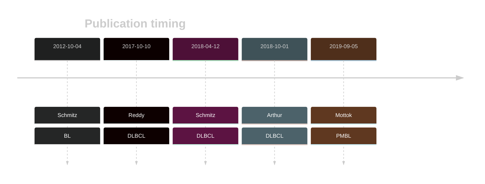

# DDX3X

## Overview
Mutations in the DDX3X gene, which encodes an RNA helicase involved in various aspects of RNA metabolism, have significant implications in B-cell lymphomas, including BL, DLBCL, and other related malignancies and are particularly enriched within MYC-translocated tumors and those expressing the dark zone signature (DZsig).[@ennishiDoubleHitGeneExpression2019] 
These mutations are predominantly loss-of-function (LOF) mutations, affecting the helicase domain of the protein. Missense mutations are predominantly found in male patients and rarely in females, hence showing a sex-specific pattern.[@gongSequentialInverseDysregulation2021]

## History

## Relevance tier by entity

|Entity|Tier|Description                           |
|:------:|:----:|--------------------------------------|
||1|high-confidence PMBL/cHL/GZL gene[@mottokIntegrativeGenomicAnalysis2019]|
|    |1 | high-confidence BL gene               [@schmitzBurkittLymphomaPathogenesis2012]|
| |1 | high-confidence DLBCL gene            [@reddyGeneticFunctionalDrivers2017; @schmitzGeneticsPathogenesisDiffuse2018; @arthurGenomewideDiscoverySomatic2018]|
|    |2 | Although recurrent, the relevance of mutations in FL is tenuous |

## Mutation incidence in large patient cohorts (GAMBL reanalysis)

|Entity|source               |frequency (%)|
|:------:|:---------------------:|:-------------:|
|BL    |GAMBL genomes+capture|44.34        |
|BL    |Thomas cohort        |48.70        |
|BL    |Panea cohort         |39.60        |
|DLBCL |GAMBL genomes        | 8.80        |
|DLBCL |Schmitz cohort       | 4.68        |
|DLBCL |Reddy cohort         | 4.50        |
|DLBCL |Chapuy cohort        | 5.56        |
|FL    |GAMBL genomes        | 2.54        |

## Mutation pattern and selective pressure estimates

|Entity|aSHM|Significant selection|dN/dS (missense)|dN/dS (nonsense)|
|:------:|:----:|:---------------------:|:----------------:|:----------------:|
|BL    |Yes |Yes                  |19.270          |125.826         |
|DLBCL |Yes |No                   | 3.193          |  8.744         |
|FL    |Yes |No                   |11.136          | 21.489         |

## aSHM regions

|chr_name|hg19_start|hg19_end|region                                                                                          |regulatory_comment|
|:--------:|:----------:|:--------:|:------------------------------------------------------------------------------------------------:|:------------------:|
|chrX    |42800580  |42804184|[intergenic](https://genome.ucsc.edu/s/rdmorin/GAMBL%20hg19?position=chrX%3A42800580%2D42804184)|NA                |

View coding variants in ProteinPaint [hg19](https://morinlab.github.io/LLMPP/GAMBL/DDX3X_protein.html)  or [hg38](https://morinlab.github.io/LLMPP/GAMBL/DDX3X_protein_hg38.html)

View all variants in GenomePaint [hg19](https://morinlab.github.io/LLMPP/GAMBL/DDX3X.html)  or [hg38](https://morinlab.github.io/LLMPP/GAMBL/DDX3X_hg38.html)

## DDX3X Expression

<!-- ORIGIN: schmitzBurkittLymphomaPathogenesis2012 -->
<!-- DLBCL: schmitzGeneticsPathogenesisDiffuse2018a -->
<!-- BL: schmitzBurkittLymphomaPathogenesis2012 -->
<!-- BL: schmitzBurkittLymphomaPathogenesis2012 -->
<!-- PMBL: mottokIntegrativeGenomicAnalysis2019b -->

## References

