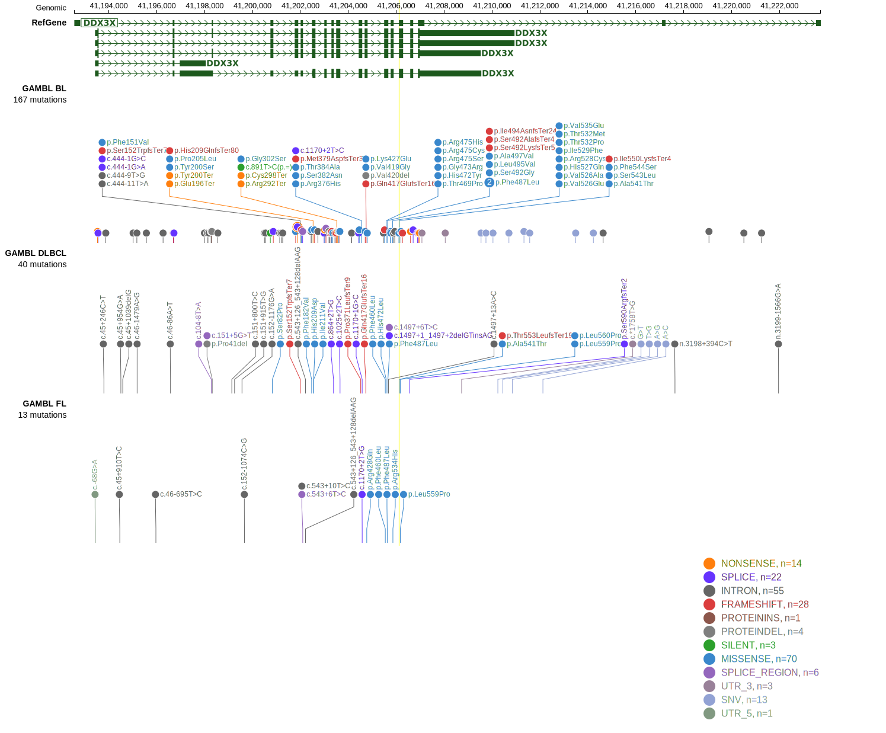

# [DDX3X]

## Mutation tier

|Entity|Tier|Description                           |
|:------:|:----:|--------------------------------------|
|BL    |1   |high-confidence BL gene               |
|DLBCL |1   |high-confidence DLBCL gene            |
|FL    |2   |relevance in FL not firmly established|
## Mutation incidence

|Entity|source               |frequency (%)|
|:------:|:---------------------:|:-------------:|
|BL    |GAMBL genomes+capture|44.34        |
|BL    |Thomas cohort        |48.70        |
|BL    |Panea cohort         |39.60        |
|DLBCL |GAMBL genomes        | 8.80        |
|DLBCL |Schmitz cohort       | 4.70        |
|DLBCL |Reddy cohort         | 4.50        |
|DLBCL |Chapuy cohort        | 5.60        |
|FL    |GAMBL genomes        | 2.54        |

## Mutation pattern

|Entity|aSHM|Significant selection|dN/dS (missense)|dN/dS (nonsense)|
|:------:|:----:|:---------------------:|:----------------:|:----------------:|
|BL    |Yes |Yes                  |19.270          |125.826         |
|DLBCL |Yes |No                   | 3.193          |  8.744         |
|FL    |Yes |No                   |11.136          | 21.489         |

## aSHM regions

|chr_name|hg19_start|hg19_end|region                                                                                          |regulatory_comment|
|:--------:|:----------:|:--------:|:------------------------------------------------------------------------------------------------:|:------------------:|
|chrX    |42800580  |42804184|[intergenic](https://genome.ucsc.edu/s/rdmorin/GAMBL%20hg19?position=chrX%3A42800580%2D42804184)|NA                |

> [!NOTE]
> First described in BL in 2012 by [Schmitz R](https://pubmed.ncbi.nlm.nih.gov/22885699). First described in DLBCL in 2018 by [Schmitz R](https://pubmed.ncbi.nlm.nih.gov/29641966). First described in FL in 2023 by [Dreval K](https://pubmed.ncbi.nlm.nih.gov/37084389)

View coding variants in ProteinPaint [hg19](https://www.bcgsc.ca/downloads/morinlab/GAMBL/test/genes/DDX3X_protein.html)  or [hg38](https://www.bcgsc.ca/downloads/morinlab/GAMBL/test/genes/DDX3X_protein_hg38.html)

View all variants in GenomePaint [hg19](https://www.bcgsc.ca/downloads/morinlab/GAMBL/test/genes/DDX3X.html)

