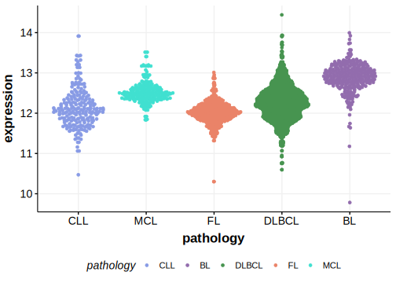

[[_TOC_]]

## Overview

Mutations in this gene were first described in FL in 2021 by Hübschmann et al.[@hubschmannMutationalMechanismsShaping2021]

## Relevance tier by entity

[[include:tables/table1_DHX15.md]]

## Mutation incidence in large patient cohorts (GAMBL reanalysis)

|Entity|source       |frequency (%)|
|:------:|:-------------:|:-------------:|
|FL    |GAMBL genomes|0.69         |

## Mutation pattern and selective pressure estimates

[[include:tables/dnds_DHX15.md]]

[[include:browser_DHX15.md]]

## Expression

<!-- ORIGIN: hubschmannMutationalMechanismsShaping2021b -->
<!-- FL: hubschmannMutationalMechanismsShaping2021b -->

## All Mutations

[SP59360](https://www.bcgsc.ca/downloads/morinlab/GAMBL/MALY/SP59360.html)
[SP192767](https://www.bcgsc.ca/downloads/morinlab/GAMBL/MALY/SP192767.html)
[SP116616](https://www.bcgsc.ca/downloads/morinlab/GAMBL/MALY/SP116616.html)
[SP192807](https://www.bcgsc.ca/downloads/morinlab/GAMBL/MALY/SP192807.html)
[SP193017](https://www.bcgsc.ca/downloads/morinlab/GAMBL/MALY/SP193017.html)

[[include:tables/mermaid_DHX15.md]]

## References
