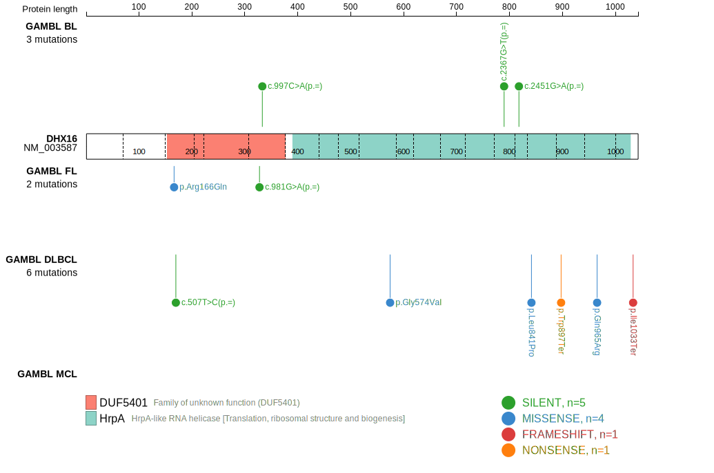
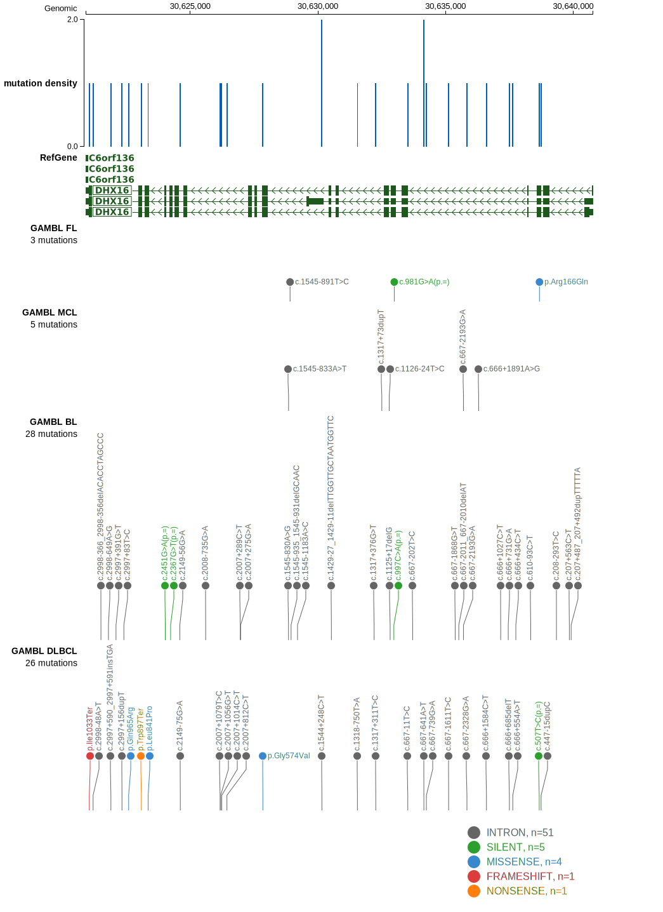

# DHX16

## Relevance tier by entity

|Entity|Tier|Description                              |
|:------:|:----:|-----------------------------------------|
|DLBCL |2   |relevance in DLBCL not firmly established|

## Mutation incidence in large patient cohorts (GAMBL reanalysis)

|Entity|source        |frequency (%)|
|:------:|:--------------:|:-------------:|
|DLBCL |GAMBL genomes |1.91         |
|DLBCL |Schmitz cohort|1.91         |
|DLBCL |Reddy cohort  |  NA         |
|DLBCL |Chapuy cohort |1.28         |

## Mutation pattern and selective pressure estimates

|Entity|aSHM|Significant selection|dN/dS (missense)|dN/dS (nonsense)|
|:------:|:----:|:---------------------:|:----------------:|:----------------:|
|BL    |No  |No                   |0.298           | 0.00           |
|DLBCL |No  |No                   |2.652           |11.87           |
|FL    |No  |No                   |3.825           | 0.00           |

> [!NOTE]
> First described in DLBCL in 2021 by [Hübschmann D](https://pubmed.ncbi.nlm.nih.gov/33953289)

View coding variants in ProteinPaint [hg19](https://morinlab.github.io/LLMPP/GAMBL/DHX16_protein.html)  or [hg38](https://morinlab.github.io/LLMPP/GAMBL/DHX16_protein_hg38.html)

View all variants in GenomePaint [hg19](https://morinlab.github.io/LLMPP/GAMBL/DHX16.html)  or [hg38](https://morinlab.github.io/LLMPP/GAMBL/DHX16_hg38.html)

## DHX16 Expression

