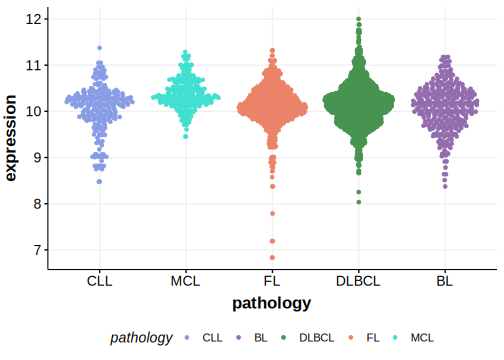

[[_TOC_]]

## Overview

Mutations in this gene were first described in DLBCL in 2021 by Hübschmann et al.[@hubschmannMutationalMechanismsShaping2021]

## Relevance tier by entity

[[include:tables/table1_DHX16.md]]

## Mutation incidence in large patient cohorts (GAMBL reanalysis)

|Entity|source        |frequency (%)|
|:------:|:--------------:|:-------------:|
|DLBCL |GAMBL genomes |1.91         |
|DLBCL |Schmitz cohort|1.91         |
|DLBCL |Reddy cohort  |  NA         |
|DLBCL |Chapuy cohort |1.28         |

## Mutation pattern and selective pressure estimates

[[include:tables/dnds_DHX16.md]]

[[include:tables/browser_DHX16.md]]

## Expression

## All Mutations

[SP116697](https://www.bcgsc.ca/downloads/morinlab/GAMBL/MALY/SP116697.html)
[SP59368](https://www.bcgsc.ca/downloads/morinlab/GAMBL/MALY/SP59368.html)
[SP59384](https://www.bcgsc.ca/downloads/morinlab/GAMBL/MALY/SP59384.html)
[SP194212](https://www.bcgsc.ca/downloads/morinlab/GAMBL/MALY/SP194212.html)
[SP193957](https://www.bcgsc.ca/downloads/morinlab/GAMBL/MALY/SP193957.html)

[[include:tables/mermaid_DHX16.md]]

## References

<!-- ORIGIN: hubschmannMutationalMechanismsShaping2021b -->
<!-- DLBCL: hubschmannMutationalMechanismsShaping2021b -->
