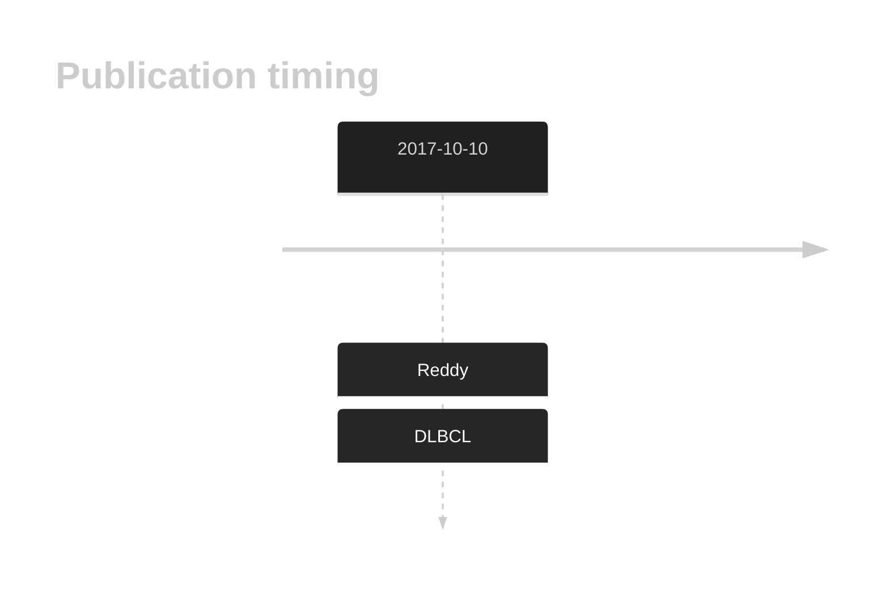

# DICER1

<<Warn("The variants reported in this gene in DLBCL failed QC")>>

## History

## Relevance tier by entity

|Entity|Tier|Description                              |
|:------:|:----:|-----------------------------------------|
| |2-F   |failed QC|

## Mutation incidence in large patient cohorts (GAMBL reanalysis)

|Entity|source        |frequency (%)|
|:------:|:--------------:|:-------------:|
|DLBCL |GAMBL genomes |1.34         |
|DLBCL |Schmitz cohort|2.34         |
|DLBCL |Reddy cohort  |1.10         |
|DLBCL |Chapuy cohort |2.56         |

## Mutation pattern and selective pressure estimates

|Entity|aSHM|Significant selection|dN/dS (missense)|dN/dS (nonsense)|
|:------:|:----:|:---------------------:|:----------------:|:----------------:|
|BL    |No  |No                   |0.609           |0               |
|DLBCL |No  |No                   |0.818           |0               |
|FL    |No  |No                   |2.448           |0               |

> [!WARNING]
> Mutations in this gene were reported to be inflated in the original results according to [Dreval K](https://www.biorxiv.org/content/10.1101/2023.11.21.567983v1)

View coding variants in ProteinPaint [hg19](https://morinlab.github.io/LLMPP/GAMBL/DICER1_protein.html)  or [hg38](https://morinlab.github.io/LLMPP/GAMBL/DICER1_protein_hg38.html)

View all variants in GenomePaint [hg19](https://morinlab.github.io/LLMPP/GAMBL/DICER1.html)  or [hg38](https://morinlab.github.io/LLMPP/GAMBL/DICER1_hg38.html)

## DICER1 Expression

<!-- ORIGIN: reddyGeneticFunctionalDrivers2017 -->
<!-- DLBCL: reddyGeneticFunctionalDrivers2017 -->

## References

