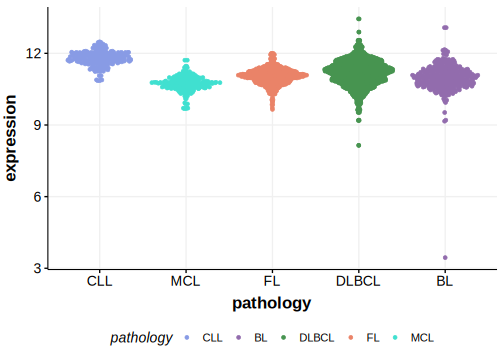

[[_TOC_]]

## Relevance tier by entity

|Entity|Tier|Description                              |
|:------:|:----:|-----------------------------------------|
| |3  |Retired, Failed QC[@reddyGeneticFunctionalDrivers2017]|

<<Warn("The variants reported in this gene in DLBCL failed QC")>>

Mutations in this gene were reported to be inflated in the original results according to [Dreval K](https://www.biorxiv.org/content/10.1101/2023.11.21.567983v1)

## Mutation incidence in large patient cohorts (GAMBL reanalysis)

|Entity|source        |frequency (%)|
|:------:|:--------------:|:-------------:|
|DLBCL |GAMBL genomes |1.34         |
|DLBCL |Schmitz cohort|2.34         |
|DLBCL |Reddy cohort  |1.10         |
|DLBCL |Chapuy cohort |2.56         |

## Mutation pattern and selective pressure estimates

[[include:dnds_DICER1.md]]

[[include:browser_DICER1.md]]

## Expression

<!-- ORIGIN: reddyGeneticFunctionalDrivers2017 -->
<!-- DLBCL: reddyGeneticFunctionalDrivers2017 -->

[[include:mermaid_DICER1.md]]

## References

