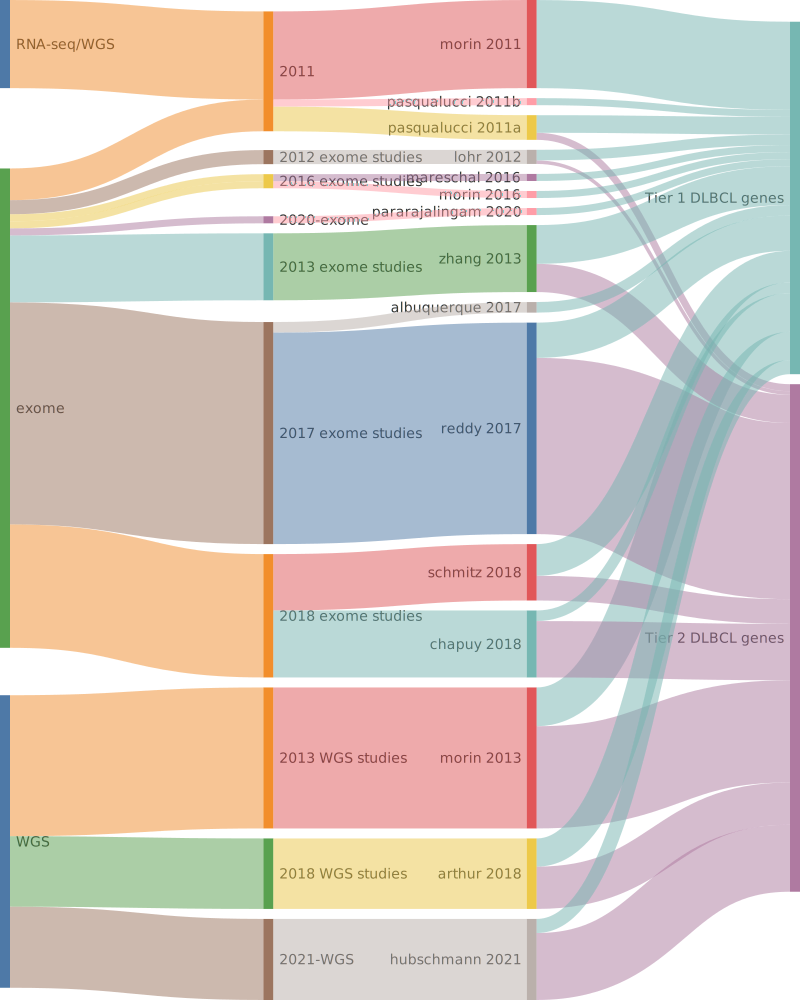

## Origins of DLBCL genes

## Tier 1 DLBCL genes

### *124 total*

|Gene|Summary| First DLBCL study | Other entities | QC result |
|:-:|:-:|:-:|:-|:-|
|[ACTB](ACTB)|Tier 1 GE[@lohrDiscoveryPrioritizationSomatic2012a]|[Lohr et al](papers/lohrDiscoveryPrioritizationSomatic2012a)|[@wienandGenomicAnalysesFlowsorted2019b]||
|[ACTG1](ACTG1)|Tier 1 GE[@hubschmannMutationalMechanismsShaping2021b]|[Hubschmann et al](papers/hubschmannMutationalMechanismsShaping2021b)|[@deschGenotypingCirculatingTumor2020; @spinaGeneticsNodalMarginal2016b]||
|[ARID1A](ARID1A)|Tier 1 GE[@zhangGeneticHeterogeneityDiffuse2013]|[Zhang et al](papers/zhangGeneticHeterogeneityDiffuse2013)|[@krysiakRecurrentSomaticMutations2017b; @loveGeneticLandscapeMutations2012; @rossiCodingGenomeSplenic2012c; @wienandGenomicAnalysesFlowsorted2019b]||
|[ATM](ATM)|Tier 1 GE[@reddyGeneticFunctionalDrivers2017]|[Reddy et al](papers/reddyGeneticFunctionalDrivers2017)|[@beaLandscapeSomaticMutations2013; @braggioGenomicAnalysisMarginal2012]||
|[B2M](B2M)|Tier 1 GE[@morinFrequentMutationHistonemodifying2011], FE[@challa-malladiCombinedGeneticInactivationa]|[Morin et al](papers/morinFrequentMutationHistonemodifying2011)|[@pararajalingamCodingNoncodingDrivers2020; @reichelFlowSortingExome2015a]||
|[BCL10](BCL10)|Tier 1 GE[@morinFrequentMutationHistonemodifying2011], FE[@xiaBCL10MutationsDefine2022]|[Morin et al](papers/morinFrequentMutationHistonemodifying2011)|[@russler-germainMutationsAssociatedProgression2023b; @spinaGeneticsNodalMarginal2016b]||
|[BCL2](BCL2)|Tier 1 GE[@tanakaFrequentIncidenceSomatic1992], FE[@balSuperenhancerHypermutationAlters2022]|[Tanaka et al](papers/tanakaFrequentIncidenceSomatic1992)|[@burkhardtClinicalRelevanceMolecular2022b; @morinFrequentMutationHistonemodifying2011; @sarkozyMutationalLandscapeGray2021a]||
|[BCL6](BCL6)|Tier 1 GE[@morinFrequentMutationHistonemodifying2011], FE[@balSuperenhancerHypermutationAlters2022]|[Morin et al](papers/morinFrequentMutationHistonemodifying2011)|[@loveGeneticLandscapeMutations2012]||
|[BCL7A](BCL7A)|Tier 1 GE[@morinFrequentMutationHistonemodifying2011], FE[@balinas-gaviraFrequentMutationsAminoterminal2020b]|[Morin et al](papers/morinFrequentMutationHistonemodifying2011)|[@grandeGenomewideDiscoverySomatic2019; @krysiakRecurrentSomaticMutations2017b; @reichelFlowSortingExome2015a]||
|[BIRC6](BIRC6)|Tier 1 GE[@reddyGeneticFunctionalDrivers2017]|[Reddy et al](papers/reddyGeneticFunctionalDrivers2017)|[@sarkozyMutationalLandscapeGray2021a]||
|[BRAF](BRAF)|Tier 1 GE[@tiacciBRAFMutationsHairycell2011a]|[Tiacci et al](papers/tiacciBRAFMutationsHairycell2011a)|[@loveGeneticLandscapeMutations2012]||
|[BTG1](BTG1)|Tier 1 GE[@morinFrequentMutationHistonemodifying2011], FE[@mlynarczykBTG1MutationYields2023b]|[Morin et al](papers/morinFrequentMutationHistonemodifying2011)|[@burkhardtClinicalRelevanceMolecular2022b; @sarkozyMutationalLandscapeGray2021a]||
|[BTG2](BTG2)|Tier 1 GE[@morinFrequentMutationHistonemodifying2011], CE[@guoMutationBTG2Gene2022b]|[Morin et al](papers/morinFrequentMutationHistonemodifying2011)|[@loveGeneticLandscapeMutations2012]||
|[BTK](BTK)|Tier 1 GE[@albuquerqueEnhancingKnowledgeDiscovery2017a]|[Albuquerque et al](papers/albuquerqueEnhancingKnowledgeDiscovery2017a)|[@krysiakRecurrentSomaticMutations2017b]||
|[CARD11](CARD11)|Tier 1 GE[@lenzOncogenicCARD11Mutations2008], FE[@lenzOncogenicCARD11Mutations2008], CE[@zhaoExpressionPrognosticValue2016]|[Lenz et al](papers/lenzOncogenicCARD11Mutations2008)|[@morinFrequentMutationHistonemodifying2011; @wuGeneticHeterogeneityPrimary2016; @yanBCRTLRSignaling2012a]||
|[CCND3](CCND3)|Tier 1 GE[@morinFrequentMutationHistonemodifying2011], FE[@schmitzBurkittLymphomaPathogenesis2012]|[Morin et al](papers/morinFrequentMutationHistonemodifying2011)|[@deschGenotypingCirculatingTumor2020; @jalladesExomeSequencingIdentifies2017; @richterRecurrentMutationID32012a]||
|[CD58](CD58)|Tier 1 GE[@morinFrequentMutationHistonemodifying2011], FE[@challa-malladiCombinedGeneticInactivationa]|[Morin et al](papers/morinFrequentMutationHistonemodifying2011)|[@schneiderAlterationsCD58Gene2015a]||
|[CD70](CD70)|Tier 1 GE[@morinFrequentMutationHistonemodifying2011]|[Morin et al](papers/morinFrequentMutationHistonemodifying2011)|[@russler-germainMutationsAssociatedProgression2023b]||
|[CD79B](CD79B)|Tier 1 GE[@morinFrequentMutationHistonemodifying2011], FE[@davisChronicActiveBcellreceptor2010]|[Morin et al](papers/morinFrequentMutationHistonemodifying2011)|[@paneaWholeGenomeLandscape2019]||
|[CD83](CD83)|Tier 1 GE[@morinMutationalStructuralAnalysis2013]|[Morin et al](papers/morinMutationalStructuralAnalysis2013)|[@dunsCharacterizationDLBCLPMBL2021b; @paneaWholeGenomeLandscape2019; @russler-germainMutationsAssociatedProgression2023b]||
|[CDKN2A](CDKN2A)|Tier 1 GE[@morinMutationalStructuralAnalysis2013], CE[@jardinDiffuseLargeBcell2010a]|[Morin et al](papers/morinMutationalStructuralAnalysis2013)|[@grandeGenomewideDiscoverySomatic2019; @spinaGeneticsNodalMarginal2016b]||
|[CREBBP](CREBBP)|Tier 1 GE[@pasqualucciInactivatingMutationsAcetyltransferase2011a], FE[@pasqualucciInactivatingMutationsAcetyltransferase2011a]|[Pasqualucci et al](papers/pasqualucciInactivatingMutationsAcetyltransferase2011a)|[@dunsCharacterizationDLBCLPMBL2021b; @loveGeneticLandscapeMutations2012; @parryWholeExomeSequencing2013]||
|[CXCR4](CXCR4)|Tier 1 GE[@khodabakhshiRecurrentTargetsAberrant2012]|[Khodabakhshi et al](papers/khodabakhshiRecurrentTargetsAberrant2012)|[@krysiakRecurrentSomaticMutations2017b; @paneaWholeGenomeLandscape2019]||
|[CXCR5](CXCR5)|Tier 1 GE[@schmitzGeneticsPathogenesisDiffuse2018a]|[Schmitz et al](papers/schmitzGeneticsPathogenesisDiffuse2018a)|[@mottokIntegrativeGenomicAnalysis2019b]||
|[DDX3X](DDX3X)|Tier 1 GE[@reddyGeneticFunctionalDrivers2017], FE[@gongSequentialInverseDysregulation2021], CE[@kizhakeyilDDX3XLossAdverse2021]|[Reddy et al](papers/reddyGeneticFunctionalDrivers2017)|[@mottokIntegrativeGenomicAnalysis2019b; @schmitzBurkittLymphomaPathogenesis2012]||
|[DTX1](DTX1)|Tier 1 GE[@zhangGeneticHeterogeneityDiffuse2013], FE[@demirandaExomeSequencingReveals2014], CE[@merirantaDeltex1MutationsPredict2017b]|[Zhang et al](papers/zhangGeneticHeterogeneityDiffuse2013)|[@gomezUltraDeepSequencingReveals2023; @loveGeneticLandscapeMutations2012; @rossiCodingGenomeSplenic2012c]||
|[DUSP2](DUSP2)|Tier 1 GE[@lohrDiscoveryPrioritizationSomatic2012a]|[Lohr et al](papers/lohrDiscoveryPrioritizationSomatic2012a)|[@dunsCharacterizationDLBCLPMBL2021b]||
|[EBF1](EBF1)|Tier 1 GE[@bohleRoleEarlyBcell2013]|[Bohle et al](papers/bohleRoleEarlyBcell2013)|[@reichelFlowSortingExome2015a; @thomasGeneticSubgroupsInform2023]||
|[EEF1A1](EEF1A1)|Tier 1 GE[@hubschmannMutationalMechanismsShaping2021b], CE[@gongExpressionClinicalValue2021]|[Hubschmann et al](papers/hubschmannMutationalMechanismsShaping2021b)|[@reichelFlowSortingExome2015a]||
|[EP300](EP300)|Tier 1 GE[@pasqualucciInactivatingMutationsAcetyltransferase2011a], FE[@pasqualucciInactivatingMutationsAcetyltransferase2011a]|[Pasqualucci et al](papers/pasqualucciInactivatingMutationsAcetyltransferase2011a)|[@rossiCodingGenomeSplenic2012c]||
|[ETS1](ETS1)|Tier 1 GE[@morinFrequentMutationHistonemodifying2011]|[Morin et al](papers/morinFrequentMutationHistonemodifying2011)|[@paneaWholeGenomeLandscape2019]||
|[ETV6](ETV6)|Tier 1 GE[@lohrDiscoveryPrioritizationSomatic2012a]|[Lohr et al](papers/lohrDiscoveryPrioritizationSomatic2012a)|||
|[EZH2](EZH2)|Tier 1 GE[@morinSomaticMutationsAltering2010a], FE[@yapSomaticMutationsEZH22011b]|[Morin et al](papers/morinSomaticMutationsAltering2010a)|[@loveGeneticLandscapeMutations2012; @mottokIntegrativeGenomicAnalysis2019b]||
|[FAS](FAS)|Tier 1 GE[@schollMutationsRegionFAS2007], FE[@seebergerLossFasCD952001]|[Scholl et al](papers/schollMutationsRegionFAS2007)|[@spinaGeneticsNodalMarginal2016b]||
|[FBXO11](FBXO11)|Tier 1 GE[@hubschmannMutationalMechanismsShaping2021b], FE[@schneiderFBXO11InactivationLeads2016b]|[Hubschmann et al](papers/hubschmannMutationalMechanismsShaping2021b)|[@parryWholeExomeSequencing2013; @richterRecurrentMutationID32012a]||
|[FBXW7](FBXW7)|Tier 1 GE[@zhangGeneticHeterogeneityDiffuse2013], FE[@saffieFBXW7TriggersDegradation2020b]|[Zhang et al](papers/zhangGeneticHeterogeneityDiffuse2013)|||
|[FOXO1](FOXO1)|Tier 1 GE[@morinFrequentMutationHistonemodifying2011], FE[@trinhAnalysisFOXO1Mutations], CE[@trinhAnalysisFOXO1Mutations]|[Morin et al](papers/morinFrequentMutationHistonemodifying2011)|[@dunsCharacterizationDLBCLPMBL2021b; @schmitzBurkittLymphomaPathogenesis2012]||
|[GNA13](GNA13)|Tier 1 GE[@morinFrequentMutationHistonemodifying2011], FE[@muppidiLossSignalingGa132014b]|[Morin et al](papers/morinFrequentMutationHistonemodifying2011)|[@loveGeneticLandscapeMutations2012; @reichelFlowSortingExome2015a]||
|[GNAI2](GNAI2)|Tier 1 GE[@morinMutationalStructuralAnalysis2013]|[Morin et al](papers/morinMutationalStructuralAnalysis2013)|[@grandeGenomewideDiscoverySomatic2019]||
|[GRB2](GRB2)|Tier 1 GE[@pasqualucciAnalysisCodingGenome2011]|[Pasqualucci et al](papers/pasqualucciAnalysisCodingGenome2011)|||
|[GRHPR](GRHPR)|Tier 1 GE[@arthurGenomewideDiscoverySomatic2018]|[Arthur et al](papers/arthurGenomewideDiscoverySomatic2018)|||
|[HIST1H1B](HIST1H1B)|Tier 1 GE[@chapuyMolecularSubtypesDiffuse2018b]|[Chapuy et al](papers/chapuyMolecularSubtypesDiffuse2018b)|[@krysiakRecurrentSomaticMutations2017b; @sarkozyMutationalLandscapeGray2021a]||
|[HIST1H1C](HIST1H1C)|Tier 1 GE[@morinFrequentMutationHistonemodifying2011]|[Morin et al](papers/morinFrequentMutationHistonemodifying2011)|[@paneaWholeGenomeLandscape2019]||
|[HIST1H1D](HIST1H1D)|Tier 1 GE[@morinMutationalStructuralAnalysis2013]|[Morin et al](papers/morinMutationalStructuralAnalysis2013)|[@jalladesExomeSequencingIdentifies2017; @krysiakRecurrentSomaticMutations2017b]||
|[HIST1H1E](HIST1H1E)|Tier 1 GE[@lohrDiscoveryPrioritizationSomatic2012a]|[Lohr et al](papers/lohrDiscoveryPrioritizationSomatic2012a)|[@grandeGenomewideDiscoverySomatic2019; @krysiakRecurrentSomaticMutations2017b; @reichelFlowSortingExome2015a]||
|[HIST1H2AC](HIST1H2AC)|Tier 1 GE[@morinMutationalStructuralAnalysis2013]|[Morin et al](papers/morinMutationalStructuralAnalysis2013)|[@krysiakRecurrentSomaticMutations2017b]||
|[HIST1H2AM](HIST1H2AM)|Tier 1 GE[@chapuyMolecularSubtypesDiffuse2018b]|[Chapuy et al](papers/chapuyMolecularSubtypesDiffuse2018b)|[@krysiakRecurrentSomaticMutations2017b; @paneaWholeGenomeLandscape2019]||
|[HIST1H2BC](HIST1H2BC)|Tier 1 GE[@lohrDiscoveryPrioritizationSomatic2012a]|[Lohr et al](papers/lohrDiscoveryPrioritizationSomatic2012a)|[@krysiakRecurrentSomaticMutations2017b; @mottokIntegrativeGenomicAnalysis2019b]||
|[HIST1H2BK](HIST1H2BK)|Tier 1 GE[@zhangGeneticHeterogeneityDiffuse2013]|[Zhang et al](papers/zhangGeneticHeterogeneityDiffuse2013)|[@paneaWholeGenomeLandscape2019; @rossiCodingGenomeSplenic2012c]||
|[HIST1H3B](HIST1H3B)|Tier 1 GE[@lohrDiscoveryPrioritizationSomatic2012a]|[Lohr et al](papers/lohrDiscoveryPrioritizationSomatic2012a)|[@reichelFlowSortingExome2015a]||
|[HIST2H2BE](HIST2H2BE)|Tier 1 GE[@schmitzGeneticsPathogenesisDiffuse2018a]|[Schmitz et al](papers/schmitzGeneticsPathogenesisDiffuse2018a)|||
|[HLA-A](HLA-A)|Tier 1 GE[@lohrDiscoveryPrioritizationSomatic2012a]|[Lohr et al](papers/lohrDiscoveryPrioritizationSomatic2012a)|[@deschGenotypingCirculatingTumor2020]||
|[HLA-B](HLA-B)|Tier 1 GE[@lohrDiscoveryPrioritizationSomatic2012a]|[Lohr et al](papers/lohrDiscoveryPrioritizationSomatic2012a)|[@wienandGenomicAnalysesFlowsorted2019b]||
|[HLA-C](HLA-C)|Tier 1 GE[@chapuyMolecularSubtypesDiffuse2018b]|[Chapuy et al](papers/chapuyMolecularSubtypesDiffuse2018b)|[@gomezUltraDeepSequencingReveals2023]||
|[HLA-DMB](HLA-DMB)|Tier 1 GE[@hubschmannMutationalMechanismsShaping2021b]|[Hubschmann et al](papers/hubschmannMutationalMechanismsShaping2021b)|||
|[HNRNPU](HNRNPU)|Tier 1 GE[@reddyGeneticFunctionalDrivers2017]|[Reddy et al](papers/reddyGeneticFunctionalDrivers2017)|[@paneaWholeGenomeLandscape2019]||
|[HVCN1](HVCN1)|Tier 1 GE[@chapuyMolecularSubtypesDiffuse2018b]|[Chapuy et al](papers/chapuyMolecularSubtypesDiffuse2018b)|[@krysiakRecurrentSomaticMutations2017b]||
|[IKZF3](IKZF3)|Tier 1 GE[@morinFrequentMutationHistonemodifying2011]|[Morin et al](papers/morinFrequentMutationHistonemodifying2011)|[@paneaWholeGenomeLandscape2019]||
|[IL4R](IL4R)|Tier 1 GE[@dunsCharacterizationDLBCLPMBL2021b], FE[@viganoSomaticIL4RMutations2018b]|[Duns et al](papers/dunsCharacterizationDLBCLPMBL2021b)|[@viganoSomaticIL4RMutations2018b]||
|[IRF4](IRF4)|Tier 1 GE[@morinFrequentMutationHistonemodifying2011]|[Morin et al](papers/morinFrequentMutationHistonemodifying2011)|[@mottokIntegrativeGenomicAnalysis2019b]||
|[IRF8](IRF8)|Tier 1 GE[@morinFrequentMutationHistonemodifying2011]|[Morin et al](papers/morinFrequentMutationHistonemodifying2011)|[@mottokIntegrativeGenomicAnalysis2019b; @paneaWholeGenomeLandscape2019]||
|[ITPKB](ITPKB)|Tier 1 GE[@schmitzGeneticsPathogenesisDiffuse2018a]|[Schmitz et al](papers/schmitzGeneticsPathogenesisDiffuse2018a)|[@reichelFlowSortingExome2015a]||
|[JUNB](JUNB)|Tier 1 GE[@reddyGeneticFunctionalDrivers2017]|[Reddy et al](papers/reddyGeneticFunctionalDrivers2017)|[@mottokIntegrativeGenomicAnalysis2019b]|PASS|
|[KLF2](KLF2)|Tier 1 GE[@pasqualucciAnalysisCodingGenome2011]|[Pasqualucci et al](papers/pasqualucciAnalysisCodingGenome2011)|[@deschGenotypingCirculatingTumor2020; @jalladesExomeSequencingIdentifies2017]||
|[KLHL14](KLHL14)|Tier 1 GE[@zhangGeneticHeterogeneityDiffuse2013], FE[@choiRegulationCellReceptordependent2020], CE[@hodkinsonBiomarkersResponseIbrutinib2021]|[Zhang et al](papers/zhangGeneticHeterogeneityDiffuse2013)|||
|[KLHL6](KLHL6)|Tier 1 GE[@morinFrequentMutationHistonemodifying2011], FE[@merirantaDisruptionKLHL6Fuels2024]|[Morin et al](papers/morinFrequentMutationHistonemodifying2011)|[@ganapathiGeneticLandscapeDural2016]||
|[KMT2C](KMT2C)|Tier 1 GE[@zhangGeneticHeterogeneityDiffuse2013]|[Zhang et al](papers/zhangGeneticHeterogeneityDiffuse2013)|[@sarkozyMutationalLandscapeGray2021a; @zhangGenomicLandscapeMantle2014; @zhouSporadicEndemicBurkitt2019]||
|[KMT2D](KMT2D)|Tier 1 GE[@morinFrequentMutationHistonemodifying2011]|[Morin et al](papers/morinFrequentMutationHistonemodifying2011)|[@beaLandscapeSomaticMutations2013; @deschGenotypingCirculatingTumor2020; @grandeGenomewideDiscoverySomatic2019; @rossiCodingGenomeSplenic2012c]||
|[KRAS](KRAS)|Tier 1 GE[@lohrDiscoveryPrioritizationSomatic2012a]|[Lohr et al](papers/lohrDiscoveryPrioritizationSomatic2012a)|||
|[LCOR](LCOR)|Tier 1 GE[@arthurGenomewideDiscoverySomatic2018]|[Arthur et al](papers/arthurGenomewideDiscoverySomatic2018)|||
|[LRRN3](LRRN3)|Tier 1 GE[@zhangGeneticHeterogeneityDiffuse2013]|[Zhang et al](papers/zhangGeneticHeterogeneityDiffuse2013)|[@sarkozyMutationalLandscapeGray2021a]||
|[LTB](LTB)|Tier 1 GE[@chapuyMolecularSubtypesDiffuse2018b]|[Chapuy et al](papers/chapuyMolecularSubtypesDiffuse2018b)|[@deschGenotypingCirculatingTumor2020]||
|[MEF2B](MEF2B)|Tier 1 GE[@morinFrequentMutationHistonemodifying2011], FE[@yingMEF2BMutationsLead]|[Morin et al](papers/morinFrequentMutationHistonemodifying2011)|[@beaLandscapeSomaticMutations2013]||
|[MEF2C](MEF2C)|Tier 1 GE[@arthurGenomewideDiscoverySomatic2018]|[Arthur et al](papers/arthurGenomewideDiscoverySomatic2018)|||
|[MGA](MGA)|Tier 1 GE[@reddyGeneticFunctionalDrivers2017]|[Reddy et al](papers/reddyGeneticFunctionalDrivers2017)|[@jalladesExomeSequencingIdentifies2017]||
|[MPEG1](MPEG1)|Tier 1 GE[@morinMutationalStructuralAnalysis2013]|[Morin et al](papers/morinMutationalStructuralAnalysis2013)|||
|[MS4A1](MS4A1)|Tier 1 GE[@rushtonGeneticEvolutionaryPatterns2020]|[Rushton et al](papers/rushtonGeneticEvolutionaryPatterns2020)|[@mottokIntegrativeGenomicAnalysis2019b]||
|[MTOR](MTOR)|Tier 1 GE[@zhangGeneticHeterogeneityDiffuse2013]|[Zhang et al](papers/zhangGeneticHeterogeneityDiffuse2013)|[@paneaWholeGenomeLandscape2019]||
|[MYC](MYC)|Tier 1 GE[@pasqualucciHypermutationMultipleProtooncogenes2001a]|[Pasqualucci et al](papers/pasqualucciHypermutationMultipleProtooncogenes2001a)|[@dunsCharacterizationDLBCLPMBL2021b; @jalladesExomeSequencingIdentifies2017; @johnstonCmycHypermutationBurkitt1992]||
|[MYD88](MYD88)|Tier 1 GE[@ngoOncogenicallyActiveMYD882011a]|[Ngo et al](papers/ngoOncogenicallyActiveMYD882011a)|[@yanBCRTLRSignaling2012a]||
|[NFKBIA](NFKBIA)|Tier 1 GE[@lakeMutationsNFKBIAEncoding2009]|[Lake et al](papers/lakeMutationsNFKBIAEncoding2009)|[@russler-germainMutationsAssociatedProgression2023b; @wienandGenomicAnalysesFlowsorted2019b]||
|[NFKBIE](NFKBIE)|Tier 1 GE[@morinGeneticLandscapesRelapsed2016]|[Morin et al](papers/morinGeneticLandscapesRelapsed2016)|[@mansouriFrequentNFKBIEDeletions2016; @pararajalingamCodingNoncodingDrivers2020]||
|[NFKBIZ](NFKBIZ)|Tier 1 GE[@morinGeneticLandscapesRelapsed2016]|[Morin et al](papers/morinGeneticLandscapesRelapsed2016)|||
|[NOL9](NOL9)|Tier 1 GE[@schmitzGeneticsPathogenesisDiffuse2018a]|[Schmitz et al](papers/schmitzGeneticsPathogenesisDiffuse2018a)|[@spinaGeneticsNodalMarginal2016b]||
|[NOTCH1](NOTCH1)|Tier 1 GE[@pasqualucciAnalysisCodingGenome2011], CE[@kridelWholeTranscriptomeSequencing2012]|[Pasqualucci et al](papers/pasqualucciAnalysisCodingGenome2011)|[@beaLandscapeSomaticMutations2013; @loveGeneticLandscapeMutations2012; @rossiCodingGenomeSplenic2012c]||
|[NOTCH2](NOTCH2)|Tier 1 GE[@zhangGeneticHeterogeneityDiffuse2013], CE[@SMZL]|[Zhang et al](papers/zhangGeneticHeterogeneityDiffuse2013)|[@beaLandscapeSomaticMutations2013; @rossiCodingGenomeSplenic2012c]||
|[OSBPL10](OSBPL10)|Tier 1 GE[@zhangGeneticHeterogeneityDiffuse2013]|[Zhang et al](papers/zhangGeneticHeterogeneityDiffuse2013)|||
|[P2RY8](P2RY8)|Tier 1 GE[@lohrDiscoveryPrioritizationSomatic2012a]|[Lohr et al](papers/lohrDiscoveryPrioritizationSomatic2012a)|[@muppidiLossSignalingGa132014b]||
|[PIM1](PIM1)|Tier 1 GE[@pasqualucciHypermutationMultipleProtooncogenes2001a]|[Pasqualucci et al](papers/pasqualucciHypermutationMultipleProtooncogenes2001a)|[@burkhardtClinicalRelevanceMolecular2022b; @dunsCharacterizationDLBCLPMBL2021b]||
|[PIM2](PIM2)|Tier 1 GE[@arthurGenomewideDiscoverySomatic2018]|[Arthur et al](papers/arthurGenomewideDiscoverySomatic2018)|[@reichelFlowSortingExome2015a]||
|[POU2AF1](POU2AF1)|Tier 1 GE[@chapuyMolecularSubtypesDiffuse2018b]|[Chapuy et al](papers/chapuyMolecularSubtypesDiffuse2018b)|[@krysiakRecurrentSomaticMutations2017b]||
|[POU2F2](POU2F2)|Tier 1 GE[@lohrDiscoveryPrioritizationSomatic2012a]|[Lohr et al](papers/lohrDiscoveryPrioritizationSomatic2012a)|[@krysiakRecurrentSomaticMutations2017b]||
|[PRDM1](PRDM1)|Tier 1 GE[@pasqualucciInactivationPRDM1BLIMP12006a]|[Pasqualucci et al](papers/pasqualucciInactivationPRDM1BLIMP12006a)|||
|[PTEN](PTEN)|Tier 1 GE[@reddyGeneticFunctionalDrivers2017]|[Reddy et al](papers/reddyGeneticFunctionalDrivers2017)|[@loveGeneticLandscapeMutations2012]||
|[RB1](RB1)|Tier 1 GE[@morinMutationalStructuralAnalysis2013]|[Morin et al](papers/morinMutationalStructuralAnalysis2013)|[@zhangGenomicLandscapeMantle2014]||
|[RFX7](RFX7)|Tier 1 GE||[@grandeGenomewideDiscoverySomatic2019]||
|[RHOA](RHOA)|Tier 1 GE[@zhangGeneticHeterogeneityDiffuse2013]|[Zhang et al](papers/zhangGeneticHeterogeneityDiffuse2013)|[@richterRecurrentMutationID32012a]||
|[RRAGC](RRAGC)|Tier 1 GE[@okosunRecurrentMTORC1activatingRRAGC2016a]|[Okosun et al](papers/okosunRecurrentMTORC1activatingRRAGC2016a)|||
|[S1PR2](S1PR2)|Tier 1 GE[@morinFrequentMutationHistonemodifying2011]|[Morin et al](papers/morinFrequentMutationHistonemodifying2011)|[@muppidiLossSignalingGa132014b]||
|[SETD1B](SETD1B)|Tier 1 GE[@albuquerqueEnhancingKnowledgeDiscovery2017a]|[Albuquerque et al](papers/albuquerqueEnhancingKnowledgeDiscovery2017a)|||
|[SF3B1](SF3B1)|Tier 1 GE[@reddyGeneticFunctionalDrivers2017]|[Reddy et al](papers/reddyGeneticFunctionalDrivers2017)|[@loveGeneticLandscapeMutations2012]||
|[SGK1](SGK1)|Tier 1 GE[@morinFrequentMutationHistonemodifying2011], FE[@hartmannHighlyRecurrentMutations2016b]|[Morin et al](papers/morinFrequentMutationHistonemodifying2011)|[@dunsCharacterizationDLBCLPMBL2021b]||
|[SIN3A](SIN3A)|Tier 1 GE[@chapuyMolecularSubtypesDiffuse2018b]|[Chapuy et al](papers/chapuyMolecularSubtypesDiffuse2018b)|[@grandeGenomewideDiscoverySomatic2019; @rossiCodingGenomeSplenic2012c]||
|[SMARCA4](SMARCA4)|Tier 1 GE[@reddyGeneticFunctionalDrivers2017], FE[@dengSMARCA4HaploinsufficientCell2024]|[Reddy et al](papers/reddyGeneticFunctionalDrivers2017)|[@krysiakRecurrentSomaticMutations2017b; @nadeuGenomicEpigenomicInsights2020b; @richterRecurrentMutationID32012a]||
|[SOCS1](SOCS1)|Tier 1 GE[@morinFrequentMutationHistonemodifying2011]|[Morin et al](papers/morinFrequentMutationHistonemodifying2011)|[@wenigerMutationsTumorSuppressor2006a]||
|[SPEN](SPEN)|Tier 1 GE[@albuquerqueEnhancingKnowledgeDiscovery2017a]|[Albuquerque et al](papers/albuquerqueEnhancingKnowledgeDiscovery2017a)|[@rossiCodingGenomeSplenic2012c; @sarkozyMutationalLandscapeGray2021a]||
|[STAT3](STAT3)|Tier 1 GE[@lohrDiscoveryPrioritizationSomatic2012a]|[Lohr et al](papers/lohrDiscoveryPrioritizationSomatic2012a)|||
|[STAT6](STAT6)|Tier 1 GE[@yildizActivatingSTAT6Mutations2015c], FE[@yildizActivatingSTAT6Mutations2015c]|[Yildiz et al](papers/yildizActivatingSTAT6Mutations2015c)|[@ritzRecurrentMutationsSTAT62009a]||
|[TAF1](TAF1)|Tier 1 GE[@morinMutationalStructuralAnalysis2013]|[Morin et al](papers/morinMutationalStructuralAnalysis2013)|[@spinaGeneticsNodalMarginal2016b]||
|[TBL1XR1](TBL1XR1)|Tier 1 GE[@lohrDiscoveryPrioritizationSomatic2012a]|[Lohr et al](papers/lohrDiscoveryPrioritizationSomatic2012a)|[@rossiCodingGenomeSplenic2012c]||
|[TET2](TET2)|Tier 1 GE[@albuquerqueEnhancingKnowledgeDiscovery2017a]|[Albuquerque et al](papers/albuquerqueEnhancingKnowledgeDiscovery2017a)|[@thomasGeneticSubgroupsInform2023]||
|[TMEM30A](TMEM30A)|Tier 1 GE[@morinFrequentMutationHistonemodifying2011], FE[@ennishiTMEM30ALossoffunctionMutations2020b], CE[@ennishiTMEM30ALossoffunctionMutations2020b]|[Morin et al](papers/morinFrequentMutationHistonemodifying2011)|||
|[TMSB4X](TMSB4X)|Tier 1 GE[@zhangGeneticHeterogeneityDiffuse2013]|[Zhang et al](papers/zhangGeneticHeterogeneityDiffuse2013)|||
|[TNFAIP3](TNFAIP3)|Tier 1 GE[@compagnoMutationsMultipleGenes2009a]|[Compagno et al](papers/compagnoMutationsMultipleGenes2009a)|[@rossiAlterationBIRC3Multiple2011a; @schmitzTNFAIP3A20Tumor2009a]||
|[TNFRSF14](TNFRSF14)|Tier 1 GE[@morinFrequentMutationHistonemodifying2011]|[Morin et al](papers/morinFrequentMutationHistonemodifying2011)|[@cheungAcquiredTNFRSF14Mutations2010a; @spinaGeneticsNodalMarginal2016b]||
|[TOX](TOX)|Tier 1 GE[@reddyGeneticFunctionalDrivers2017]|[Reddy et al](papers/reddyGeneticFunctionalDrivers2017)|||
|[TP53](TP53)|Tier 1 GE[@lohrDiscoveryPrioritizationSomatic2012a], FE[@rowhTp53DeletionLineage2011]|[Lohr et al](papers/lohrDiscoveryPrioritizationSomatic2012a)|[@beaLandscapeSomaticMutations2013; @morinFrequentMutationHistonemodifying2011; @rossiCodingGenomeSplenic2012c; @tiacciPervasiveMutationsJAKSTAT2018b; @wildaInactivationARFMDM2p53Pathway2004]||
|[UBE2A](UBE2A)|Tier 1 GE[@lohrDiscoveryPrioritizationSomatic2012a]|[Lohr et al](papers/lohrDiscoveryPrioritizationSomatic2012a)|[@reichelFlowSortingExome2015a]||
|[WEE1](WEE1)|Tier 1 GE[@schmitzGeneticsPathogenesisDiffuse2018a]|[Schmitz et al](papers/schmitzGeneticsPathogenesisDiffuse2018a)|[@reichelFlowSortingExome2015a]||
|[XPO1](XPO1)|Tier 1 GE[@mareschalWholeExomeSequencing2016]|[Mareschal et al](papers/mareschalWholeExomeSequencing2016)|[@jardinRecurrentMutationsExportin2016a]||
|[ZC3H12A](ZC3H12A)|Tier 1 GE[@chapuyMolecularSubtypesDiffuse2018b]|[Chapuy et al](papers/chapuyMolecularSubtypesDiffuse2018b)|||
|[ZFP36L1](ZFP36L1)|Tier 1 GE[@morinFrequentMutationHistonemodifying2011]|[Morin et al](papers/morinFrequentMutationHistonemodifying2011)|[@paneaWholeGenomeLandscape2019; @reichelFlowSortingExome2015a]||
|[ZNF292](ZNF292)|Tier 1 GE[@reddyGeneticFunctionalDrivers2017]|[Reddy et al](papers/reddyGeneticFunctionalDrivers2017)|||
|[ZNF608](ZNF608)|Tier 1 GE[@morinMutationalStructuralAnalysis2013]|[Morin et al](papers/morinMutationalStructuralAnalysis2013)|[@krysiakRecurrentSomaticMutations2017b]||

## Tier 2 DLBCL genes

### *181 total*

|Gene|Summary| First DLBCL study | Other entities | QC result |
|:-:|:-:|:-:|:-|:-|
|[ABI3BP](ABI3BP)|Tier 2 GE[@morinMutationalStructuralAnalysis2013]|[Morin et al](papers/morinMutationalStructuralAnalysis2013)||PASS|
|[ADAMTS1](ADAMTS1)|Tier 2 GE[@hubschmannMutationalMechanismsShaping2021b]|[Hubschmann et al](papers/hubschmannMutationalMechanismsShaping2021b)||PASS|
|[AICDA](AICDA)|Tier 2 GE[@arthurGenomewideDiscoverySomatic2018]|[Arthur et al](papers/arthurGenomewideDiscoverySomatic2018)|||
|[ANKRD12](ANKRD12)|Tier 2 GE[@hubschmannMutationalMechanismsShaping2021b]|[Hubschmann et al](papers/hubschmannMutationalMechanismsShaping2021b)||PASS|
|[ANKRD17](ANKRD17)|Tier 2 GE[@zhangGeneticHeterogeneityDiffuse2013]|[Zhang et al](papers/zhangGeneticHeterogeneityDiffuse2013)|||
|[ARID5B](ARID5B)|Tier 2 GE[@reddyGeneticFunctionalDrivers2017]|[Reddy et al](papers/reddyGeneticFunctionalDrivers2017)|[@gomezUltraDeepSequencingReveals2023]|PASS|
|[ASXL3](ASXL3)|Tier 2 GE[@albuquerqueEnhancingKnowledgeDiscovery2017a]|[Albuquerque et al](papers/albuquerqueEnhancingKnowledgeDiscovery2017a)|||
|[ATR](ATR)|Tier 2 GE[@reddyGeneticFunctionalDrivers2017]|[Reddy et al](papers/reddyGeneticFunctionalDrivers2017)||PASS|
|[BCL11A](BCL11A)|Tier 2 GE[@chapuyMolecularSubtypesDiffuse2018b]|[Chapuy et al](papers/chapuyMolecularSubtypesDiffuse2018b)|||
|[BCOR](BCOR)|Tier 2 GE||[@jalladesExomeSequencingIdentifies2017; @nadeuGenomicEpigenomicInsights2020b]||
|[BCR](BCR)|Tier 2 GE[@lohrDiscoveryPrioritizationSomatic2012a]|[Lohr et al](papers/lohrDiscoveryPrioritizationSomatic2012a)|||
|[BIRC3](BIRC3)|Tier 2 GE[@arthurGenomewideDiscoverySomatic2018]|[Arthur et al](papers/arthurGenomewideDiscoverySomatic2018)|[@beaLandscapeSomaticMutations2013; @dunsCharacterizationDLBCLPMBL2021b; @rossiAlterationBIRC3Multiple2011a]||
|[BLK](BLK)|Tier 2 GE||||
|[BRINP3](BRINP3)|Tier 2 GE[@reddyGeneticFunctionalDrivers2017]|[Reddy et al](papers/reddyGeneticFunctionalDrivers2017)||PASS|
|[BTBD3](BTBD3)|Tier 2 GE[@zhangGeneticHeterogeneityDiffuse2013]|[Zhang et al](papers/zhangGeneticHeterogeneityDiffuse2013)|||
|[CADPS2](CADPS2)|Tier 2 GE[@hubschmannMutationalMechanismsShaping2021b]|[Hubschmann et al](papers/hubschmannMutationalMechanismsShaping2021b)||PASS|
|[CASP8](CASP8)|Tier 2 GE[@reddyGeneticFunctionalDrivers2017]|[Reddy et al](papers/reddyGeneticFunctionalDrivers2017)|||
|[CD22](CD22)|Tier 2 GE[@reddyGeneticFunctionalDrivers2017]|[Reddy et al](papers/reddyGeneticFunctionalDrivers2017)||PASS|
|[CD274](CD274)|Tier 2 GE[@morinFrequentMutationHistonemodifying2011]|[Morin et al](papers/morinFrequentMutationHistonemodifying2011)|||
|[CD36](CD36)|Tier 2 GE[@pasqualucciAnalysisCodingGenome2011]|[Pasqualucci et al](papers/pasqualucciAnalysisCodingGenome2011)|||
|[CD44](CD44)|Tier 2 GE[@arthurGenomewideDiscoverySomatic2018]|[Arthur et al](papers/arthurGenomewideDiscoverySomatic2018)|||
|[CD74](CD74)|Tier 2 GE[@arthurGenomewideDiscoverySomatic2018]|[Arthur et al](papers/arthurGenomewideDiscoverySomatic2018)|||
|[CDH9](CDH9)|Tier 2 GE[@morinMutationalStructuralAnalysis2013]|[Morin et al](papers/morinMutationalStructuralAnalysis2013)||PASS|
|[CEP164](CEP164)|Tier 2 GE[@albuquerqueEnhancingKnowledgeDiscovery2017a]|[Albuquerque et al](papers/albuquerqueEnhancingKnowledgeDiscovery2017a)|||
|[CIITA](CIITA)|Tier 2 GE[@morinFrequentMutationHistonemodifying2011]|[Morin et al](papers/morinFrequentMutationHistonemodifying2011)|[@mottokGenomicAlterationsCIITA2015b]||
|[CNOT2](CNOT2)|Tier 2 GE[@hubschmannMutationalMechanismsShaping2021b]|[Hubschmann et al](papers/hubschmannMutationalMechanismsShaping2021b)||PASS|
|[CNTNAP5](CNTNAP5)|Tier 2 GE[@morinMutationalStructuralAnalysis2013]|[Morin et al](papers/morinMutationalStructuralAnalysis2013)||PASS|
|[COQ7](COQ7)|Tier 2 GE[@chapuyMolecularSubtypesDiffuse2018b]|[Chapuy et al](papers/chapuyMolecularSubtypesDiffuse2018b)||PASS|
|[CPS1](CPS1)|Tier 2 GE[@lohrDiscoveryPrioritizationSomatic2012a]|[Lohr et al](papers/lohrDiscoveryPrioritizationSomatic2012a)|||
|[CRIP1](CRIP1)|Tier 2 GE[@chapuyMolecularSubtypesDiffuse2018b]|[Chapuy et al](papers/chapuyMolecularSubtypesDiffuse2018b)||PASS|
|[DAZAP1](DAZAP1)|Tier 2 GE[@pararajalingamCodingNoncodingDrivers2020]|[Pararajalingam et al](papers/pararajalingamCodingNoncodingDrivers2020)|||
|[DDX10](DDX10)|Tier 2 GE[@zhangGeneticHeterogeneityDiffuse2013]|[Zhang et al](papers/zhangGeneticHeterogeneityDiffuse2013)|||
|[DHX16](DHX16)|Tier 2 GE[@hubschmannMutationalMechanismsShaping2021b]|[Hubschmann et al](papers/hubschmannMutationalMechanismsShaping2021b)||PASS|
|[DNAH5](DNAH5)|Tier 2 GE[@morinMutationalStructuralAnalysis2013]|[Morin et al](papers/morinMutationalStructuralAnalysis2013)|[@jalladesExomeSequencingIdentifies2017]|PASS|
|[DNM2](DNM2)|Tier 2 GE[@hubschmannMutationalMechanismsShaping2021b]|[Hubschmann et al](papers/hubschmannMutationalMechanismsShaping2021b)||PASS|
|[DNMT3B](DNMT3B)|Tier 2 GE[@albuquerqueEnhancingKnowledgeDiscovery2017a]|[Albuquerque et al](papers/albuquerqueEnhancingKnowledgeDiscovery2017a)|||
|[DOCK1](DOCK1)|Tier 2 GE[@chapuyMolecularSubtypesDiffuse2018b]|[Chapuy et al](papers/chapuyMolecularSubtypesDiffuse2018b)||PASS|
|[DSG4](DSG4)|Tier 2 GE[@morinMutationalStructuralAnalysis2013]|[Morin et al](papers/morinMutationalStructuralAnalysis2013)||PASS|
|[EIF2AK3](EIF2AK3)|Tier 2 GE||||
|[ERAP2](ERAP2)|Tier 2 GE[@albuquerqueEnhancingKnowledgeDiscovery2017a]|[Albuquerque et al](papers/albuquerqueEnhancingKnowledgeDiscovery2017a)|||
|[EZR](EZR)|Tier 2 GE||[@deschGenotypingCirculatingTumor2020]||
|[FAM102A](FAM102A)|Tier 2 GE||||
|[FANK1](FANK1)|Tier 2 GE||||
|[FAT2](FAT2)|Tier 2 GE[@morinFrequentMutationHistonemodifying2011]|[Morin et al](papers/morinFrequentMutationHistonemodifying2011)|||
|[FAT4](FAT4)|Tier 2 GE[@morinMutationalStructuralAnalysis2013]|[Morin et al](papers/morinMutationalStructuralAnalysis2013)|[@parryWholeExomeSequencing2013; @zhangGenomicLandscapeMantle2014]|PASS|
|[FCRL3](FCRL3)|Tier 2 GE||||
|[FNBP1](FNBP1)|Tier 2 GE||||
|[FOXC1](FOXC1)|Tier 2 GE[@schmitzGeneticsPathogenesisDiffuse2018a]|[Schmitz et al](papers/schmitzGeneticsPathogenesisDiffuse2018a)|||
|[FOXP1](FOXP1)|Tier 2 GE[@reddyGeneticFunctionalDrivers2017]|[Reddy et al](papers/reddyGeneticFunctionalDrivers2017)||PASS|
|[FUBP1](FUBP1)|Tier 2 GE[@reddyGeneticFunctionalDrivers2017]|[Reddy et al](papers/reddyGeneticFunctionalDrivers2017)||PASS|
|[GABRA1](GABRA1)|Tier 2 GE[@lohrDiscoveryPrioritizationSomatic2012a]|[Lohr et al](papers/lohrDiscoveryPrioritizationSomatic2012a)|||
|[GABRA2](GABRA2)|Tier 2 GE[@chapuyMolecularSubtypesDiffuse2018b]|[Chapuy et al](papers/chapuyMolecularSubtypesDiffuse2018b)|||
|[GOLGA5](GOLGA5)|Tier 2 GE[@reddyGeneticFunctionalDrivers2017]|[Reddy et al](papers/reddyGeneticFunctionalDrivers2017)||PASS|
|[GPC5](GPC5)|Tier 2 GE[@schmitzGeneticsPathogenesisDiffuse2018a]|[Schmitz et al](papers/schmitzGeneticsPathogenesisDiffuse2018a)|||
|[GSG2](GSG2)|Tier 2 GE[@schmitzGeneticsPathogenesisDiffuse2018a]|[Schmitz et al](papers/schmitzGeneticsPathogenesisDiffuse2018a)|||
|[H1FOO](H1FOO)|Tier 2 GE[@lohrDiscoveryPrioritizationSomatic2012a]|[Lohr et al](papers/lohrDiscoveryPrioritizationSomatic2012a)|||
|[HDAC7](HDAC7)|Tier 2 GE[@morinMutationalStructuralAnalysis2013]|[Morin et al](papers/morinMutationalStructuralAnalysis2013)||PASS|
|[HIST1H2AG](HIST1H2AG)|Tier 2 GE[@morinMutationalStructuralAnalysis2013]|[Morin et al](papers/morinMutationalStructuralAnalysis2013)|[@krysiakRecurrentSomaticMutations2017b; @paneaWholeGenomeLandscape2019; @rossiCodingGenomeSplenic2012c]|PASS|
|[HIST1H2AL](HIST1H2AL)|Tier 2 GE[@lohrDiscoveryPrioritizationSomatic2012a]|[Lohr et al](papers/lohrDiscoveryPrioritizationSomatic2012a)|||
|[HIST1H2BO](HIST1H2BO)|Tier 2 GE[@lohrDiscoveryPrioritizationSomatic2012a]|[Lohr et al](papers/lohrDiscoveryPrioritizationSomatic2012a)|||
|[HLA-DMA](HLA-DMA)|Tier 2 GE[@chapuyMolecularSubtypesDiffuse2018b]|[Chapuy et al](papers/chapuyMolecularSubtypesDiffuse2018b)|||
|[HNF1B](HNF1B)|Tier 2 GE[@pasqualucciAnalysisCodingGenome2011]|[Pasqualucci et al](papers/pasqualucciAnalysisCodingGenome2011)|||
|[HNRNPD](HNRNPD)|Tier 2 GE[@reddyGeneticFunctionalDrivers2017]|[Reddy et al](papers/reddyGeneticFunctionalDrivers2017)|||
|[HNRNPH1](HNRNPH1)|Tier 2 GE[@pararajalingamCodingNoncodingDrivers2020], FE[@pararajalingamCodingNoncodingDrivers2020], CE[@pararajalingamCodingNoncodingDrivers2020]|[Pararajalingam et al](papers/pararajalingamCodingNoncodingDrivers2020)|||
|[ID3](ID3)|Tier 2 GE[@schmitzBurkittLymphomaPathogenesis2012]|[Schmitz et al](papers/schmitzBurkittLymphomaPathogenesis2012)|[@richterRecurrentMutationID32012a; @spinaGeneticsNodalMarginal2016b]||
|[IFNGR1](IFNGR1)|Tier 2 GE[@morinMutationalStructuralAnalysis2013]|[Morin et al](papers/morinMutationalStructuralAnalysis2013)||PASS|
|[IGLL5](IGLL5)|Tier 2 GE[@chapuyMolecularSubtypesDiffuse2018b]|[Chapuy et al](papers/chapuyMolecularSubtypesDiffuse2018b)|[@deschGenotypingCirculatingTumor2020; @paneaWholeGenomeLandscape2019; @russler-germainMutationsAssociatedProgression2023b]||
|[IKBKB](IKBKB)|Tier 2 GE[@reddyGeneticFunctionalDrivers2017]|[Reddy et al](papers/reddyGeneticFunctionalDrivers2017)|[@rossiAlterationBIRC3Multiple2011a; @wienandGenomicAnalysesFlowsorted2019b]|PASS|
|[IKBKE](IKBKE)|Tier 2 GE[@hubschmannMutationalMechanismsShaping2021b]|[Hubschmann et al](papers/hubschmannMutationalMechanismsShaping2021b)||PASS|
|[IL16](IL16)|Tier 2 GE[@reddyGeneticFunctionalDrivers2017]|[Reddy et al](papers/reddyGeneticFunctionalDrivers2017)|||
|[IL6](IL6)|Tier 2 GE[@chapuyMolecularSubtypesDiffuse2018b]|[Chapuy et al](papers/chapuyMolecularSubtypesDiffuse2018b)||PASS|
|[INO80](INO80)|Tier 2 GE[@zhangGeneticHeterogeneityDiffuse2013]|[Zhang et al](papers/zhangGeneticHeterogeneityDiffuse2013)|||
|[IRF1](IRF1)|Tier 2 GE[@hubschmannMutationalMechanismsShaping2021b]|[Hubschmann et al](papers/hubschmannMutationalMechanismsShaping2021b)||PASS|
|[JAK1](JAK1)|Tier 2 GE[@zhangGeneticHeterogeneityDiffuse2013]|[Zhang et al](papers/zhangGeneticHeterogeneityDiffuse2013)|[@mottokIntegrativeGenomicAnalysis2019b]||
|[JAK3](JAK3)|Tier 2 GE[@zhangGeneticHeterogeneityDiffuse2013]|[Zhang et al](papers/zhangGeneticHeterogeneityDiffuse2013)|||
|[KCMF1](KCMF1)|Tier 2 GE[@reddyGeneticFunctionalDrivers2017]|[Reddy et al](papers/reddyGeneticFunctionalDrivers2017)||PASS|
|[KLHL21](KLHL21)|Tier 2 GE[@schmitzGeneticsPathogenesisDiffuse2018a]|[Schmitz et al](papers/schmitzGeneticsPathogenesisDiffuse2018a)|||
|[KRTAP5-5](KRTAP5-5)|Tier 2 GE[@lohrDiscoveryPrioritizationSomatic2012a]|[Lohr et al](papers/lohrDiscoveryPrioritizationSomatic2012a)|||
|[LAMA5](LAMA5)|Tier 2 GE[@schmitzGeneticsPathogenesisDiffuse2018a]|[Schmitz et al](papers/schmitzGeneticsPathogenesisDiffuse2018a)|||
|[LAPTM5](LAPTM5)|Tier 2 GE[@hubschmannMutationalMechanismsShaping2021b]|[Hubschmann et al](papers/hubschmannMutationalMechanismsShaping2021b)||PASS|
|[LPP](LPP)|Tier 2 GE[@arthurGenomewideDiscoverySomatic2018]|[Arthur et al](papers/arthurGenomewideDiscoverySomatic2018)|||
|[LRP12](LRP12)|Tier 2 GE[@hubschmannMutationalMechanismsShaping2021b]|[Hubschmann et al](papers/hubschmannMutationalMechanismsShaping2021b)||PASS|
|[LYN](LYN)|Tier 2 GE[@chapuyMolecularSubtypesDiffuse2018b]|[Chapuy et al](papers/chapuyMolecularSubtypesDiffuse2018b)||PASS|
|[MAGT1](MAGT1)|Tier 2 GE[@reddyGeneticFunctionalDrivers2017]|[Reddy et al](papers/reddyGeneticFunctionalDrivers2017)||PASS|
|[MALAT1](MALAT1)|Tier 2 GE[@arthurGenomewideDiscoverySomatic2018]|[Arthur et al](papers/arthurGenomewideDiscoverySomatic2018)|||
|[MAP2K1](MAP2K1)|Tier 2 GE[@shinBRAFV600EMAP2K12015]|[Shin et al](papers/shinBRAFV600EMAP2K12015)|[@louissaintPediatrictypeNodalFollicular2016a]||
|[MCL1](MCL1)|Tier 2 GE[@reddyGeneticFunctionalDrivers2017]|[Reddy et al](papers/reddyGeneticFunctionalDrivers2017)|[@dunsCharacterizationDLBCLPMBL2021b; @paneaWholeGenomeLandscape2019]|PASS|
|[MECOM](MECOM)|Tier 2 GE[@reddyGeneticFunctionalDrivers2017]|[Reddy et al](papers/reddyGeneticFunctionalDrivers2017)||PASS|
|[MET](MET)|Tier 2 GE[@reddyGeneticFunctionalDrivers2017]|[Reddy et al](papers/reddyGeneticFunctionalDrivers2017)||PASS|
|[MIR142](MIR142)|Tier 2 GE[@kwanhianMicroRNA142Mutated202012b]|[Kwanhian et al](papers/kwanhianMicroRNA142Mutated202012b)|[@grandeGenomewideDiscoverySomatic2019]||
|[MIR155HG](MIR155HG)|Tier 2 GE||||
|[MPDZ](MPDZ)|Tier 2 GE[@morinMutationalStructuralAnalysis2013]|[Morin et al](papers/morinMutationalStructuralAnalysis2013)|[@reichelFlowSortingExome2015a]|PASS|
|[MSH6](MSH6)|Tier 2 GE[@reddyGeneticFunctionalDrivers2017]|[Reddy et al](papers/reddyGeneticFunctionalDrivers2017)||PASS|
|[MYBPC2](MYBPC2)|Tier 2 GE[@schmitzGeneticsPathogenesisDiffuse2018a]|[Schmitz et al](papers/schmitzGeneticsPathogenesisDiffuse2018a)|||
|[MYO1E](MYO1E)|Tier 2 GE||||
|[MYOM2](MYOM2)|Tier 2 GE[@pasqualucciAnalysisCodingGenome2011]|[Pasqualucci et al](papers/pasqualucciAnalysisCodingGenome2011)|||
|[NAV1](NAV1)|Tier 2 GE[@chapuyMolecularSubtypesDiffuse2018b]|[Chapuy et al](papers/chapuyMolecularSubtypesDiffuse2018b)|||
|[NCOA3](NCOA3)|Tier 2 GE||||
|[NCOR2](NCOR2)|Tier 2 GE||[@sarkozyMutationalLandscapeGray2021a; @schmitzBurkittLymphomaPathogenesis2012; @spinaGeneticsNodalMarginal2016b]||
|[NEAT1](NEAT1)|Tier 2 GE[@arthurGenomewideDiscoverySomatic2018]|[Arthur et al](papers/arthurGenomewideDiscoverySomatic2018)|||
|[NF1](NF1)|Tier 2 GE[@zhangGeneticHeterogeneityDiffuse2013]|[Zhang et al](papers/zhangGeneticHeterogeneityDiffuse2013)|||
|[NFKB1](NFKB1)|Tier 2 GE||||
|[NLRC5](NLRC5)|Tier 2 GE||||
|[NLRP5](NLRP5)|Tier 2 GE[@morinMutationalStructuralAnalysis2013]|[Morin et al](papers/morinMutationalStructuralAnalysis2013)||PASS|
|[ODZ3](ODZ3)|Tier 2 GE[@morinMutationalStructuralAnalysis2013]|[Morin et al](papers/morinMutationalStructuralAnalysis2013)||PASS|
|[OR6K3](OR6K3)|Tier 2 GE[@lohrDiscoveryPrioritizationSomatic2012a]|[Lohr et al](papers/lohrDiscoveryPrioritizationSomatic2012a)|||
|[P2RX5](P2RX5)|Tier 2 GE[@morinMutationalStructuralAnalysis2013]|[Morin et al](papers/morinMutationalStructuralAnalysis2013)||PASS|
|[PAPOLG](PAPOLG)|Tier 2 GE[@schmitzGeneticsPathogenesisDiffuse2018a]|[Schmitz et al](papers/schmitzGeneticsPathogenesisDiffuse2018a)|||
|[PASD1](PASD1)|Tier 2 GE[@lohrDiscoveryPrioritizationSomatic2012a]|[Lohr et al](papers/lohrDiscoveryPrioritizationSomatic2012a)|||
|[PASK](PASK)|Tier 2 GE[@morinMutationalStructuralAnalysis2013]|[Morin et al](papers/morinMutationalStructuralAnalysis2013)||PASS|
|[PAX5](PAX5)|Tier 2 GE[@pasqualucciHypermutationMultipleProtooncogenes2001a]|[Pasqualucci et al](papers/pasqualucciHypermutationMultipleProtooncogenes2001a)|||
|[PCBP1](PCBP1)|Tier 2 GE||[@schmitzBurkittLymphomaPathogenesis2012]||
|[PCDHB11](PCDHB11)|Tier 2 GE[@morinMutationalStructuralAnalysis2013]|[Morin et al](papers/morinMutationalStructuralAnalysis2013)||PASS|
|[PCDHB6](PCDHB6)|Tier 2 GE[@lohrDiscoveryPrioritizationSomatic2012a]|[Lohr et al](papers/lohrDiscoveryPrioritizationSomatic2012a)|||
|[PCLO](PCLO)|Tier 2 GE[@lohrDiscoveryPrioritizationSomatic2012a]|[Lohr et al](papers/lohrDiscoveryPrioritizationSomatic2012a)|||
|[PDGFC](PDGFC)|Tier 2 GE[@lohrDiscoveryPrioritizationSomatic2012a]|[Lohr et al](papers/lohrDiscoveryPrioritizationSomatic2012a)|||
|[PDS5B](PDS5B)|Tier 2 GE[@morinMutationalStructuralAnalysis2013]|[Morin et al](papers/morinMutationalStructuralAnalysis2013)|[@hubschmannMutationalMechanismsShaping2021b]|PASS|
|[PIK3CD](PIK3CD)|Tier 2 GE[@zhangGeneticHeterogeneityDiffuse2013]|[Zhang et al](papers/zhangGeneticHeterogeneityDiffuse2013)|||
|[PIK3R1](PIK3R1)|Tier 2 GE[@zhangGeneticHeterogeneityDiffuse2013]|[Zhang et al](papers/zhangGeneticHeterogeneityDiffuse2013)|[@paneaWholeGenomeLandscape2019]||
|[PNPO](PNPO)|Tier 2 GE[@hubschmannMutationalMechanismsShaping2021b]|[Hubschmann et al](papers/hubschmannMutationalMechanismsShaping2021b)||PASS|
|[PPP1R9B](PPP1R9B)|Tier 2 GE||||
|[PRKCB](PRKCB)|Tier 2 GE[@morinMutationalStructuralAnalysis2013]|[Morin et al](papers/morinMutationalStructuralAnalysis2013)||PASS|
|[PRKDC](PRKDC)|Tier 2 GE[@schmitzGeneticsPathogenesisDiffuse2018a]|[Schmitz et al](papers/schmitzGeneticsPathogenesisDiffuse2018a)|[@hubschmannMutationalMechanismsShaping2021b]||
|[PRPS1](PRPS1)|Tier 2 GE[@chapuyMolecularSubtypesDiffuse2018b]|[Chapuy et al](papers/chapuyMolecularSubtypesDiffuse2018b)||PASS|
|[PTMA](PTMA)|Tier 2 GE||||
|[PTPN1](PTPN1)|Tier 2 GE||[@gunawardanaRecurrentSomaticMutations2014c]||
|[PTPN6](PTPN6)|Tier 2 GE[@reddyGeneticFunctionalDrivers2017]|[Reddy et al](papers/reddyGeneticFunctionalDrivers2017)||PASS|
|[PTPRD](PTPRD)|Tier 2 GE||[@spinaGeneticsNodalMarginal2016b]||
|[RAC2](RAC2)|Tier 2 GE[@hubschmannMutationalMechanismsShaping2021b]|[Hubschmann et al](papers/hubschmannMutationalMechanismsShaping2021b)||PASS|
|[RAPGEF1](RAPGEF1)|Tier 2 GE[@morinFrequentMutationHistonemodifying2011]|[Morin et al](papers/morinFrequentMutationHistonemodifying2011)|||
|[RCC](RCC)|Tier 2 GE||||
|[RFTN1](RFTN1)|Tier 2 GE[@arthurGenomewideDiscoverySomatic2018]|[Arthur et al](papers/arthurGenomewideDiscoverySomatic2018)|[@dunsCharacterizationDLBCLPMBL2021b]||
|[RFXAP](RFXAP)|Tier 2 GE||||
|[RHEX](RHEX)|Tier 2 GE||||
|[RHOH](RHOH)|Tier 2 GE[@pasqualucciHypermutationMultipleProtooncogenes2001a]|[Pasqualucci et al](papers/pasqualucciHypermutationMultipleProtooncogenes2001a)|||
|[RUBCNL](RUBCNL)|Tier 2 GE||||
|[S1PR1](S1PR1)|Tier 2 GE[@lohrDiscoveryPrioritizationSomatic2012a]|[Lohr et al](papers/lohrDiscoveryPrioritizationSomatic2012a)|[@pararajalingamCodingNoncodingDrivers2020]||
|[SAMD9L](SAMD9L)|Tier 2 GE[@morinMutationalStructuralAnalysis2013]|[Morin et al](papers/morinMutationalStructuralAnalysis2013)||PASS|
|[SEL1L3](SEL1L3)|Tier 2 GE||||
|[SEPTIN9](SEPTIN9)|Tier 2 GE||||
|[SERPINA9](SERPINA9)|Tier 2 GE[@arthurGenomewideDiscoverySomatic2018]|[Arthur et al](papers/arthurGenomewideDiscoverySomatic2018)|||
|[SETD2](SETD2)|Tier 2 GE[@zhangGeneticHeterogeneityDiffuse2013]|[Zhang et al](papers/zhangGeneticHeterogeneityDiffuse2013)|||
|[SETD5](SETD5)|Tier 2 GE[@reddyGeneticFunctionalDrivers2017]|[Reddy et al](papers/reddyGeneticFunctionalDrivers2017)|[@tiacciPervasiveMutationsJAKSTAT2018b]|PASS|
|[SIAH2](SIAH2)|Tier 2 GE[@hubschmannMutationalMechanismsShaping2021b]|[Hubschmann et al](papers/hubschmannMutationalMechanismsShaping2021b)|[@reichelFlowSortingExome2015a]|PASS|
|[SLC34A2](SLC34A2)|Tier 2 GE[@hubschmannMutationalMechanismsShaping2021b]|[Hubschmann et al](papers/hubschmannMutationalMechanismsShaping2021b)||PASS|
|[SLC38A8](SLC38A8)|Tier 2 GE[@lohrDiscoveryPrioritizationSomatic2012a]|[Lohr et al](papers/lohrDiscoveryPrioritizationSomatic2012a)|||
|[SLITRK6](SLITRK6)|Tier 2 GE[@lohrDiscoveryPrioritizationSomatic2012a]|[Lohr et al](papers/lohrDiscoveryPrioritizationSomatic2012a)|||
|[SMEK1](SMEK1)|Tier 2 GE[@zhangGeneticHeterogeneityDiffuse2013]|[Zhang et al](papers/zhangGeneticHeterogeneityDiffuse2013)|||
|[SRPX](SRPX)|Tier 2 GE[@lohrDiscoveryPrioritizationSomatic2012a]|[Lohr et al](papers/lohrDiscoveryPrioritizationSomatic2012a)|||
|[SRRM2](SRRM2)|Tier 2 GE[@morinMutationalStructuralAnalysis2013]|[Morin et al](papers/morinMutationalStructuralAnalysis2013)|[@russler-germainMutationsAssociatedProgression2023b]|PASS|
|[ST6GAL1](ST6GAL1)|Tier 2 GE[@arthurGenomewideDiscoverySomatic2018]|[Arthur et al](papers/arthurGenomewideDiscoverySomatic2018)|||
|[STAT5B](STAT5B)|Tier 2 GE[@zhangGeneticHeterogeneityDiffuse2013]|[Zhang et al](papers/zhangGeneticHeterogeneityDiffuse2013)|[@tiacciPervasiveMutationsJAKSTAT2018b]||
|[SYN2](SYN2)|Tier 2 GE[@lohrDiscoveryPrioritizationSomatic2012a]|[Lohr et al](papers/lohrDiscoveryPrioritizationSomatic2012a)|||
|[SYPL1](SYPL1)|Tier 2 GE[@morinMutationalStructuralAnalysis2013]|[Morin et al](papers/morinMutationalStructuralAnalysis2013)||PASS|
|[TAP1](TAP1)|Tier 2 GE[@schmitzGeneticsPathogenesisDiffuse2018a]|[Schmitz et al](papers/schmitzGeneticsPathogenesisDiffuse2018a)|||
|[TBC1D4](TBC1D4)|Tier 2 GE[@arthurGenomewideDiscoverySomatic2018]|[Arthur et al](papers/arthurGenomewideDiscoverySomatic2018)|||
|[TCL1A](TCL1A)|Tier 2 GE[@reddyGeneticFunctionalDrivers2017]|[Reddy et al](papers/reddyGeneticFunctionalDrivers2017)|[@grandeGenomewideDiscoverySomatic2019]||
|[TGFBR2](TGFBR2)|Tier 2 GE[@reddyGeneticFunctionalDrivers2017]|[Reddy et al](papers/reddyGeneticFunctionalDrivers2017)||PASS|
|[TIPARP](TIPARP)|Tier 2 GE[@reddyGeneticFunctionalDrivers2017]|[Reddy et al](papers/reddyGeneticFunctionalDrivers2017)||PASS|
|[TLR2](TLR2)|Tier 2 GE[@chapuyMolecularSubtypesDiffuse2018b]|[Chapuy et al](papers/chapuyMolecularSubtypesDiffuse2018b)|[@beaLandscapeSomaticMutations2013]|PASS|
|[TMSL3](TMSL3)|Tier 2 GE[@lohrDiscoveryPrioritizationSomatic2012a]|[Lohr et al](papers/lohrDiscoveryPrioritizationSomatic2012a)|||
|[TNF](TNF)|Tier 2 GE[@lohrDiscoveryPrioritizationSomatic2012a]|[Lohr et al](papers/lohrDiscoveryPrioritizationSomatic2012a)|||
|[TRAF3](TRAF3)|Tier 2 GE[@pasqualucciAnalysisCodingGenome2011]|[Pasqualucci et al](papers/pasqualucciAnalysisCodingGenome2011)|[@ottoGeneticLesionsTRAF32012a; @rossiAlterationBIRC3Multiple2011a]||
|[TRAF6](TRAF6)|Tier 2 GE[@hubschmannMutationalMechanismsShaping2021b]|[Hubschmann et al](papers/hubschmannMutationalMechanismsShaping2021b)||PASS|
|[TRIP12](TRIP12)|Tier 2 GE||||
|[UBE2J1](UBE2J1)|Tier 2 GE||||
|[UBR5](UBR5)|Tier 2 GE[@zhangGeneticHeterogeneityDiffuse2013]|[Zhang et al](papers/zhangGeneticHeterogeneityDiffuse2013)|[@pararajalingamCodingNoncodingDrivers2020]||
|[UHRF1BP1](UHRF1BP1)|Tier 2 GE[@albuquerqueEnhancingKnowledgeDiscovery2017a]|[Albuquerque et al](papers/albuquerqueEnhancingKnowledgeDiscovery2017a)|||
|[UNC5B](UNC5B)|Tier 2 GE[@hubschmannMutationalMechanismsShaping2021b]|[Hubschmann et al](papers/hubschmannMutationalMechanismsShaping2021b)||PASS|
|[UNC5C](UNC5C)|Tier 2 GE[@lohrDiscoveryPrioritizationSomatic2012a]|[Lohr et al](papers/lohrDiscoveryPrioritizationSomatic2012a)|||
|[UNC5D](UNC5D)|Tier 2 GE[@lohrDiscoveryPrioritizationSomatic2012a]|[Lohr et al](papers/lohrDiscoveryPrioritizationSomatic2012a)|||
|[USP7](USP7)|Tier 2 GE[@arthurGenomewideDiscoverySomatic2018]|[Arthur et al](papers/arthurGenomewideDiscoverySomatic2018)|[@grandeGenomewideDiscoverySomatic2019]||
|[WDFY3](WDFY3)|Tier 2 GE[@morinMutationalStructuralAnalysis2013]|[Morin et al](papers/morinMutationalStructuralAnalysis2013)||PASS|
|[WNK1](WNK1)|Tier 2 GE[@hubschmannMutationalMechanismsShaping2021b]|[Hubschmann et al](papers/hubschmannMutationalMechanismsShaping2021b)|[@jalladesExomeSequencingIdentifies2017; @thomasGeneticSubgroupsInform2023]|PASS|
|[XBP1](XBP1)|Tier 2 GE||||
|[YY1](YY1)|Tier 2 GE[@reddyGeneticFunctionalDrivers2017]|[Reddy et al](papers/reddyGeneticFunctionalDrivers2017)||PASS|
|[ZCCHC7](ZCCHC7)|Tier 2 GE[@arthurGenomewideDiscoverySomatic2018]|[Arthur et al](papers/arthurGenomewideDiscoverySomatic2018)|||
|[ZEB2](ZEB2)|Tier 2 GE[@zhangGeneticHeterogeneityDiffuse2013]|[Zhang et al](papers/zhangGeneticHeterogeneityDiffuse2013)|||
|[ZFX](ZFX)|Tier 2 GE[@reddyGeneticFunctionalDrivers2017]|[Reddy et al](papers/reddyGeneticFunctionalDrivers2017)||PASS|
|[ZNF217](ZNF217)|Tier 2 GE[@hubschmannMutationalMechanismsShaping2021b]|[Hubschmann et al](papers/hubschmannMutationalMechanismsShaping2021b)|[@reichelFlowSortingExome2015a]|PASS|
|[ZNF423](ZNF423)|Tier 2 GE[@chapuyMolecularSubtypesDiffuse2018b]|[Chapuy et al](papers/chapuyMolecularSubtypesDiffuse2018b)||PASS|

## Tier 3 DLBCL genes

### *386 total*

|Gene|Summary| First DLBCL study | Other entities | QC result |
|:-:|:-:|:-:|:-|:-|
|[ABCA3](ABCA3)|Tier 3 GE[@zhangGeneticHeterogeneityDiffuse2013]|[Zhang et al](papers/zhangGeneticHeterogeneityDiffuse2013)|[@beaLandscapeSomaticMutations2013]||
|[ABCA4](ABCA4)|Tier 3 GE[@zhangGeneticHeterogeneityDiffuse2013]|[Zhang et al](papers/zhangGeneticHeterogeneityDiffuse2013)|||
|[ABCB1](ABCB1)|Tier 3 GE[@fanComprehensiveCharacterizationDriver2020b]|[Fan et al](papers/fanComprehensiveCharacterizationDriver2020b)|||
|[ACE](ACE)|Tier 3 GE[@zhangGeneticHeterogeneityDiffuse2013]|[Zhang et al](papers/zhangGeneticHeterogeneityDiffuse2013)|[@loveGeneticLandscapeMutations2012]||
|[ACSM3](ACSM3)|Tier 3 GE[@zhangGeneticHeterogeneityDiffuse2013]|[Zhang et al](papers/zhangGeneticHeterogeneityDiffuse2013)|||
|[ACSS2](ACSS2)|Tier 3 GE[@zhangGeneticHeterogeneityDiffuse2013]|[Zhang et al](papers/zhangGeneticHeterogeneityDiffuse2013)|||
|[ACSS3](ACSS3)|Tier 3 GE[@zhangGeneticHeterogeneityDiffuse2013]|[Zhang et al](papers/zhangGeneticHeterogeneityDiffuse2013)|||
|[ACTN1](ACTN1)|Tier 3 GE[@zhangGeneticHeterogeneityDiffuse2013]|[Zhang et al](papers/zhangGeneticHeterogeneityDiffuse2013)|||
|[ADAM2](ADAM2)|Tier 3 GE[@zhangGeneticHeterogeneityDiffuse2013]|[Zhang et al](papers/zhangGeneticHeterogeneityDiffuse2013)|||
|[ADAMTS15](ADAMTS15)|Tier 3 GE[@zhangGeneticHeterogeneityDiffuse2013]|[Zhang et al](papers/zhangGeneticHeterogeneityDiffuse2013)|||
|[ADH7](ADH7)|Tier 3 GE[@zhangGeneticHeterogeneityDiffuse2013]|[Zhang et al](papers/zhangGeneticHeterogeneityDiffuse2013)|||
|[AFAP1L2](AFAP1L2)|Tier 3 GE[@zhangGeneticHeterogeneityDiffuse2013]|[Zhang et al](papers/zhangGeneticHeterogeneityDiffuse2013)|||
|[AGA](AGA)|Tier 3 GE[@fanComprehensiveCharacterizationDriver2020b]|[Fan et al](papers/fanComprehensiveCharacterizationDriver2020b)|||
|[AHR](AHR)|Tier 3 GE[@zhangGeneticHeterogeneityDiffuse2013]|[Zhang et al](papers/zhangGeneticHeterogeneityDiffuse2013)|||
|[AKAP9](AKAP9)|Tier 3 GE[@zhangGeneticHeterogeneityDiffuse2013]|[Zhang et al](papers/zhangGeneticHeterogeneityDiffuse2013)|||
|[ALAS1](ALAS1)|Tier 3 GE[@zhangGeneticHeterogeneityDiffuse2013]|[Zhang et al](papers/zhangGeneticHeterogeneityDiffuse2013)|||
|[ALDH1L2](ALDH1L2)|Tier 3 GE[@zhangGeneticHeterogeneityDiffuse2013]|[Zhang et al](papers/zhangGeneticHeterogeneityDiffuse2013)|||
|[AMAC1](AMAC1)|Tier 3 GE[@zhangGeneticHeterogeneityDiffuse2013]|[Zhang et al](papers/zhangGeneticHeterogeneityDiffuse2013)|||
|[AMIGO3](AMIGO3)|Tier 3 GE[@zhangGeneticHeterogeneityDiffuse2013]|[Zhang et al](papers/zhangGeneticHeterogeneityDiffuse2013)|||
|[AMPH](AMPH)|Tier 3 GE[@zhangGeneticHeterogeneityDiffuse2013]|[Zhang et al](papers/zhangGeneticHeterogeneityDiffuse2013)|||
|[ANK2](ANK2)|Tier 3 GE[@zhangGeneticHeterogeneityDiffuse2013]|[Zhang et al](papers/zhangGeneticHeterogeneityDiffuse2013)|[@zhangGenomicLandscapeMantle2014]||
|[ANKRD44](ANKRD44)|Tier 3 GE[@zhangGeneticHeterogeneityDiffuse2013]|[Zhang et al](papers/zhangGeneticHeterogeneityDiffuse2013)|||
|[ANTXR1](ANTXR1)|Tier 3 GE[@zhangGeneticHeterogeneityDiffuse2013]|[Zhang et al](papers/zhangGeneticHeterogeneityDiffuse2013)|||
|[AP1G2](AP1G2)|Tier 3 GE[@zhangGeneticHeterogeneityDiffuse2013]|[Zhang et al](papers/zhangGeneticHeterogeneityDiffuse2013)|||
|[APBB1](APBB1)|Tier 3 GE[@zhangGeneticHeterogeneityDiffuse2013]|[Zhang et al](papers/zhangGeneticHeterogeneityDiffuse2013)|||
|[APC](APC)|Tier 3 GE[@zhangGeneticHeterogeneityDiffuse2013]|[Zhang et al](papers/zhangGeneticHeterogeneityDiffuse2013)|||
|[APMAP](APMAP)|Tier 3 GE[@fanComprehensiveCharacterizationDriver2020b]|[Fan et al](papers/fanComprehensiveCharacterizationDriver2020b)|||
|[APOA5](APOA5)|Tier 3 GE[@zhangGeneticHeterogeneityDiffuse2013]|[Zhang et al](papers/zhangGeneticHeterogeneityDiffuse2013)|||
|[APP](APP)|Tier 3 GE[@zhangGeneticHeterogeneityDiffuse2013]|[Zhang et al](papers/zhangGeneticHeterogeneityDiffuse2013)|||
|[ARID1B](ARID1B)|Tier 3 GE[@reddyGeneticFunctionalDrivers2017]|[Reddy et al](papers/reddyGeneticFunctionalDrivers2017)||FAIL|
|[ATIC](ATIC)|Tier 3 GE[@zhangGeneticHeterogeneityDiffuse2013]|[Zhang et al](papers/zhangGeneticHeterogeneityDiffuse2013)|||
|[ATP10A](ATP10A)|Tier 3 GE[@zhangGeneticHeterogeneityDiffuse2013]|[Zhang et al](papers/zhangGeneticHeterogeneityDiffuse2013)|||
|[ATP1A2](ATP1A2)|Tier 3 GE[@zhangGeneticHeterogeneityDiffuse2013]|[Zhang et al](papers/zhangGeneticHeterogeneityDiffuse2013)|||
|[ATP2A3](ATP2A3)|Tier 3 GE[@zhangGeneticHeterogeneityDiffuse2013]|[Zhang et al](papers/zhangGeneticHeterogeneityDiffuse2013)|||
|[ATP6V0A1](ATP6V0A1)|Tier 3 GE[@fanComprehensiveCharacterizationDriver2020b]|[Fan et al](papers/fanComprehensiveCharacterizationDriver2020b)|||
|[B4GALNT2](B4GALNT2)|Tier 3 GE[@zhangGeneticHeterogeneityDiffuse2013]|[Zhang et al](papers/zhangGeneticHeterogeneityDiffuse2013)|||
|[BAZ1A](BAZ1A)|Tier 3 GE[@zhangGeneticHeterogeneityDiffuse2013]|[Zhang et al](papers/zhangGeneticHeterogeneityDiffuse2013)|||
|[BCAT2](BCAT2)|Tier 3 GE[@zhangGeneticHeterogeneityDiffuse2013]|[Zhang et al](papers/zhangGeneticHeterogeneityDiffuse2013)|||
|[BLM](BLM)|Tier 3 GE[@zhangGeneticHeterogeneityDiffuse2013]|[Zhang et al](papers/zhangGeneticHeterogeneityDiffuse2013)|||
|[BMPR1A](BMPR1A)|Tier 3 GE[@zhangGeneticHeterogeneityDiffuse2013]|[Zhang et al](papers/zhangGeneticHeterogeneityDiffuse2013)|||
|[BRCA1](BRCA1)|Tier 3 GE[@fanComprehensiveCharacterizationDriver2020b]|[Fan et al](papers/fanComprehensiveCharacterizationDriver2020b)|||
|[BRCA2](BRCA2)|Tier 3 GE[@zhangGeneticHeterogeneityDiffuse2013]|[Zhang et al](papers/zhangGeneticHeterogeneityDiffuse2013)|||
|[BRD4](BRD4)|Tier 3 GE[@zhangGeneticHeterogeneityDiffuse2013]|[Zhang et al](papers/zhangGeneticHeterogeneityDiffuse2013)|[@loveGeneticLandscapeMutations2012]||
|[BSCL2](BSCL2)|Tier 3 GE[@zhangGeneticHeterogeneityDiffuse2013]|[Zhang et al](papers/zhangGeneticHeterogeneityDiffuse2013)|||
|[BTAF1](BTAF1)|Tier 3 GE[@zhangGeneticHeterogeneityDiffuse2013]|[Zhang et al](papers/zhangGeneticHeterogeneityDiffuse2013)|||
|[C9](C9)|Tier 3 GE[@zhangGeneticHeterogeneityDiffuse2013]|[Zhang et al](papers/zhangGeneticHeterogeneityDiffuse2013)|||
|[CAD](CAD)|Tier 3 GE[@zhangGeneticHeterogeneityDiffuse2013]|[Zhang et al](papers/zhangGeneticHeterogeneityDiffuse2013)|[@loveGeneticLandscapeMutations2012]||
|[CAPN5](CAPN5)|Tier 3 GE[@zhangGeneticHeterogeneityDiffuse2013]|[Zhang et al](papers/zhangGeneticHeterogeneityDiffuse2013)|||
|[CAPN7](CAPN7)|Tier 3 GE[@zhangGeneticHeterogeneityDiffuse2013]|[Zhang et al](papers/zhangGeneticHeterogeneityDiffuse2013)|||
|[CBLB](CBLB)|Tier 3 GE[@reddyGeneticFunctionalDrivers2017]|[Reddy et al](papers/reddyGeneticFunctionalDrivers2017)||FAIL|
|[CBX3](CBX3)|Tier 3 GE[@fanComprehensiveCharacterizationDriver2020b]|[Fan et al](papers/fanComprehensiveCharacterizationDriver2020b)|||
|[CCDC132](CCDC132)|Tier 3 GE[@zhangGeneticHeterogeneityDiffuse2013]|[Zhang et al](papers/zhangGeneticHeterogeneityDiffuse2013)|||
|[CCDC46](CCDC46)|Tier 3 GE[@zhangGeneticHeterogeneityDiffuse2013]|[Zhang et al](papers/zhangGeneticHeterogeneityDiffuse2013)|||
|[CCDC97](CCDC97)|Tier 3 GE[@zhangGeneticHeterogeneityDiffuse2013]|[Zhang et al](papers/zhangGeneticHeterogeneityDiffuse2013)|||
|[CCL4](CCL4)|Tier 3 GE[@chapuyMolecularSubtypesDiffuse2018b]|[Chapuy et al](papers/chapuyMolecularSubtypesDiffuse2018b)||FAIL|
|[CCNF](CCNF)|Tier 3 GE[@zhangGeneticHeterogeneityDiffuse2013]|[Zhang et al](papers/zhangGeneticHeterogeneityDiffuse2013)|[@abateDistinctViralMutational2015a]||
|[CDC123](CDC123)|Tier 3 GE[@zhangGeneticHeterogeneityDiffuse2013]|[Zhang et al](papers/zhangGeneticHeterogeneityDiffuse2013)|||
|[CDC73](CDC73)|Tier 3 GE[@reddyGeneticFunctionalDrivers2017]|[Reddy et al](papers/reddyGeneticFunctionalDrivers2017)|[@loveGeneticLandscapeMutations2012]|FAIL|
|[CDH10](CDH10)|Tier 3 GE[@zhangGeneticHeterogeneityDiffuse2013]|[Zhang et al](papers/zhangGeneticHeterogeneityDiffuse2013)|||
|[CDH7](CDH7)|Tier 3 GE[@zhangGeneticHeterogeneityDiffuse2013]|[Zhang et al](papers/zhangGeneticHeterogeneityDiffuse2013)|||
|[CDH8](CDH8)|Tier 3 GE[@reddyGeneticFunctionalDrivers2017]|[Reddy et al](papers/reddyGeneticFunctionalDrivers2017)|[@zhangGenomicLandscapeMantle2014]|FAIL|
|[CDK3](CDK3)|Tier 3 GE[@zhangGeneticHeterogeneityDiffuse2013]|[Zhang et al](papers/zhangGeneticHeterogeneityDiffuse2013)|||
|[CDKN1A](CDKN1A)|Tier 3 GE[@fanComprehensiveCharacterizationDriver2020b]|[Fan et al](papers/fanComprehensiveCharacterizationDriver2020b)|||
|[CECR1](CECR1)|Tier 3 GE[@zhangGeneticHeterogeneityDiffuse2013]|[Zhang et al](papers/zhangGeneticHeterogeneityDiffuse2013)|||
|[CELSR2](CELSR2)|Tier 3 GE[@zhangGeneticHeterogeneityDiffuse2013]|[Zhang et al](papers/zhangGeneticHeterogeneityDiffuse2013)|||
|[CGN](CGN)|Tier 3 GE[@fanComprehensiveCharacterizationDriver2020b]|[Fan et al](papers/fanComprehensiveCharacterizationDriver2020b)|||
|[CHD1](CHD1)|Tier 3 GE[@reddyGeneticFunctionalDrivers2017]|[Reddy et al](papers/reddyGeneticFunctionalDrivers2017)||FAIL|
|[CHD3](CHD3)|Tier 3 GE[@zhangGeneticHeterogeneityDiffuse2013]|[Zhang et al](papers/zhangGeneticHeterogeneityDiffuse2013)|||
|[CHEK2](CHEK2)|Tier 3 GE[@fanComprehensiveCharacterizationDriver2020b]|[Fan et al](papers/fanComprehensiveCharacterizationDriver2020b)|||
|[CHRM5](CHRM5)|Tier 3 GE[@zhangGeneticHeterogeneityDiffuse2013]|[Zhang et al](papers/zhangGeneticHeterogeneityDiffuse2013)|||
|[CHST2](CHST2)|Tier 3 GE[@reddyGeneticFunctionalDrivers2017]|[Reddy et al](papers/reddyGeneticFunctionalDrivers2017)||FAIL|
|[CIC](CIC)|Tier 3 GE[@zhangGeneticHeterogeneityDiffuse2013]|[Zhang et al](papers/zhangGeneticHeterogeneityDiffuse2013)|||
|[CNGA4](CNGA4)|Tier 3 GE[@zhangGeneticHeterogeneityDiffuse2013]|[Zhang et al](papers/zhangGeneticHeterogeneityDiffuse2013)|||
|[CNOT6](CNOT6)|Tier 3 GE[@zhangGeneticHeterogeneityDiffuse2013]|[Zhang et al](papers/zhangGeneticHeterogeneityDiffuse2013)|||
|[CNP](CNP)|Tier 3 GE[@zhangGeneticHeterogeneityDiffuse2013]|[Zhang et al](papers/zhangGeneticHeterogeneityDiffuse2013)|||
|[CNTN6](CNTN6)|Tier 3 GE[@zhangGeneticHeterogeneityDiffuse2013]|[Zhang et al](papers/zhangGeneticHeterogeneityDiffuse2013)|||
|[COL5A2](COL5A2)|Tier 3 GE[@zhangGeneticHeterogeneityDiffuse2013]|[Zhang et al](papers/zhangGeneticHeterogeneityDiffuse2013)|||
|[CORO2A](CORO2A)|Tier 3 GE[@zhangGeneticHeterogeneityDiffuse2013]|[Zhang et al](papers/zhangGeneticHeterogeneityDiffuse2013)|||
|[CORO7](CORO7)|Tier 3 GE[@zhangGeneticHeterogeneityDiffuse2013]|[Zhang et al](papers/zhangGeneticHeterogeneityDiffuse2013)|||
|[CRELD2](CRELD2)|Tier 3 GE[@zhangGeneticHeterogeneityDiffuse2013]|[Zhang et al](papers/zhangGeneticHeterogeneityDiffuse2013)|||
|[CRTC3](CRTC3)|Tier 3 GE[@zhangGeneticHeterogeneityDiffuse2013]|[Zhang et al](papers/zhangGeneticHeterogeneityDiffuse2013)|||
|[CSNK1A1](CSNK1A1)|Tier 3 GE[@fanComprehensiveCharacterizationDriver2020b]|[Fan et al](papers/fanComprehensiveCharacterizationDriver2020b)|||
|[CSNK2A1](CSNK2A1)|Tier 3 GE[@fanComprehensiveCharacterizationDriver2020b]|[Fan et al](papers/fanComprehensiveCharacterizationDriver2020b)|||
|[CST7](CST7)|Tier 3 GE[@zhangGeneticHeterogeneityDiffuse2013]|[Zhang et al](papers/zhangGeneticHeterogeneityDiffuse2013)|||
|[CTNNA3](CTNNA3)|Tier 3 GE[@zhangGeneticHeterogeneityDiffuse2013]|[Zhang et al](papers/zhangGeneticHeterogeneityDiffuse2013)|||
|[CYP24A1](CYP24A1)|Tier 3 GE[@zhangGeneticHeterogeneityDiffuse2013]|[Zhang et al](papers/zhangGeneticHeterogeneityDiffuse2013)|||
|[CYP2C18](CYP2C18)|Tier 3 GE[@zhangGeneticHeterogeneityDiffuse2013]|[Zhang et al](papers/zhangGeneticHeterogeneityDiffuse2013)|||
|[CYYR1](CYYR1)|Tier 3 GE[@fanComprehensiveCharacterizationDriver2020b]|[Fan et al](papers/fanComprehensiveCharacterizationDriver2020b)|||
|[DCAF6](DCAF6)|Tier 3 GE[@reddyGeneticFunctionalDrivers2017]|[Reddy et al](papers/reddyGeneticFunctionalDrivers2017)||FAIL|
|[DDB1](DDB1)|Tier 3 GE[@zhangGeneticHeterogeneityDiffuse2013]|[Zhang et al](papers/zhangGeneticHeterogeneityDiffuse2013)|||
|[DGCR8](DGCR8)|Tier 3 GE[@fanComprehensiveCharacterizationDriver2020b]|[Fan et al](papers/fanComprehensiveCharacterizationDriver2020b)|||
|[DHX33](DHX33)|Tier 3 GE[@fanComprehensiveCharacterizationDriver2020b]|[Fan et al](papers/fanComprehensiveCharacterizationDriver2020b)|||
|[DIAPH3](DIAPH3)|Tier 3 GE[@zhangGeneticHeterogeneityDiffuse2013]|[Zhang et al](papers/zhangGeneticHeterogeneityDiffuse2013)|||
|[DICER1](DICER1)|Tier 3 GE[@reddyGeneticFunctionalDrivers2017]|[Reddy et al](papers/reddyGeneticFunctionalDrivers2017)||FAIL|
|[DIP2B](DIP2B)|Tier 3 GE[@zhangGeneticHeterogeneityDiffuse2013]|[Zhang et al](papers/zhangGeneticHeterogeneityDiffuse2013)|||
|[DLGAP1](DLGAP1)|Tier 3 GE[@zhangGeneticHeterogeneityDiffuse2013]|[Zhang et al](papers/zhangGeneticHeterogeneityDiffuse2013)|[@loveGeneticLandscapeMutations2012]||
|[DMXL1](DMXL1)|Tier 3 GE[@zhangGeneticHeterogeneityDiffuse2013]|[Zhang et al](papers/zhangGeneticHeterogeneityDiffuse2013)|||
|[DNMT3A](DNMT3A)|Tier 3 GE[@reddyGeneticFunctionalDrivers2017]|[Reddy et al](papers/reddyGeneticFunctionalDrivers2017)||FAIL|
|[DOCK2](DOCK2)|Tier 3 GE[@zhangGeneticHeterogeneityDiffuse2013]|[Zhang et al](papers/zhangGeneticHeterogeneityDiffuse2013)|||
|[DOCK5](DOCK5)|Tier 3 GE[@fanComprehensiveCharacterizationDriver2020b]|[Fan et al](papers/fanComprehensiveCharacterizationDriver2020b)|||
|[DOLK](DOLK)|Tier 3 GE[@zhangGeneticHeterogeneityDiffuse2013]|[Zhang et al](papers/zhangGeneticHeterogeneityDiffuse2013)|||
|[DSC2](DSC2)|Tier 3 GE[@zhangGeneticHeterogeneityDiffuse2013]|[Zhang et al](papers/zhangGeneticHeterogeneityDiffuse2013)|||
|[DSCAML1](DSCAML1)|Tier 3 GE[@zhangGeneticHeterogeneityDiffuse2013]|[Zhang et al](papers/zhangGeneticHeterogeneityDiffuse2013)|||
|[DSG2](DSG2)|Tier 3 GE[@zhangGeneticHeterogeneityDiffuse2013]|[Zhang et al](papers/zhangGeneticHeterogeneityDiffuse2013)|||
|[DSP](DSP)|Tier 3 GE[@zhangGeneticHeterogeneityDiffuse2013]|[Zhang et al](papers/zhangGeneticHeterogeneityDiffuse2013)|||
|[DUOXA2](DUOXA2)|Tier 3 GE[@zhangGeneticHeterogeneityDiffuse2013]|[Zhang et al](papers/zhangGeneticHeterogeneityDiffuse2013)|||
|[DUPD1](DUPD1)|Tier 3 GE[@zhangGeneticHeterogeneityDiffuse2013]|[Zhang et al](papers/zhangGeneticHeterogeneityDiffuse2013)|||
|[DYNC1H1](DYNC1H1)|Tier 3 GE[@zhangGeneticHeterogeneityDiffuse2013]|[Zhang et al](papers/zhangGeneticHeterogeneityDiffuse2013)|||
|[DYNC1I1](DYNC1I1)|Tier 3 GE[@zhangGeneticHeterogeneityDiffuse2013]|[Zhang et al](papers/zhangGeneticHeterogeneityDiffuse2013)|||
|[ECGF1](ECGF1)|Tier 3 GE[@zhangGeneticHeterogeneityDiffuse2013]|[Zhang et al](papers/zhangGeneticHeterogeneityDiffuse2013)|||
|[ECT2L](ECT2L)|Tier 3 GE[@fanComprehensiveCharacterizationDriver2020b]|[Fan et al](papers/fanComprehensiveCharacterizationDriver2020b)|||
|[EGFR](EGFR)|Tier 3 GE[@fanComprehensiveCharacterizationDriver2020b]|[Fan et al](papers/fanComprehensiveCharacterizationDriver2020b)|||
|[EPHA3](EPHA3)|Tier 3 GE[@zhangGeneticHeterogeneityDiffuse2013]|[Zhang et al](papers/zhangGeneticHeterogeneityDiffuse2013)|||
|[EPHA5](EPHA5)|Tier 3 GE[@zhangGeneticHeterogeneityDiffuse2013]|[Zhang et al](papers/zhangGeneticHeterogeneityDiffuse2013)|||
|[EPHA7](EPHA7)|Tier 3 GE[@zhangGeneticHeterogeneityDiffuse2013]|[Zhang et al](papers/zhangGeneticHeterogeneityDiffuse2013)|[@mottokIntegrativeGenomicAnalysis2019b]||
|[ERBB3](ERBB3)|Tier 3 GE[@zhangGeneticHeterogeneityDiffuse2013]|[Zhang et al](papers/zhangGeneticHeterogeneityDiffuse2013)|||
|[ERN2](ERN2)|Tier 3 GE[@zhangGeneticHeterogeneityDiffuse2013]|[Zhang et al](papers/zhangGeneticHeterogeneityDiffuse2013)|||
|[ETNPPL](ETNPPL)|Tier 3 GE[@zhangGeneticHeterogeneityDiffuse2013]|[Zhang et al](papers/zhangGeneticHeterogeneityDiffuse2013)|||
|[EXTL3](EXTL3)|Tier 3 GE[@zhangGeneticHeterogeneityDiffuse2013]|[Zhang et al](papers/zhangGeneticHeterogeneityDiffuse2013)|||
|[FAIM](FAIM)|Tier 3 GE[@fanComprehensiveCharacterizationDriver2020b]|[Fan et al](papers/fanComprehensiveCharacterizationDriver2020b)|||
|[FAM161A](FAM161A)|Tier 3 GE[@fanComprehensiveCharacterizationDriver2020b]|[Fan et al](papers/fanComprehensiveCharacterizationDriver2020b)|||
|[FAM38B](FAM38B)|Tier 3 GE[@morinMutationalStructuralAnalysis2013]|[Morin et al](papers/morinMutationalStructuralAnalysis2013)||FAIL|
|[FAM62C](FAM62C)|Tier 3 GE[@zhangGeneticHeterogeneityDiffuse2013]|[Zhang et al](papers/zhangGeneticHeterogeneityDiffuse2013)|||
|[FANCD2](FANCD2)|Tier 3 GE[@zhangGeneticHeterogeneityDiffuse2013]|[Zhang et al](papers/zhangGeneticHeterogeneityDiffuse2013)|||
|[FGD3](FGD3)|Tier 3 GE[@zhangGeneticHeterogeneityDiffuse2013]|[Zhang et al](papers/zhangGeneticHeterogeneityDiffuse2013)|||
|[FGFR1](FGFR1)|Tier 3 GE[@zhangGeneticHeterogeneityDiffuse2013]|[Zhang et al](papers/zhangGeneticHeterogeneityDiffuse2013)|||
|[FIGN](FIGN)|Tier 3 GE[@zhangGeneticHeterogeneityDiffuse2013]|[Zhang et al](papers/zhangGeneticHeterogeneityDiffuse2013)|||
|[FLNA](FLNA)|Tier 3 GE[@fanComprehensiveCharacterizationDriver2020b]|[Fan et al](papers/fanComprehensiveCharacterizationDriver2020b)|||
|[FLNC](FLNC)|Tier 3 GE[@zhangGeneticHeterogeneityDiffuse2013]|[Zhang et al](papers/zhangGeneticHeterogeneityDiffuse2013)|||
|[FLT1](FLT1)|Tier 3 GE[@fanComprehensiveCharacterizationDriver2020b]|[Fan et al](papers/fanComprehensiveCharacterizationDriver2020b)|||
|[FMO2](FMO2)|Tier 3 GE[@zhangGeneticHeterogeneityDiffuse2013]|[Zhang et al](papers/zhangGeneticHeterogeneityDiffuse2013)|||
|[FN1](FN1)|Tier 3 GE[@fanComprehensiveCharacterizationDriver2020b]|[Fan et al](papers/fanComprehensiveCharacterizationDriver2020b)|||
|[FNDC1](FNDC1)|Tier 3 GE[@morinMutationalStructuralAnalysis2013]|[Morin et al](papers/morinMutationalStructuralAnalysis2013)||FAIL|
|[FRMPD1](FRMPD1)|Tier 3 GE[@zhangGeneticHeterogeneityDiffuse2013]|[Zhang et al](papers/zhangGeneticHeterogeneityDiffuse2013)|||
|[FUT5](FUT5)|Tier 3 GE[@chapuyMolecularSubtypesDiffuse2018b]|[Chapuy et al](papers/chapuyMolecularSubtypesDiffuse2018b)||FAIL|
|[FZD1](FZD1)|Tier 3 GE[@fanComprehensiveCharacterizationDriver2020b]|[Fan et al](papers/fanComprehensiveCharacterizationDriver2020b)|||
|[GABRG1](GABRG1)|Tier 3 GE[@zhangGeneticHeterogeneityDiffuse2013]|[Zhang et al](papers/zhangGeneticHeterogeneityDiffuse2013)|||
|[GAK](GAK)|Tier 3 GE[@hubschmannMutationalMechanismsShaping2021b]|[Hubschmann et al](papers/hubschmannMutationalMechanismsShaping2021b)||FAIL|
|[GATA2](GATA2)|Tier 3 GE[@fanComprehensiveCharacterizationDriver2020b]|[Fan et al](papers/fanComprehensiveCharacterizationDriver2020b)|||
|[GATA3](GATA3)|Tier 3 GE[@fanComprehensiveCharacterizationDriver2020b]|[Fan et al](papers/fanComprehensiveCharacterizationDriver2020b)|||
|[GCN1L1](GCN1L1)|Tier 3 GE[@zhangGeneticHeterogeneityDiffuse2013]|[Zhang et al](papers/zhangGeneticHeterogeneityDiffuse2013)|||
|[GJA8](GJA8)|Tier 3 GE[@zhangGeneticHeterogeneityDiffuse2013]|[Zhang et al](papers/zhangGeneticHeterogeneityDiffuse2013)|||
|[GJB4](GJB4)|Tier 3 GE[@zhangGeneticHeterogeneityDiffuse2013]|[Zhang et al](papers/zhangGeneticHeterogeneityDiffuse2013)|||
|[GNAS](GNAS)|Tier 3 GE[@reddyGeneticFunctionalDrivers2017]|[Reddy et al](papers/reddyGeneticFunctionalDrivers2017)||FAIL|
|[GOPC](GOPC)|Tier 3 GE[@zhangGeneticHeterogeneityDiffuse2013]|[Zhang et al](papers/zhangGeneticHeterogeneityDiffuse2013)|||
|[GPD2](GPD2)|Tier 3 GE[@zhangGeneticHeterogeneityDiffuse2013]|[Zhang et al](papers/zhangGeneticHeterogeneityDiffuse2013)|||
|[GPR133](GPR133)|Tier 3 GE[@zhangGeneticHeterogeneityDiffuse2013]|[Zhang et al](papers/zhangGeneticHeterogeneityDiffuse2013)|||
|[GPR15](GPR15)|Tier 3 GE[@zhangGeneticHeterogeneityDiffuse2013]|[Zhang et al](papers/zhangGeneticHeterogeneityDiffuse2013)|||
|[GREM2](GREM2)|Tier 3 GE[@zhangGeneticHeterogeneityDiffuse2013]|[Zhang et al](papers/zhangGeneticHeterogeneityDiffuse2013)|||
|[GRIA2](GRIA2)|Tier 3 GE[@zhangGeneticHeterogeneityDiffuse2013]|[Zhang et al](papers/zhangGeneticHeterogeneityDiffuse2013)|||
|[GRM5](GRM5)|Tier 3 GE[@zhangGeneticHeterogeneityDiffuse2013]|[Zhang et al](papers/zhangGeneticHeterogeneityDiffuse2013)|||
|[H6PD](H6PD)|Tier 3 GE[@zhangGeneticHeterogeneityDiffuse2013]|[Zhang et al](papers/zhangGeneticHeterogeneityDiffuse2013)|||
|[HACE1](HACE1)|Tier 3 GE[@zhangGeneticHeterogeneityDiffuse2013]|[Zhang et al](papers/zhangGeneticHeterogeneityDiffuse2013)|||
|[HCK](HCK)|Tier 3 GE[@zhangGeneticHeterogeneityDiffuse2013]|[Zhang et al](papers/zhangGeneticHeterogeneityDiffuse2013)|||
|[HFE](HFE)|Tier 3 GE[@fanComprehensiveCharacterizationDriver2020b]|[Fan et al](papers/fanComprehensiveCharacterizationDriver2020b)|||
|[HIPK3](HIPK3)|Tier 3 GE[@zhangGeneticHeterogeneityDiffuse2013]|[Zhang et al](papers/zhangGeneticHeterogeneityDiffuse2013)|||
|[HIST1H4I](HIST1H4I)|Tier 3 GE[@zhangGeneticHeterogeneityDiffuse2013]|[Zhang et al](papers/zhangGeneticHeterogeneityDiffuse2013)|||
|[HK3](HK3)|Tier 3 GE[@zhangGeneticHeterogeneityDiffuse2013]|[Zhang et al](papers/zhangGeneticHeterogeneityDiffuse2013)|||
|[HLA-DQA1](HLA-DQA1)|Tier 3 GE[@hubschmannMutationalMechanismsShaping2021b]|[Hubschmann et al](papers/hubschmannMutationalMechanismsShaping2021b)||FAIL|
|[HLA-DRB1](HLA-DRB1)|Tier 3 GE[@fanComprehensiveCharacterizationDriver2020b]|[Fan et al](papers/fanComprehensiveCharacterizationDriver2020b)|||
|[HNRNPR](HNRNPR)|Tier 3 GE[@zhangGeneticHeterogeneityDiffuse2013]|[Zhang et al](papers/zhangGeneticHeterogeneityDiffuse2013)|||
|[HRAS](HRAS)|Tier 3 GE[@reddyGeneticFunctionalDrivers2017]|[Reddy et al](papers/reddyGeneticFunctionalDrivers2017)|[@jalladesExomeSequencingIdentifies2017]|FAIL|
|[HSF2](HSF2)|Tier 3 GE[@zhangGeneticHeterogeneityDiffuse2013]|[Zhang et al](papers/zhangGeneticHeterogeneityDiffuse2013)|||
|[IDH1](IDH1)|Tier 3 GE[@zhangGeneticHeterogeneityDiffuse2013]|[Zhang et al](papers/zhangGeneticHeterogeneityDiffuse2013)|||
|[IER2](IER2)|Tier 3 GE[@morinMutationalStructuralAnalysis2013]|[Morin et al](papers/morinMutationalStructuralAnalysis2013)||FAIL|
|[IL6ST](IL6ST)|Tier 3 GE[@fanComprehensiveCharacterizationDriver2020b]|[Fan et al](papers/fanComprehensiveCharacterizationDriver2020b)|||
|[INSC](INSC)|Tier 3 GE[@zhangGeneticHeterogeneityDiffuse2013]|[Zhang et al](papers/zhangGeneticHeterogeneityDiffuse2013)|||
|[INTS6](INTS6)|Tier 3 GE[@zhangGeneticHeterogeneityDiffuse2013]|[Zhang et al](papers/zhangGeneticHeterogeneityDiffuse2013)|||
|[IQGAP1](IQGAP1)|Tier 3 GE[@zhangGeneticHeterogeneityDiffuse2013]|[Zhang et al](papers/zhangGeneticHeterogeneityDiffuse2013)|||
|[IQUB](IQUB)|Tier 3 GE[@zhangGeneticHeterogeneityDiffuse2013]|[Zhang et al](papers/zhangGeneticHeterogeneityDiffuse2013)|||
|[ITGA2](ITGA2)|Tier 3 GE[@zhangGeneticHeterogeneityDiffuse2013]|[Zhang et al](papers/zhangGeneticHeterogeneityDiffuse2013)|||
|[ITGA8](ITGA8)|Tier 3 GE[@zhangGeneticHeterogeneityDiffuse2013]|[Zhang et al](papers/zhangGeneticHeterogeneityDiffuse2013)|||
|[ITGB3](ITGB3)|Tier 3 GE[@zhangGeneticHeterogeneityDiffuse2013]|[Zhang et al](papers/zhangGeneticHeterogeneityDiffuse2013)|||
|[ITGB4](ITGB4)|Tier 3 GE[@fanComprehensiveCharacterizationDriver2020b]|[Fan et al](papers/fanComprehensiveCharacterizationDriver2020b)|||
|[ITPR1](ITPR1)|Tier 3 GE[@fanComprehensiveCharacterizationDriver2020b]|[Fan et al](papers/fanComprehensiveCharacterizationDriver2020b)|||
|[JAG1](JAG1)|Tier 3 GE[@zhangGeneticHeterogeneityDiffuse2013]|[Zhang et al](papers/zhangGeneticHeterogeneityDiffuse2013)|||
|[JAKMIP2](JAKMIP2)|Tier 3 GE[@zhangGeneticHeterogeneityDiffuse2013]|[Zhang et al](papers/zhangGeneticHeterogeneityDiffuse2013)|||
|[KCNA3](KCNA3)|Tier 3 GE[@zhangGeneticHeterogeneityDiffuse2013]|[Zhang et al](papers/zhangGeneticHeterogeneityDiffuse2013)|||
|[KCNAB3](KCNAB3)|Tier 3 GE[@zhangGeneticHeterogeneityDiffuse2013]|[Zhang et al](papers/zhangGeneticHeterogeneityDiffuse2013)|||
|[KCNJ6](KCNJ6)|Tier 3 GE[@zhangGeneticHeterogeneityDiffuse2013]|[Zhang et al](papers/zhangGeneticHeterogeneityDiffuse2013)|||
|[KCNT2](KCNT2)|Tier 3 GE[@zhangGeneticHeterogeneityDiffuse2013]|[Zhang et al](papers/zhangGeneticHeterogeneityDiffuse2013)|||
|[KDR](KDR)|Tier 3 GE[@zhangGeneticHeterogeneityDiffuse2013]|[Zhang et al](papers/zhangGeneticHeterogeneityDiffuse2013)|||
|[KIF21B](KIF21B)|Tier 3 GE[@zhangGeneticHeterogeneityDiffuse2013]|[Zhang et al](papers/zhangGeneticHeterogeneityDiffuse2013)|||
|[KIT](KIT)|Tier 3 GE[@zhangGeneticHeterogeneityDiffuse2013]|[Zhang et al](papers/zhangGeneticHeterogeneityDiffuse2013)|||
|[KITLG](KITLG)|Tier 3 GE[@fanComprehensiveCharacterizationDriver2020b]|[Fan et al](papers/fanComprehensiveCharacterizationDriver2020b)|||
|[KLB](KLB)|Tier 3 GE[@zhangGeneticHeterogeneityDiffuse2013]|[Zhang et al](papers/zhangGeneticHeterogeneityDiffuse2013)|||
|[KLC3](KLC3)|Tier 3 GE[@zhangGeneticHeterogeneityDiffuse2013]|[Zhang et al](papers/zhangGeneticHeterogeneityDiffuse2013)|||
|[KLF4](KLF4)|Tier 3 GE[@zhangGeneticHeterogeneityDiffuse2013]|[Zhang et al](papers/zhangGeneticHeterogeneityDiffuse2013)|||
|[KLRC4](KLRC4)|Tier 3 GE[@fanComprehensiveCharacterizationDriver2020b]|[Fan et al](papers/fanComprehensiveCharacterizationDriver2020b)|||
|[KRT6A](KRT6A)|Tier 3 GE[@zhangGeneticHeterogeneityDiffuse2013]|[Zhang et al](papers/zhangGeneticHeterogeneityDiffuse2013)|||
|[LEPR](LEPR)|Tier 3 GE[@fanComprehensiveCharacterizationDriver2020b]|[Fan et al](papers/fanComprehensiveCharacterizationDriver2020b)|||
|[LEPREL1](LEPREL1)|Tier 3 GE[@zhangGeneticHeterogeneityDiffuse2013]|[Zhang et al](papers/zhangGeneticHeterogeneityDiffuse2013)|||
|[LIFR](LIFR)|Tier 3 GE[@zhangGeneticHeterogeneityDiffuse2013]|[Zhang et al](papers/zhangGeneticHeterogeneityDiffuse2013)|||
|[LILRA2](LILRA2)|Tier 3 GE[@zhangGeneticHeterogeneityDiffuse2013]|[Zhang et al](papers/zhangGeneticHeterogeneityDiffuse2013)|||
|[LIN54](LIN54)|Tier 3 GE[@reddyGeneticFunctionalDrivers2017]|[Reddy et al](papers/reddyGeneticFunctionalDrivers2017)||FAIL|
|[LIN7C](LIN7C)|Tier 3 GE[@zhangGeneticHeterogeneityDiffuse2013]|[Zhang et al](papers/zhangGeneticHeterogeneityDiffuse2013)|||
|[LPHN2](LPHN2)|Tier 3 GE[@zhangGeneticHeterogeneityDiffuse2013]|[Zhang et al](papers/zhangGeneticHeterogeneityDiffuse2013)|||
|[LRAP](LRAP)|Tier 3 GE[@zhangGeneticHeterogeneityDiffuse2013]|[Zhang et al](papers/zhangGeneticHeterogeneityDiffuse2013)|||
|[LRIG3](LRIG3)|Tier 3 GE[@zhangGeneticHeterogeneityDiffuse2013]|[Zhang et al](papers/zhangGeneticHeterogeneityDiffuse2013)|||
|[LRP1](LRP1)|Tier 3 GE[@zhangGeneticHeterogeneityDiffuse2013]|[Zhang et al](papers/zhangGeneticHeterogeneityDiffuse2013)|||
|[LRP10](LRP10)|Tier 3 GE[@zhangGeneticHeterogeneityDiffuse2013]|[Zhang et al](papers/zhangGeneticHeterogeneityDiffuse2013)|||
|[LRP1B](LRP1B)|Tier 3 GE[@zhangGeneticHeterogeneityDiffuse2013]|[Zhang et al](papers/zhangGeneticHeterogeneityDiffuse2013)|[@spinaGeneticsNodalMarginal2016b]||
|[LRP3](LRP3)|Tier 3 GE[@zhangGeneticHeterogeneityDiffuse2013]|[Zhang et al](papers/zhangGeneticHeterogeneityDiffuse2013)|||
|[LYST](LYST)|Tier 3 GE[@zhangGeneticHeterogeneityDiffuse2013]|[Zhang et al](papers/zhangGeneticHeterogeneityDiffuse2013)|||
|[MAP2K3](MAP2K3)|Tier 3 GE[@fanComprehensiveCharacterizationDriver2020b]|[Fan et al](papers/fanComprehensiveCharacterizationDriver2020b)|||
|[MAP4K4](MAP4K4)|Tier 3 GE[@reddyGeneticFunctionalDrivers2017]|[Reddy et al](papers/reddyGeneticFunctionalDrivers2017)||FAIL|
|[MARCHF7](MARCHF7)|Tier 3 GE[@zhangGeneticHeterogeneityDiffuse2013]|[Zhang et al](papers/zhangGeneticHeterogeneityDiffuse2013)|||
|[MARK1](MARK1)|Tier 3 GE[@reddyGeneticFunctionalDrivers2017]|[Reddy et al](papers/reddyGeneticFunctionalDrivers2017)||FAIL|
|[MBL2](MBL2)|Tier 3 GE[@zhangGeneticHeterogeneityDiffuse2013]|[Zhang et al](papers/zhangGeneticHeterogeneityDiffuse2013)|||
|[MCM8](MCM8)|Tier 3 GE[@fanComprehensiveCharacterizationDriver2020b]|[Fan et al](papers/fanComprehensiveCharacterizationDriver2020b)|||
|[MED13L](MED13L)|Tier 3 GE[@zhangGeneticHeterogeneityDiffuse2013]|[Zhang et al](papers/zhangGeneticHeterogeneityDiffuse2013)|||
|[MIB1](MIB1)|Tier 3 GE[@zhangGeneticHeterogeneityDiffuse2013]|[Zhang et al](papers/zhangGeneticHeterogeneityDiffuse2013)|||
|[MLH1](MLH1)|Tier 3 GE[@fanComprehensiveCharacterizationDriver2020b]|[Fan et al](papers/fanComprehensiveCharacterizationDriver2020b)|||
|[MMEL1](MMEL1)|Tier 3 GE[@fanComprehensiveCharacterizationDriver2020b]|[Fan et al](papers/fanComprehensiveCharacterizationDriver2020b)|||
|[MN1](MN1)|Tier 3 GE[@zhangGeneticHeterogeneityDiffuse2013]|[Zhang et al](papers/zhangGeneticHeterogeneityDiffuse2013)|||
|[MORC2](MORC2)|Tier 3 GE[@zhangGeneticHeterogeneityDiffuse2013]|[Zhang et al](papers/zhangGeneticHeterogeneityDiffuse2013)|||
|[MPL](MPL)|Tier 3 GE[@zhangGeneticHeterogeneityDiffuse2013]|[Zhang et al](papers/zhangGeneticHeterogeneityDiffuse2013)|||
|[MSH2](MSH2)|Tier 3 GE[@reddyGeneticFunctionalDrivers2017]|[Reddy et al](papers/reddyGeneticFunctionalDrivers2017)||FAIL|
|[MSN](MSN)|Tier 3 GE[@fanComprehensiveCharacterizationDriver2020b]|[Fan et al](papers/fanComprehensiveCharacterizationDriver2020b)|||
|[MTMR3](MTMR3)|Tier 3 GE[@zhangGeneticHeterogeneityDiffuse2013]|[Zhang et al](papers/zhangGeneticHeterogeneityDiffuse2013)|||
|[MYB](MYB)|Tier 3 GE[@reddyGeneticFunctionalDrivers2017]|[Reddy et al](papers/reddyGeneticFunctionalDrivers2017)|[@deschGenotypingCirculatingTumor2020]|FAIL|
|[MYL7](MYL7)|Tier 3 GE[@zhangGeneticHeterogeneityDiffuse2013]|[Zhang et al](papers/zhangGeneticHeterogeneityDiffuse2013)|||
|[MYO5C](MYO5C)|Tier 3 GE[@zhangGeneticHeterogeneityDiffuse2013]|[Zhang et al](papers/zhangGeneticHeterogeneityDiffuse2013)|||
|[MYRIP](MYRIP)|Tier 3 GE[@zhangGeneticHeterogeneityDiffuse2013]|[Zhang et al](papers/zhangGeneticHeterogeneityDiffuse2013)|||
|[NANOG](NANOG)|Tier 3 GE[@chapuyMolecularSubtypesDiffuse2018b]|[Chapuy et al](papers/chapuyMolecularSubtypesDiffuse2018b)||FAIL|
|[NCOR1](NCOR1)|Tier 3 GE[@reddyGeneticFunctionalDrivers2017]|[Reddy et al](papers/reddyGeneticFunctionalDrivers2017)||FAIL|
|[NDUFS1](NDUFS1)|Tier 3 GE[@zhangGeneticHeterogeneityDiffuse2013]|[Zhang et al](papers/zhangGeneticHeterogeneityDiffuse2013)|||
|[NELL2](NELL2)|Tier 3 GE[@zhangGeneticHeterogeneityDiffuse2013]|[Zhang et al](papers/zhangGeneticHeterogeneityDiffuse2013)|||
|[NFIB](NFIB)|Tier 3 GE[@zhangGeneticHeterogeneityDiffuse2013]|[Zhang et al](papers/zhangGeneticHeterogeneityDiffuse2013)|||
|[NFKB2](NFKB2)|Tier 3 GE[@reddyGeneticFunctionalDrivers2017]|[Reddy et al](papers/reddyGeneticFunctionalDrivers2017)|[@mottokIntegrativeGenomicAnalysis2019b]|FAIL|
|[NFX1](NFX1)|Tier 3 GE[@zhangGeneticHeterogeneityDiffuse2013]|[Zhang et al](papers/zhangGeneticHeterogeneityDiffuse2013)|||
|[NGFR](NGFR)|Tier 3 GE[@zhangGeneticHeterogeneityDiffuse2013]|[Zhang et al](papers/zhangGeneticHeterogeneityDiffuse2013)|||
|[NIPBL](NIPBL)|Tier 3 GE[@zhangGeneticHeterogeneityDiffuse2013]|[Zhang et al](papers/zhangGeneticHeterogeneityDiffuse2013)|||
|[NLGN2](NLGN2)|Tier 3 GE[@zhangGeneticHeterogeneityDiffuse2013]|[Zhang et al](papers/zhangGeneticHeterogeneityDiffuse2013)|||
|[NLRP7](NLRP7)|Tier 3 GE[@zhangGeneticHeterogeneityDiffuse2013]|[Zhang et al](papers/zhangGeneticHeterogeneityDiffuse2013)|||
|[NLRP8](NLRP8)|Tier 3 GE[@chapuyMolecularSubtypesDiffuse2018b]|[Chapuy et al](papers/chapuyMolecularSubtypesDiffuse2018b)||FAIL|
|[NOTCH3](NOTCH3)|Tier 3 GE[@fanComprehensiveCharacterizationDriver2020b]|[Fan et al](papers/fanComprehensiveCharacterizationDriver2020b)|||
|[NPHP1](NPHP1)|Tier 3 GE[@zhangGeneticHeterogeneityDiffuse2013]|[Zhang et al](papers/zhangGeneticHeterogeneityDiffuse2013)|||
|[NPY2R](NPY2R)|Tier 3 GE[@zhangGeneticHeterogeneityDiffuse2013]|[Zhang et al](papers/zhangGeneticHeterogeneityDiffuse2013)|||
|[NR2F2](NR2F2)|Tier 3 GE[@hubschmannMutationalMechanismsShaping2021b]|[Hubschmann et al](papers/hubschmannMutationalMechanismsShaping2021b)||FAIL|
|[NRXN2](NRXN2)|Tier 3 GE[@zhangGeneticHeterogeneityDiffuse2013]|[Zhang et al](papers/zhangGeneticHeterogeneityDiffuse2013)|[@loveGeneticLandscapeMutations2012]||
|[NSD1](NSD1)|Tier 3 GE[@zhangGeneticHeterogeneityDiffuse2013]|[Zhang et al](papers/zhangGeneticHeterogeneityDiffuse2013)|||
|[NSD2](NSD2)|Tier 3 GE[@zhangGeneticHeterogeneityDiffuse2013]|[Zhang et al](papers/zhangGeneticHeterogeneityDiffuse2013)|[@beaLandscapeSomaticMutations2013]||
|[NUP153](NUP153)|Tier 3 GE[@fanComprehensiveCharacterizationDriver2020b]|[Fan et al](papers/fanComprehensiveCharacterizationDriver2020b)|||
|[ONECUT1](ONECUT1)|Tier 3 GE[@zhangGeneticHeterogeneityDiffuse2013]|[Zhang et al](papers/zhangGeneticHeterogeneityDiffuse2013)|||
|[PABPC1](PABPC1)|Tier 3 GE[@fanComprehensiveCharacterizationDriver2020b]|[Fan et al](papers/fanComprehensiveCharacterizationDriver2020b)|||
|[PADI1](PADI1)|Tier 3 GE[@zhangGeneticHeterogeneityDiffuse2013]|[Zhang et al](papers/zhangGeneticHeterogeneityDiffuse2013)|||
|[PAPPA2](PAPPA2)|Tier 3 GE[@zhangGeneticHeterogeneityDiffuse2013]|[Zhang et al](papers/zhangGeneticHeterogeneityDiffuse2013)|||
|[PBX1](PBX1)|Tier 3 GE[@zhangGeneticHeterogeneityDiffuse2013]|[Zhang et al](papers/zhangGeneticHeterogeneityDiffuse2013)|||
|[PCCB](PCCB)|Tier 3 GE[@zhangGeneticHeterogeneityDiffuse2013]|[Zhang et al](papers/zhangGeneticHeterogeneityDiffuse2013)|||
|[PCDE1C](PCDE1C)|Tier 3 GE[@zhangGeneticHeterogeneityDiffuse2013]|[Zhang et al](papers/zhangGeneticHeterogeneityDiffuse2013)|||
|[PCDH7](PCDH7)|Tier 3 GE[@zhangGeneticHeterogeneityDiffuse2013]|[Zhang et al](papers/zhangGeneticHeterogeneityDiffuse2013)|||
|[PCDHB1](PCDHB1)|Tier 3 GE[@zhangGeneticHeterogeneityDiffuse2013]|[Zhang et al](papers/zhangGeneticHeterogeneityDiffuse2013)|||
|[PCDHB15](PCDHB15)|Tier 3 GE[@zhangGeneticHeterogeneityDiffuse2013]|[Zhang et al](papers/zhangGeneticHeterogeneityDiffuse2013)|||
|[PCDHB3](PCDHB3)|Tier 3 GE[@zhangGeneticHeterogeneityDiffuse2013]|[Zhang et al](papers/zhangGeneticHeterogeneityDiffuse2013)|||
|[PCDHB5](PCDHB5)|Tier 3 GE[@zhangGeneticHeterogeneityDiffuse2013]|[Zhang et al](papers/zhangGeneticHeterogeneityDiffuse2013)|||
|[PCDHGA2](PCDHGA2)|Tier 3 GE[@zhangGeneticHeterogeneityDiffuse2013]|[Zhang et al](papers/zhangGeneticHeterogeneityDiffuse2013)|||
|[PDE1C](PDE1C)|Tier 3 GE[@zhangGeneticHeterogeneityDiffuse2013]|[Zhang et al](papers/zhangGeneticHeterogeneityDiffuse2013)|||
|[PDE4DIP](PDE4DIP)|Tier 3 GE[@chapuyMolecularSubtypesDiffuse2018b]|[Chapuy et al](papers/chapuyMolecularSubtypesDiffuse2018b)||FAIL|
|[PDGFRA](PDGFRA)|Tier 3 GE[@zhangGeneticHeterogeneityDiffuse2013]|[Zhang et al](papers/zhangGeneticHeterogeneityDiffuse2013)|||
|[PDGFRB](PDGFRB)|Tier 3 GE[@fanComprehensiveCharacterizationDriver2020b]|[Fan et al](papers/fanComprehensiveCharacterizationDriver2020b)|||
|[PDIA2](PDIA2)|Tier 3 GE[@zhangGeneticHeterogeneityDiffuse2013]|[Zhang et al](papers/zhangGeneticHeterogeneityDiffuse2013)|||
|[PDZRN3](PDZRN3)|Tier 3 GE[@zhangGeneticHeterogeneityDiffuse2013]|[Zhang et al](papers/zhangGeneticHeterogeneityDiffuse2013)|[@paneaWholeGenomeLandscape2019]||
|[PDZRN4](PDZRN4)|Tier 3 GE[@zhangGeneticHeterogeneityDiffuse2013]|[Zhang et al](papers/zhangGeneticHeterogeneityDiffuse2013)|||
|[PFN1](PFN1)|Tier 3 GE[@fanComprehensiveCharacterizationDriver2020b]|[Fan et al](papers/fanComprehensiveCharacterizationDriver2020b)|||
|[PGR](PGR)|Tier 3 GE[@fanComprehensiveCharacterizationDriver2020b]|[Fan et al](papers/fanComprehensiveCharacterizationDriver2020b)|||
|[PHF6](PHF6)|Tier 3 GE[@reddyGeneticFunctionalDrivers2017]|[Reddy et al](papers/reddyGeneticFunctionalDrivers2017)|[@thomasGeneticSubgroupsInform2023]|FAIL|
|[PKD1](PKD1)|Tier 3 GE[@morinMutationalStructuralAnalysis2013]|[Morin et al](papers/morinMutationalStructuralAnalysis2013)||FAIL|
|[PLA2G4B](PLA2G4B)|Tier 3 GE[@zhangGeneticHeterogeneityDiffuse2013]|[Zhang et al](papers/zhangGeneticHeterogeneityDiffuse2013)|||
|[PLCB4](PLCB4)|Tier 3 GE[@fanComprehensiveCharacterizationDriver2020b]|[Fan et al](papers/fanComprehensiveCharacterizationDriver2020b)|||
|[PLCG2](PLCG2)|Tier 3 GE[@fanComprehensiveCharacterizationDriver2020b]|[Fan et al](papers/fanComprehensiveCharacterizationDriver2020b)|[@paneaWholeGenomeLandscape2019]||
|[PLEKHA7](PLEKHA7)|Tier 3 GE[@zhangGeneticHeterogeneityDiffuse2013]|[Zhang et al](papers/zhangGeneticHeterogeneityDiffuse2013)|||
|[PNLIPRP1](PNLIPRP1)|Tier 3 GE[@zhangGeneticHeterogeneityDiffuse2013]|[Zhang et al](papers/zhangGeneticHeterogeneityDiffuse2013)|||
|[PNPT1](PNPT1)|Tier 3 GE[@zhangGeneticHeterogeneityDiffuse2013]|[Zhang et al](papers/zhangGeneticHeterogeneityDiffuse2013)|||
|[POGZ](POGZ)|Tier 3 GE[@morinMutationalStructuralAnalysis2013]|[Morin et al](papers/morinMutationalStructuralAnalysis2013)||FAIL|
|[POLD3](POLD3)|Tier 3 GE[@fanComprehensiveCharacterizationDriver2020b]|[Fan et al](papers/fanComprehensiveCharacterizationDriver2020b)|||
|[POLE](POLE)|Tier 3 GE[@zhangGeneticHeterogeneityDiffuse2013]|[Zhang et al](papers/zhangGeneticHeterogeneityDiffuse2013)|||
|[POLQ](POLQ)|Tier 3 GE[@fanComprehensiveCharacterizationDriver2020b]|[Fan et al](papers/fanComprehensiveCharacterizationDriver2020b)|||
|[PPARGC1A](PPARGC1A)|Tier 3 GE[@zhangGeneticHeterogeneityDiffuse2013]|[Zhang et al](papers/zhangGeneticHeterogeneityDiffuse2013)|||
|[PPP2R2B](PPP2R2B)|Tier 3 GE[@fanComprehensiveCharacterizationDriver2020b]|[Fan et al](papers/fanComprehensiveCharacterizationDriver2020b)|||
|[PPWD1](PPWD1)|Tier 3 GE[@zhangGeneticHeterogeneityDiffuse2013]|[Zhang et al](papers/zhangGeneticHeterogeneityDiffuse2013)|||
|[PRDM16](PRDM16)|Tier 3 GE[@zhangGeneticHeterogeneityDiffuse2013]|[Zhang et al](papers/zhangGeneticHeterogeneityDiffuse2013)|||
|[PRKCB1](PRKCB1)|Tier 3 GE[@zhangGeneticHeterogeneityDiffuse2013]|[Zhang et al](papers/zhangGeneticHeterogeneityDiffuse2013)|||
|[PRKCQ](PRKCQ)|Tier 3 GE[@zhangGeneticHeterogeneityDiffuse2013]|[Zhang et al](papers/zhangGeneticHeterogeneityDiffuse2013)|||
|[PROS1](PROS1)|Tier 3 GE[@zhangGeneticHeterogeneityDiffuse2013]|[Zhang et al](papers/zhangGeneticHeterogeneityDiffuse2013)|||
|[PRSS7](PRSS7)|Tier 3 GE[@zhangGeneticHeterogeneityDiffuse2013]|[Zhang et al](papers/zhangGeneticHeterogeneityDiffuse2013)|||
|[PTCH1](PTCH1)|Tier 3 GE[@fanComprehensiveCharacterizationDriver2020b]|[Fan et al](papers/fanComprehensiveCharacterizationDriver2020b)|||
|[PTPN14](PTPN14)|Tier 3 GE[@zhangGeneticHeterogeneityDiffuse2013]|[Zhang et al](papers/zhangGeneticHeterogeneityDiffuse2013)|||
|[PTPN23](PTPN23)|Tier 3 GE[@morinMutationalStructuralAnalysis2013]|[Morin et al](papers/morinMutationalStructuralAnalysis2013)||FAIL|
|[PTPRF](PTPRF)|Tier 3 GE[@zhangGeneticHeterogeneityDiffuse2013]|[Zhang et al](papers/zhangGeneticHeterogeneityDiffuse2013)|||
|[PTPRK](PTPRK)|Tier 3 GE[@reddyGeneticFunctionalDrivers2017]|[Reddy et al](papers/reddyGeneticFunctionalDrivers2017)||FAIL|
|[PTPRT](PTPRT)|Tier 3 GE[@zhangGeneticHeterogeneityDiffuse2013]|[Zhang et al](papers/zhangGeneticHeterogeneityDiffuse2013)|||
|[PXK](PXK)|Tier 3 GE[@zhangGeneticHeterogeneityDiffuse2013]|[Zhang et al](papers/zhangGeneticHeterogeneityDiffuse2013)|||
|[RAB3GAP1](RAB3GAP1)|Tier 3 GE[@zhangGeneticHeterogeneityDiffuse2013]|[Zhang et al](papers/zhangGeneticHeterogeneityDiffuse2013)|||
|[RAD9A](RAD9A)|Tier 3 GE[@chapuyMolecularSubtypesDiffuse2018b]|[Chapuy et al](papers/chapuyMolecularSubtypesDiffuse2018b)||FAIL|
|[RAF1](RAF1)|Tier 3 GE[@fanComprehensiveCharacterizationDriver2020b]|[Fan et al](papers/fanComprehensiveCharacterizationDriver2020b)|[@jalladesExomeSequencingIdentifies2017]||
|[RAPGEF2](RAPGEF2)|Tier 3 GE[@zhangGeneticHeterogeneityDiffuse2013]|[Zhang et al](papers/zhangGeneticHeterogeneityDiffuse2013)|||
|[RAPGEF3](RAPGEF3)|Tier 3 GE[@fanComprehensiveCharacterizationDriver2020b]|[Fan et al](papers/fanComprehensiveCharacterizationDriver2020b)|||
|[RARA](RARA)|Tier 3 GE[@reddyGeneticFunctionalDrivers2017]|[Reddy et al](papers/reddyGeneticFunctionalDrivers2017)||FAIL|
|[RBM15B](RBM15B)|Tier 3 GE[@zhangGeneticHeterogeneityDiffuse2013]|[Zhang et al](papers/zhangGeneticHeterogeneityDiffuse2013)|||
|[RECQL4](RECQL4)|Tier 3 GE[@fanComprehensiveCharacterizationDriver2020b]|[Fan et al](papers/fanComprehensiveCharacterizationDriver2020b)|||
|[RELN](RELN)|Tier 3 GE[@zhangGeneticHeterogeneityDiffuse2013]|[Zhang et al](papers/zhangGeneticHeterogeneityDiffuse2013)|[@sarkozyMutationalLandscapeGray2021a]||
|[RET](RET)|Tier 3 GE[@fanComprehensiveCharacterizationDriver2020b]|[Fan et al](papers/fanComprehensiveCharacterizationDriver2020b)|[@loveGeneticLandscapeMutations2012]||
|[RFC1](RFC1)|Tier 3 GE[@zhangGeneticHeterogeneityDiffuse2013]|[Zhang et al](papers/zhangGeneticHeterogeneityDiffuse2013)|||
|[RGS1](RGS1)|Tier 3 GE[@zhangGeneticHeterogeneityDiffuse2013]|[Zhang et al](papers/zhangGeneticHeterogeneityDiffuse2013)|[@mottokIntegrativeGenomicAnalysis2019b]||
|[RHPN2](RHPN2)|Tier 3 GE[@fanComprehensiveCharacterizationDriver2020b]|[Fan et al](papers/fanComprehensiveCharacterizationDriver2020b)|||
|[RIF1](RIF1)|Tier 3 GE[@fanComprehensiveCharacterizationDriver2020b]|[Fan et al](papers/fanComprehensiveCharacterizationDriver2020b)|||
|[RIMS4](RIMS4)|Tier 3 GE[@fanComprehensiveCharacterizationDriver2020b]|[Fan et al](papers/fanComprehensiveCharacterizationDriver2020b)|||
|[ROR2](ROR2)|Tier 3 GE[@zhangGeneticHeterogeneityDiffuse2013]|[Zhang et al](papers/zhangGeneticHeterogeneityDiffuse2013)|||
|[RPTOR](RPTOR)|Tier 3 GE[@fanComprehensiveCharacterizationDriver2020b]|[Fan et al](papers/fanComprehensiveCharacterizationDriver2020b)|||
|[RSL1D1](RSL1D1)|Tier 3 GE[@zhangGeneticHeterogeneityDiffuse2013]|[Zhang et al](papers/zhangGeneticHeterogeneityDiffuse2013)|||
|[RUNDC1](RUNDC1)|Tier 3 GE[@zhangGeneticHeterogeneityDiffuse2013]|[Zhang et al](papers/zhangGeneticHeterogeneityDiffuse2013)|||
|[RUNX1](RUNX1)|Tier 3 GE[@reddyGeneticFunctionalDrivers2017]|[Reddy et al](papers/reddyGeneticFunctionalDrivers2017)||FAIL|
|[RYR1](RYR1)|Tier 3 GE[@zhangGeneticHeterogeneityDiffuse2013]|[Zhang et al](papers/zhangGeneticHeterogeneityDiffuse2013)|||
|[SAPS3](SAPS3)|Tier 3 GE[@zhangGeneticHeterogeneityDiffuse2013]|[Zhang et al](papers/zhangGeneticHeterogeneityDiffuse2013)|||
|[SARM1](SARM1)|Tier 3 GE[@morinMutationalStructuralAnalysis2013]|[Morin et al](papers/morinMutationalStructuralAnalysis2013)||FAIL|
|[SCYL1](SCYL1)|Tier 3 GE[@zhangGeneticHeterogeneityDiffuse2013]|[Zhang et al](papers/zhangGeneticHeterogeneityDiffuse2013)|||
|[SEMA3A](SEMA3A)|Tier 3 GE[@zhangGeneticHeterogeneityDiffuse2013]|[Zhang et al](papers/zhangGeneticHeterogeneityDiffuse2013)|||
|[SEMA3D](SEMA3D)|Tier 3 GE[@zhangGeneticHeterogeneityDiffuse2013]|[Zhang et al](papers/zhangGeneticHeterogeneityDiffuse2013)|||
|[SEMA5A](SEMA5A)|Tier 3 GE[@zhangGeneticHeterogeneityDiffuse2013]|[Zhang et al](papers/zhangGeneticHeterogeneityDiffuse2013)|||
|[SERINC2](SERINC2)|Tier 3 GE[@zhangGeneticHeterogeneityDiffuse2013]|[Zhang et al](papers/zhangGeneticHeterogeneityDiffuse2013)|||
|[SH3PXD2B](SH3PXD2B)|Tier 3 GE[@zhangGeneticHeterogeneityDiffuse2013]|[Zhang et al](papers/zhangGeneticHeterogeneityDiffuse2013)|||
|[SHMT2](SHMT2)|Tier 3 GE[@zhangGeneticHeterogeneityDiffuse2013]|[Zhang et al](papers/zhangGeneticHeterogeneityDiffuse2013)|||
|[SIGLEC10](SIGLEC10)|Tier 3 GE[@zhangGeneticHeterogeneityDiffuse2013]|[Zhang et al](papers/zhangGeneticHeterogeneityDiffuse2013)|||
|[SLC16A7](SLC16A7)|Tier 3 GE[@zhangGeneticHeterogeneityDiffuse2013]|[Zhang et al](papers/zhangGeneticHeterogeneityDiffuse2013)|||
|[SLC16A8](SLC16A8)|Tier 3 GE[@fanComprehensiveCharacterizationDriver2020b]|[Fan et al](papers/fanComprehensiveCharacterizationDriver2020b)|||
|[SLC4A8](SLC4A8)|Tier 3 GE[@zhangGeneticHeterogeneityDiffuse2013]|[Zhang et al](papers/zhangGeneticHeterogeneityDiffuse2013)|||
|[SLC5A1](SLC5A1)|Tier 3 GE[@zhangGeneticHeterogeneityDiffuse2013]|[Zhang et al](papers/zhangGeneticHeterogeneityDiffuse2013)|||
|[SLC9A5](SLC9A5)|Tier 3 GE[@zhangGeneticHeterogeneityDiffuse2013]|[Zhang et al](papers/zhangGeneticHeterogeneityDiffuse2013)|||
|[SMO](SMO)|Tier 3 GE[@fanComprehensiveCharacterizationDriver2020b]|[Fan et al](papers/fanComprehensiveCharacterizationDriver2020b)|||
|[SOS2](SOS2)|Tier 3 GE[@fanComprehensiveCharacterizationDriver2020b]|[Fan et al](papers/fanComprehensiveCharacterizationDriver2020b)|||
|[SOX6](SOX6)|Tier 3 GE[@zhangGeneticHeterogeneityDiffuse2013]|[Zhang et al](papers/zhangGeneticHeterogeneityDiffuse2013)|||
|[SPEG](SPEG)|Tier 3 GE[@zhangGeneticHeterogeneityDiffuse2013]|[Zhang et al](papers/zhangGeneticHeterogeneityDiffuse2013)|||
|[SPTBN1](SPTBN1)|Tier 3 GE[@zhangGeneticHeterogeneityDiffuse2013]|[Zhang et al](papers/zhangGeneticHeterogeneityDiffuse2013)|||
|[ST8SIA3](ST8SIA3)|Tier 3 GE[@zhangGeneticHeterogeneityDiffuse2013]|[Zhang et al](papers/zhangGeneticHeterogeneityDiffuse2013)|||
|[SULF2](SULF2)|Tier 3 GE[@zhangGeneticHeterogeneityDiffuse2013]|[Zhang et al](papers/zhangGeneticHeterogeneityDiffuse2013)|||
|[SYK](SYK)|Tier 3 GE[@reddyGeneticFunctionalDrivers2017]|[Reddy et al](papers/reddyGeneticFunctionalDrivers2017)||FAIL|
|[TAF1L](TAF1L)|Tier 3 GE[@zhangGeneticHeterogeneityDiffuse2013]|[Zhang et al](papers/zhangGeneticHeterogeneityDiffuse2013)|||
|[TAF4B](TAF4B)|Tier 3 GE[@zhangGeneticHeterogeneityDiffuse2013]|[Zhang et al](papers/zhangGeneticHeterogeneityDiffuse2013)|||
|[TECRL](TECRL)|Tier 3 GE[@fanComprehensiveCharacterizationDriver2020b]|[Fan et al](papers/fanComprehensiveCharacterizationDriver2020b)|||
|[THBS4](THBS4)|Tier 3 GE[@zhangGeneticHeterogeneityDiffuse2013]|[Zhang et al](papers/zhangGeneticHeterogeneityDiffuse2013)|||
|[TIMM50](TIMM50)|Tier 3 GE[@zhangGeneticHeterogeneityDiffuse2013]|[Zhang et al](papers/zhangGeneticHeterogeneityDiffuse2013)|||
|[TLN1](TLN1)|Tier 3 GE[@fanComprehensiveCharacterizationDriver2020b]|[Fan et al](papers/fanComprehensiveCharacterizationDriver2020b)|||
|[TLN2](TLN2)|Tier 3 GE[@zhangGeneticHeterogeneityDiffuse2013]|[Zhang et al](papers/zhangGeneticHeterogeneityDiffuse2013)|||
|[TLR4](TLR4)|Tier 3 GE[@fanComprehensiveCharacterizationDriver2020b]|[Fan et al](papers/fanComprehensiveCharacterizationDriver2020b)|||
|[TMC1](TMC1)|Tier 3 GE[@zhangGeneticHeterogeneityDiffuse2013]|[Zhang et al](papers/zhangGeneticHeterogeneityDiffuse2013)|||
|[TMEM161A](TMEM161A)|Tier 3 GE[@zhangGeneticHeterogeneityDiffuse2013]|[Zhang et al](papers/zhangGeneticHeterogeneityDiffuse2013)|||
|[TMEM16E](TMEM16E)|Tier 3 GE[@zhangGeneticHeterogeneityDiffuse2013]|[Zhang et al](papers/zhangGeneticHeterogeneityDiffuse2013)|||
|[TMEM63A](TMEM63A)|Tier 3 GE[@zhangGeneticHeterogeneityDiffuse2013]|[Zhang et al](papers/zhangGeneticHeterogeneityDiffuse2013)|||
|[TNPO1](TNPO1)|Tier 3 GE[@fanComprehensiveCharacterizationDriver2020b]|[Fan et al](papers/fanComprehensiveCharacterizationDriver2020b)|||
|[TPR](TPR)|Tier 3 GE[@fanComprehensiveCharacterizationDriver2020b]|[Fan et al](papers/fanComprehensiveCharacterizationDriver2020b)|||
|[TPRKB](TPRKB)|Tier 3 GE[@zhangGeneticHeterogeneityDiffuse2013]|[Zhang et al](papers/zhangGeneticHeterogeneityDiffuse2013)|||
|[TRIM37](TRIM37)|Tier 3 GE[@zhangGeneticHeterogeneityDiffuse2013]|[Zhang et al](papers/zhangGeneticHeterogeneityDiffuse2013)|||
|[TRIP11](TRIP11)|Tier 3 GE[@zhangGeneticHeterogeneityDiffuse2013]|[Zhang et al](papers/zhangGeneticHeterogeneityDiffuse2013)|[@reichelFlowSortingExome2015a]||
|[TRRAP](TRRAP)|Tier 3 GE[@zhangGeneticHeterogeneityDiffuse2013]|[Zhang et al](papers/zhangGeneticHeterogeneityDiffuse2013)|[@rossiCodingGenomeSplenic2012c]||
|[TSC2](TSC2)|Tier 3 GE[@zhangGeneticHeterogeneityDiffuse2013]|[Zhang et al](papers/zhangGeneticHeterogeneityDiffuse2013)|||
|[TSHZ2](TSHZ2)|Tier 3 GE[@zhangGeneticHeterogeneityDiffuse2013]|[Zhang et al](papers/zhangGeneticHeterogeneityDiffuse2013)|||
|[TYRO3](TYRO3)|Tier 3 GE[@fanComprehensiveCharacterizationDriver2020b]|[Fan et al](papers/fanComprehensiveCharacterizationDriver2020b)|||
|[UBXN11](UBXN11)|Tier 3 GE[@fanComprehensiveCharacterizationDriver2020b]|[Fan et al](papers/fanComprehensiveCharacterizationDriver2020b)|||
|[UBXN2B](UBXN2B)|Tier 3 GE[@fanComprehensiveCharacterizationDriver2020b]|[Fan et al](papers/fanComprehensiveCharacterizationDriver2020b)|||
|[UHRF1BP1L](UHRF1BP1L)|Tier 3 GE[@zhangGeneticHeterogeneityDiffuse2013]|[Zhang et al](papers/zhangGeneticHeterogeneityDiffuse2013)|||
|[UNC13B](UNC13B)|Tier 3 GE[@zhangGeneticHeterogeneityDiffuse2013]|[Zhang et al](papers/zhangGeneticHeterogeneityDiffuse2013)|||
|[UQCRC1](UQCRC1)|Tier 3 GE[@zhangGeneticHeterogeneityDiffuse2013]|[Zhang et al](papers/zhangGeneticHeterogeneityDiffuse2013)|||
|[VANGL1](VANGL1)|Tier 3 GE[@fanComprehensiveCharacterizationDriver2020b]|[Fan et al](papers/fanComprehensiveCharacterizationDriver2020b)|||
|[VPS13A](VPS13A)|Tier 3 GE[@zhangGeneticHeterogeneityDiffuse2013]|[Zhang et al](papers/zhangGeneticHeterogeneityDiffuse2013)|||
|[WAC](WAC)|Tier 3 GE[@reddyGeneticFunctionalDrivers2017]|[Reddy et al](papers/reddyGeneticFunctionalDrivers2017)|[@rossiCodingGenomeSplenic2012c]|FAIL|
|[WDR65](WDR65)|Tier 3 GE[@zhangGeneticHeterogeneityDiffuse2013]|[Zhang et al](papers/zhangGeneticHeterogeneityDiffuse2013)|||
|[WDR66](WDR66)|Tier 3 GE[@zhangGeneticHeterogeneityDiffuse2013]|[Zhang et al](papers/zhangGeneticHeterogeneityDiffuse2013)|||
|[WDR67](WDR67)|Tier 3 GE[@zhangGeneticHeterogeneityDiffuse2013]|[Zhang et al](papers/zhangGeneticHeterogeneityDiffuse2013)|||
|[WIF1](WIF1)|Tier 3 GE[@zhangGeneticHeterogeneityDiffuse2013]|[Zhang et al](papers/zhangGeneticHeterogeneityDiffuse2013)|||
|[WNK4](WNK4)|Tier 3 GE[@zhangGeneticHeterogeneityDiffuse2013]|[Zhang et al](papers/zhangGeneticHeterogeneityDiffuse2013)|||
|[WT1](WT1)|Tier 3 GE[@zhangGeneticHeterogeneityDiffuse2013]|[Zhang et al](papers/zhangGeneticHeterogeneityDiffuse2013)|||
|[XDH](XDH)|Tier 3 GE[@zhangGeneticHeterogeneityDiffuse2013]|[Zhang et al](papers/zhangGeneticHeterogeneityDiffuse2013)|||
|[ZBTB7A](ZBTB7A)|Tier 3 GE[@reddyGeneticFunctionalDrivers2017]|[Reddy et al](papers/reddyGeneticFunctionalDrivers2017)|[@burkhardtClinicalRelevanceMolecular2022b]|FAIL|
|[ZFAT](ZFAT)|Tier 3 GE[@reddyGeneticFunctionalDrivers2017]|[Reddy et al](papers/reddyGeneticFunctionalDrivers2017)||FAIL|
|[ZIC4](ZIC4)|Tier 3 GE[@zhangGeneticHeterogeneityDiffuse2013]|[Zhang et al](papers/zhangGeneticHeterogeneityDiffuse2013)|||
|[ZMYM4](ZMYM4)|Tier 3 GE[@fanComprehensiveCharacterizationDriver2020b]|[Fan et al](papers/fanComprehensiveCharacterizationDriver2020b)|||
|[ZNF354A](ZNF354A)|Tier 3 GE[@zhangGeneticHeterogeneityDiffuse2013]|[Zhang et al](papers/zhangGeneticHeterogeneityDiffuse2013)|||
|[ZNF366](ZNF366)|Tier 3 GE[@zhangGeneticHeterogeneityDiffuse2013]|[Zhang et al](papers/zhangGeneticHeterogeneityDiffuse2013)|||
|[ZNF439](ZNF439)|Tier 3 GE[@zhangGeneticHeterogeneityDiffuse2013]|[Zhang et al](papers/zhangGeneticHeterogeneityDiffuse2013)|||
|[ZNF474](ZNF474)|Tier 3 GE[@zhangGeneticHeterogeneityDiffuse2013]|[Zhang et al](papers/zhangGeneticHeterogeneityDiffuse2013)|||
|[ZNF700](ZNF700)|Tier 3 GE[@zhangGeneticHeterogeneityDiffuse2013]|[Zhang et al](papers/zhangGeneticHeterogeneityDiffuse2013)|||
|[ZNF790](ZNF790)|Tier 3 GE[@zhangGeneticHeterogeneityDiffuse2013]|[Zhang et al](papers/zhangGeneticHeterogeneityDiffuse2013)|||
|[ZNF814](ZNF814)|Tier 3 GE[@fanComprehensiveCharacterizationDriver2020b]|[Fan et al](papers/fanComprehensiveCharacterizationDriver2020b)|||
|[ZNF91](ZNF91)|Tier 3 GE[@zhangGeneticHeterogeneityDiffuse2013]|[Zhang et al](papers/zhangGeneticHeterogeneityDiffuse2013)|||
|[ZP1](ZP1)|Tier 3 GE[@zhangGeneticHeterogeneityDiffuse2013]|[Zhang et al](papers/zhangGeneticHeterogeneityDiffuse2013)|||

# References
