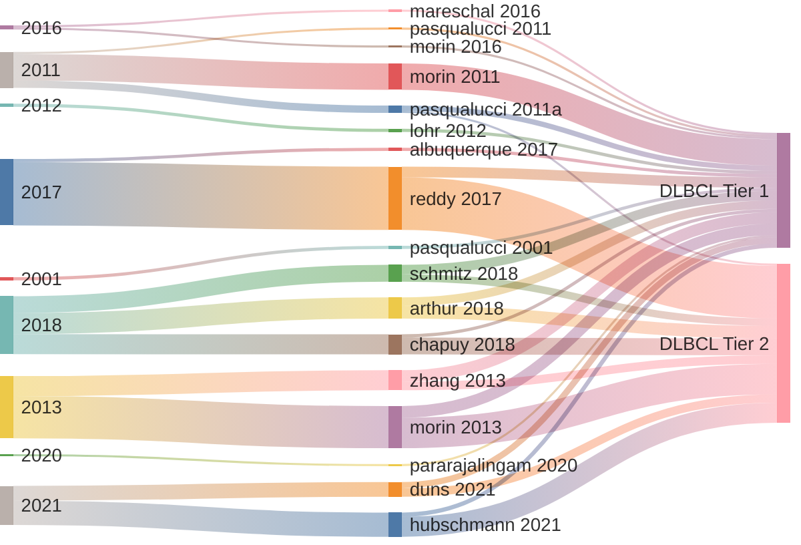

```mermaid
---
config:
  sankey:
    showValues: false
---
sankey-beta
2017, reddy 2017, 60
2017, albuquerque 2017, 3
2018, schmitz 2018, 16
2018, arthur 2018, 20
2016, mareschal 2016, 2
2016, morin 2016, 2
2011, pasqualucci 2011a,7
2011, pasqualucci 2011,2 
2011, morin 2011, 25
2012, lohr 2012, 3
2013, morin 2013, 40
2013, zhang 2013, 19
2018, chapuy 2018, 19
2021, hubschmann 2021, 23
2021, duns 2021, 14
2001, pasqualucci 2001, 3
2020, pararajalingam 2020, 2
pasqualucci 2001,DLBCL Tier 1, 3
pararajalingam 2020,DLBCL Tier 1, 2
morin 2011,DLBCL Tier 1, 25
lohr 2012,DLBCL Tier 1, 3
duns 2021,DLBCL Tier 2, 8
duns 2021,DLBCL Tier 1, 6
pasqualucci 2011a,DLBCL Tier 1, 5
pasqualucci 2011a,DLBCL Tier 2, 2
pasqualucci 2011,DLBCL Tier 1, 2
hubschmann 2021,DLBCL Tier 1, 4
hubschmann 2021,DLBCL Tier 2, 19
reddy 2017,DLBCL Tier 1, 10
reddy 2017,DLBCL Tier 2, 50
chapuy 2018,DLBCL Tier 2, 16
chapuy 2018,DLBCL Tier 1, 3
morin 2016,DLBCL Tier 1, 2
morin 2013,DLBCL Tier 2, 29
morin 2013,DLBCL Tier 1, 11
zhang 2013,DLBCL Tier 1, 11
zhang 2013,DLBCL Tier 2, 8
mareschal 2016,DLBCL Tier 1, 2
albuquerque 2017,DLBCL Tier 1, 3
arthur 2018,DLBCL Tier 2, 12
arthur 2018,DLBCL Tier 1, 8
schmitz 2018,DLBCL Tier 2, 7
schmitz 2018,DLBCL Tier 1, 9


```