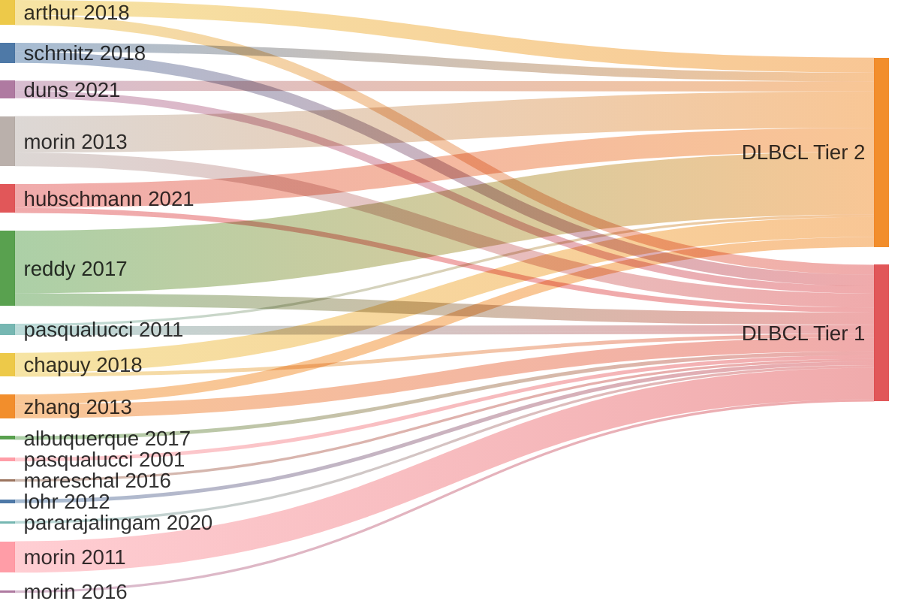

```mermaid
---
config:
  sankey:
    showValues: false
---
sankey-beta
schmitz 2018,DLBCL Tier 2, 7
schmitz 2018,DLBCL Tier 1, 9
pasqualucci 2011,DLBCL Tier 1, 5
pasqualucci 2011,DLBCL Tier 2, 2
pasqualucci 2011,DLBCL Tier 1, 2
albuquerque 2017,DLBCL Tier 1, 3
arthur 2018,DLBCL Tier 2, 12
arthur 2018,DLBCL Tier 1, 8
duns 2021,DLBCL Tier 2, 8
duns 2021,DLBCL Tier 1, 6
pasqualucci 2001,DLBCL Tier 1, 3
mareschal 2016,DLBCL Tier 1, 2
morin 2013,DLBCL Tier 2, 29
morin 2013,DLBCL Tier 1, 11
lohr 2012,DLBCL Tier 1, 3
zhang 2013,DLBCL Tier 1, 11
zhang 2013,DLBCL Tier 2, 8
hubschmann 2021,DLBCL Tier 1, 4
hubschmann 2021,DLBCL Tier 2, 19
pararajalingam 2020,DLBCL Tier 1, 2
reddy 2017,DLBCL Tier 2, 50
reddy 2017,DLBCL Tier 1, 10
chapuy 2018,DLBCL Tier 2, 16
chapuy 2018,DLBCL Tier 1, 3
morin 2016,DLBCL Tier 1, 2
morin 2011,DLBCL Tier 1, 25
```