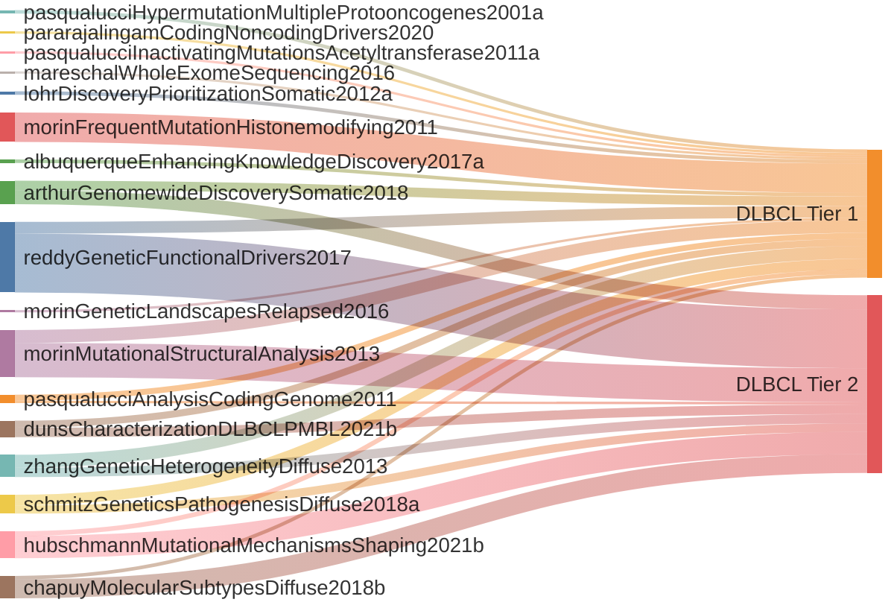

```mermaid
---
config:
  sankey:
    showValues: false
---
sankey-beta

reddyGeneticFunctionalDrivers2017,DLBCL Tier 1, 10
reddyGeneticFunctionalDrivers2017,DLBCL Tier 2, 50
pasqualucciHypermutationMultipleProtooncogenes2001a,DLBCL Tier 1, 3
arthurGenomewideDiscoverySomatic2018,DLBCL Tier 2, 12
arthurGenomewideDiscoverySomatic2018,DLBCL Tier 1, 8
pararajalingamCodingNoncodingDrivers2020,DLBCL Tier 1, 2
morinMutationalStructuralAnalysis2013,DLBCL Tier 1, 11
morinMutationalStructuralAnalysis2013,DLBCL Tier 2, 29
pasqualucciInactivatingMutationsAcetyltransferase2011a,DLBCL Tier 1, 2
dunsCharacterizationDLBCLPMBL2021b,DLBCL Tier 2, 8
dunsCharacterizationDLBCLPMBL2021b,DLBCL Tier 1, 6
mareschalWholeExomeSequencing2016,DLBCL Tier 1, 2
lohrDiscoveryPrioritizationSomatic2012a,DLBCL Tier 1, 3
pasqualucciAnalysisCodingGenome2011,DLBCL Tier 1, 5
pasqualucciAnalysisCodingGenome2011,DLBCL Tier 2, 2
morinFrequentMutationHistonemodifying2011,DLBCL Tier 1, 25
zhangGeneticHeterogeneityDiffuse2013,DLBCL Tier 1, 11
zhangGeneticHeterogeneityDiffuse2013,DLBCL Tier 2, 8
albuquerqueEnhancingKnowledgeDiscovery2017a,DLBCL Tier 1, 3
schmitzGeneticsPathogenesisDiffuse2018a,DLBCL Tier 2, 7
schmitzGeneticsPathogenesisDiffuse2018a,DLBCL Tier 1, 9
morinGeneticLandscapesRelapsed2016,DLBCL Tier 1, 2
hubschmannMutationalMechanismsShaping2021b,DLBCL Tier 1, 4
hubschmannMutationalMechanismsShaping2021b,DLBCL Tier 2, 19
chapuyMolecularSubtypesDiffuse2018b,DLBCL Tier 1, 3
chapuyMolecularSubtypesDiffuse2018b,DLBCL Tier 2, 16
```