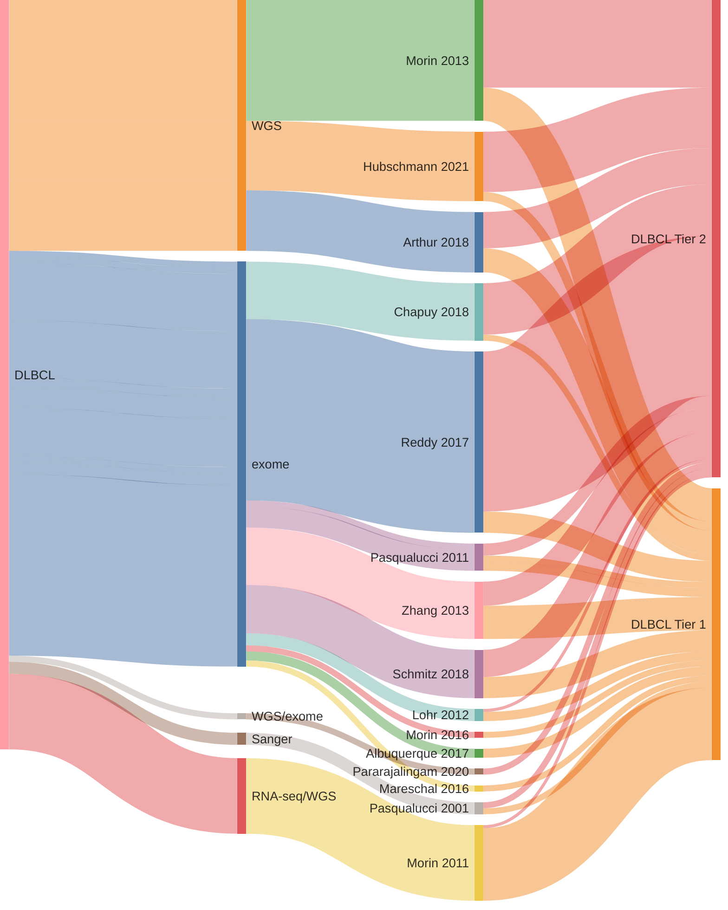

```mermaid
---
config:
  sankey:
    showValues: false
    linkColor: target
    width: 800
    height: 1000
    nodeAlignment: right
---
sankey-beta
Arthur 2018, DLBCL Tier 1, 8
Arthur 2018, DLBCL Tier 2, 12
Chapuy 2018, DLBCL Tier 1, 2
Chapuy 2018, DLBCL Tier 2, 17
Morin 2013, DLBCL Tier 1, 11
Morin 2013, DLBCL Tier 2, 29
Mareschal 2016, DLBCL Tier 1, 2
Pasqualucci 2011, DLBCL Tier 1, 2
Zhang 2013, DLBCL Tier 1, 11
Zhang 2013, DLBCL Tier 2, 8
Pararajalingam 2020, DLBCL Tier 2, 2
Pasqualucci 2001, DLBCL Tier 1, 2
Pasqualucci 2001, DLBCL Tier 2, 2
Reddy 2017, DLBCL Tier 1, 7
Reddy 2017, DLBCL Tier 2, 53
Hubschmann 2021, DLBCL Tier 1, 3
Hubschmann 2021, DLBCL Tier 2, 20
Morin 2016, DLBCL Tier 1, 2
Lohr 2012, DLBCL Tier 1, 3
Lohr 2012, DLBCL Tier 2, 1
Albuquerque 2017, DLBCL Tier 1, 3
Morin 2011, DLBCL Tier 1, 24
Morin 2011, DLBCL Tier 2, 1
Schmitz 2018, DLBCL Tier 1, 7
Schmitz 2018, DLBCL Tier 2, 9
Pasqualucci 2011, DLBCL Tier 1, 3
Pasqualucci 2011, DLBCL Tier 2, 4
DLBCL, Sanger, 4
Sanger, Pasqualucci 2001, 4
DLBCL, WGS/exome, 2
WGS/exome, Pararajalingam 2020, 2
DLBCL, exome, 2
exome, Mareschal 2016, 2
DLBCL, exome, 2
exome, Pasqualucci 2011, 2
DLBCL, WGS, 40
WGS, Morin 2013, 40
DLBCL, exome, 19
exome, Chapuy 2018, 19
DLBCL, exome, 19
exome, Zhang 2013, 19
DLBCL, WGS, 20
WGS, Arthur 2018, 20
DLBCL, RNA-seq/WGS, 25
RNA-seq/WGS, Morin 2011, 25
DLBCL, exome, 3
exome, Albuquerque 2017, 3
DLBCL, exome, 7
exome, Pasqualucci 2011, 7
DLBCL, exome, 16
exome, Schmitz 2018, 16
DLBCL, exome, 2
exome, Morin 2016, 2
DLBCL, exome, 4
exome, Lohr 2012, 4
DLBCL, WGS, 23
WGS, Hubschmann 2021, 23
DLBCL, exome, 60
exome, Reddy 2017, 60
```
