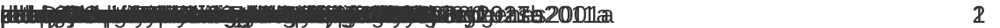

```mermaid
---
config:
  sankey:
    showValues: false
---
sankey-beta

morinMutationalStructuralAnalysis2013,2,DLBCL Tier 29
morinMutationalStructuralAnalysis2013,1,DLBCL Tier 11
reddyGeneticFunctionalDrivers2017,1,DLBCL Tier 10
reddyGeneticFunctionalDrivers2017,2,DLBCL Tier 50
lohrDiscoveryPrioritizationSomatic2012a,1,DLBCL Tier 3
albuquerqueEnhancingKnowledgeDiscovery2017a,1,DLBCL Tier 3
dunsCharacterizationDLBCLPMBL2021b,2,DLBCL Tier 8
dunsCharacterizationDLBCLPMBL2021b,1,DLBCL Tier 6
morinFrequentMutationHistonemodifying2011,1,DLBCL Tier 25
pararajalingamCodingNoncodingDrivers2020,1,DLBCL Tier 2
hubschmannMutationalMechanismsShaping2021b,2,DLBCL Tier 19
hubschmannMutationalMechanismsShaping2021b,1,DLBCL Tier 4
pasqualucciAnalysisCodingGenome2011,2,DLBCL Tier 2
pasqualucciAnalysisCodingGenome2011,1,DLBCL Tier 5
mareschalWholeExomeSequencing2016,1,DLBCL Tier 2
pasqualucciHypermutationMultipleProtooncogenes2001a,1,DLBCL Tier 3
arthurGenomewideDiscoverySomatic2018,2,DLBCL Tier 12
arthurGenomewideDiscoverySomatic2018,1,DLBCL Tier 8
morinGeneticLandscapesRelapsed2016,1,DLBCL Tier 2
pasqualucciInactivatingMutationsAcetyltransferase2011a,1,DLBCL Tier 2
chapuyMolecularSubtypesDiffuse2018b,2,DLBCL Tier 16
chapuyMolecularSubtypesDiffuse2018b,1,DLBCL Tier 3
schmitzGeneticsPathogenesisDiffuse2018a,2,DLBCL Tier 7
schmitzGeneticsPathogenesisDiffuse2018a,1,DLBCL Tier 9
zhangGeneticHeterogeneityDiffuse2013,1,DLBCL Tier 11
zhangGeneticHeterogeneityDiffuse2013,2,DLBCL Tier 8

```