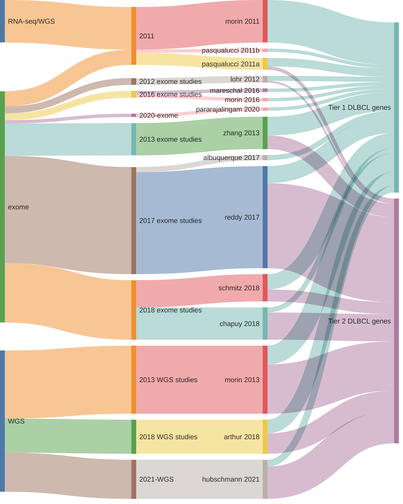

```mermaid


---
config:
  sankey:
    showValues: false
    linkColor: target
    width: 800
    height: 1000
    nodeAlignment: right
---
sankey-beta

RNA-seq/WGS, 2011, 25
2011, morin 2011, 25
morin 2011, Tier 1 DLBCL genes, 25

exome, 2011, 9
2011, pasqualucci 2011a, 7
pasqualucci 2011a, Tier 1 DLBCL genes, 5
pasqualucci 2011a, Tier 2 DLBCL genes, 2
2011, pasqualucci 2011b, 2
pasqualucci 2011b, Tier 1 DLBCL genes, 2

exome, 2012 exome studies, 4
2012 exome studies, lohr 2012, 4
lohr 2012, Tier 2 DLBCL genes, 1
lohr 2012, Tier 1 DLBCL genes, 3


WGS, 2013 WGS studies, 40
2013 WGS studies, morin 2013, 40
morin 2013, Tier 2 DLBCL genes, 29
morin 2013, Tier 1 DLBCL genes, 11

exome, 2013 exome studies, 19
2013 exome studies, zhang 2013, 19
zhang 2013,  Tier 1 DLBCL genes, 11
zhang 2013,  Tier 2 DLBCL genes, 8


exome, 2016 exome studies, 2
2016 exome studies, mareschal 2016, 2
mareschal 2016, Tier 1 DLBCL genes, 2

exome, 2016 exome studies, 2
2016 exome studies, morin 2016, 2
morin 2016, Tier 1 DLBCL genes, 2

2017 exome studies, albuquerque 2017, 3
albuquerque 2017, Tier 1 DLBCL genes, 3

exome, 2017 exome studies, 63
2017 exome studies, reddy 2017, 60
reddy 2017, Tier 2 DLBCL genes, 50
reddy 2017, Tier 1 DLBCL genes, 10

exome, 2018 exome studies, 35
2018 exome studies, schmitz 2018, 16
schmitz 2018, Tier 2 DLBCL genes, 7
schmitz 2018, Tier 1 DLBCL genes, 9

2018 exome studies, chapuy 2018, 19
chapuy 2018, Tier 2 DLBCL genes, 16
chapuy 2018, Tier 1 DLBCL genes, 3

WGS, 2018 WGS studies, 20
2018 WGS studies, arthur 2018, 20
arthur 2018, Tier 2 DLBCL genes, 12
arthur 2018, Tier 1 DLBCL genes, 8

exome, 2020-exome, 2
2020-exome, pararajalingam 2020, 2
pararajalingam 2020, Tier 1 DLBCL genes, 2

WGS, 2021-WGS, 23
2021-WGS, hubschmann 2021, 23
hubschmann 2021, Tier 1 DLBCL genes, 4
hubschmann 2021, Tier 2 DLBCL genes, 19


```
