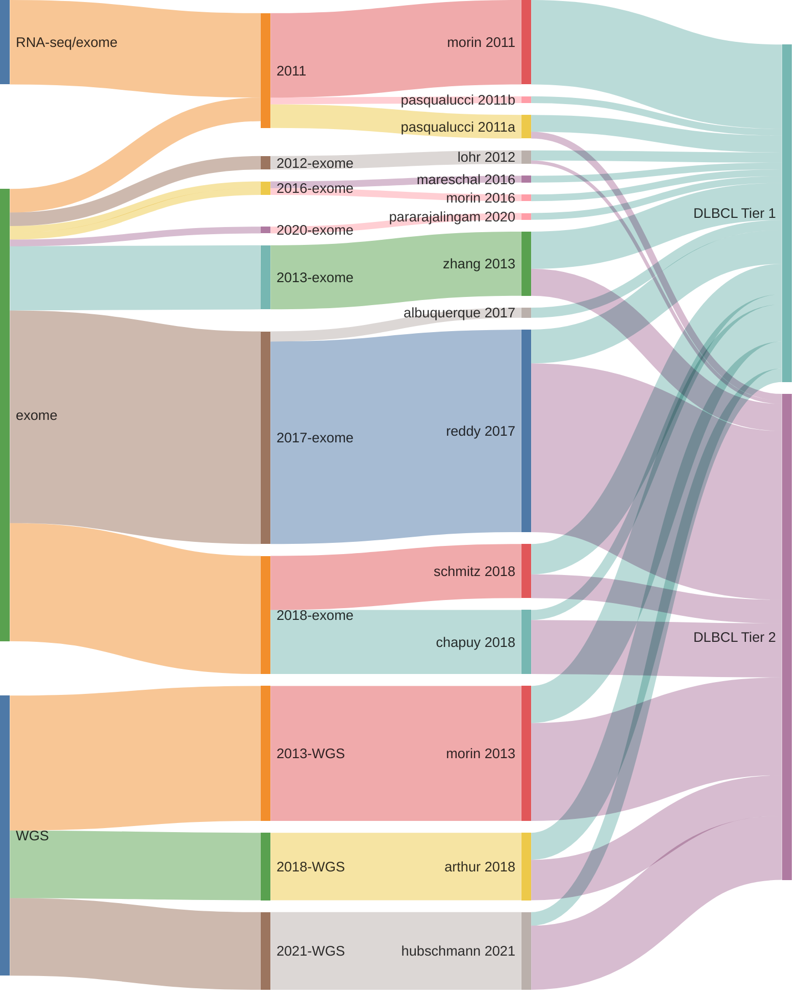

```mermaid


---
config:
  sankey:
    showValues: false
    linkColor: target
    width: 800
    height: 1000
    nodeAlignment: right
---
sankey-beta

RNA-seq/exome, 2011, 25
2011, morin 2011, 25
morin 2011,DLBCL Tier 1, 25

exome, 2011, 7
2011, pasqualucci 2011a, 7
pasqualucci 2011a, DLBCL Tier 1, 5
pasqualucci 2011a, DLBCL Tier 2, 2
2011, pasqualucci 2011b, 2
pasqualucci 2011b, DLBCL Tier 1, 2

exome, 2012-exome, 4
2012-exome, lohr 2012, 4


lohr 2012, DLBCL Tier 2, 1
lohr 2012, DLBCL Tier 1, 3


WGS, 2013-WGS, 40
2013-WGS, morin 2013, 40
morin 2013, DLBCL Tier 2, 29
morin 2013, DLBCL Tier 1, 11

exome, 2013-exome, 19
2013-exome, zhang 2013, 19
zhang 2013, DLBCL Tier 1, 11
zhang 2013, DLBCL Tier 2, 8


exome, 2016-exome, 2
2016-exome, mareschal 2016, 2
mareschal 2016, DLBCL Tier 1, 2

exome, 2016-exome, 2
2016-exome, morin 2016, 2
morin 2016, DLBCL Tier 1, 2

2017-exome, albuquerque 2017, 3
albuquerque 2017, DLBCL Tier 1, 3

exome, 2017-exome, 63
2017-exome, reddy 2017, 60
reddy 2017, DLBCL Tier 2, 50
reddy 2017, DLBCL Tier 1, 10

exome, 2018-exome, 35
2018-exome, schmitz 2018, 16
schmitz 2018, DLBCL Tier 2, 7
schmitz 2018, DLBCL Tier 1, 9

2018-exome, chapuy 2018, 19
chapuy 2018, DLBCL Tier 2, 16
chapuy 2018, DLBCL Tier 1, 3

WGS, 2018-WGS, 20
2018-WGS, arthur 2018, 20
arthur 2018, DLBCL Tier 2, 12
arthur 2018, DLBCL Tier 1, 8

exome, 2020-exome, 2
2020-exome, pararajalingam 2020, 2
pararajalingam 2020, DLBCL Tier 1, 2

WGS, 2021-WGS, 23
2021-WGS, hubschmann 2021, 23
hubschmann 2021, DLBCL Tier 1, 4
hubschmann 2021, DLBCL Tier 2, 19


```