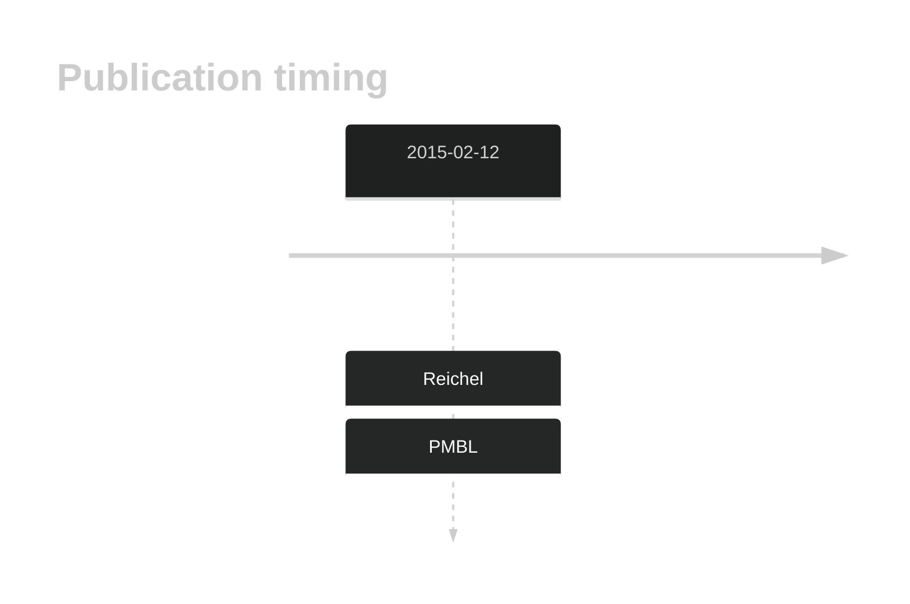

# DMD

## History

## Relevance tier by entity

|Entity|Tier|Description|
|:------:|:----:|--------------------------------------|
||2|relevance in PMBL/cHL/GZL not firmly established[@reichelFlowSortingExome2015a]|

## Mutation incidence in large patient cohorts (GAMBL reanalysis)

|Entity|source |frequency (%)|
|:------:|:----:|:----:|
|BL|GAMBL Exome |7.471 |
|BL|GAMBL Genome |5.405 |
|DLBCL|GAMBL Exome |7.332 |
|DLBCL|GAMBL Genome |6.015 |
|FL|GAMBL Exome |4.298 |
|MCL|GAMBL Genome |1.754 |

## References

