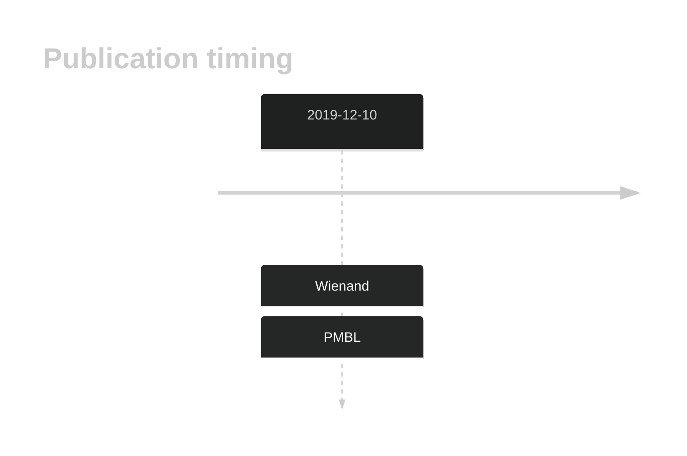

# DNAH12

## History

## Relevance tier by entity

|Entity|Tier|Description|
|:------:|:----:|--------------------------------------|
||2|relevance in PMBL/cHL/GZL not firmly established[@wienandGenomicAnalysesFlowsorted2019b]|

## Mutation incidence in large patient cohorts (GAMBL reanalysis)

|Entity|source |frequency (%)|
|:------:|:----:|:----:|
|BL|GAMBL Exome |6.897 |
|BL|GAMBL Genome |4.247 |
|DLBCL|GAMBL Exome |3.881 |
|DLBCL|GAMBL Genome |2.82 |
|MCL|GAMBL Genome |1.17 |

## References

