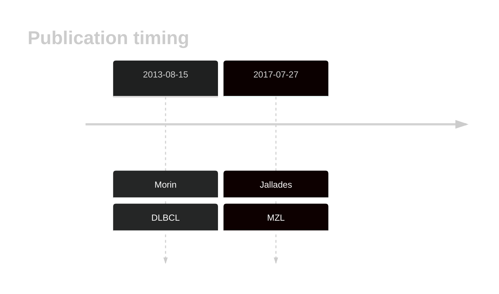
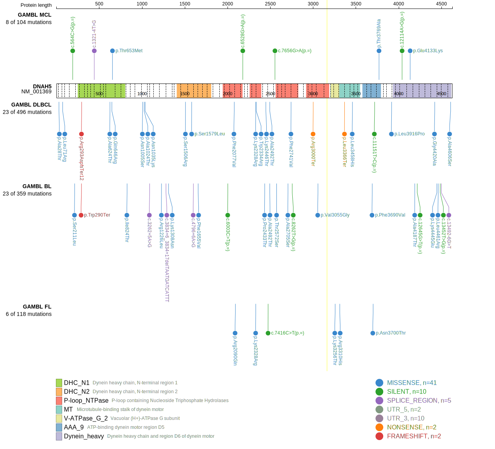

# DNAH5

## History

## Relevance tier by entity

|Entity|Tier|Description                              |
|:------:|:----:|-----------------------------------------|
||2|relevance in MZL not firmly established[@jalladesExomeSequencingIdentifies2017]|
| |2   |relevance in DLBCL not firmly established[@morinMutationalStructuralAnalysis2013]|

## Mutation incidence in large patient cohorts (GAMBL reanalysis)

|Entity|source        |frequency (%)|
|:------:|:--------------:|:-------------:|
|DLBCL |GAMBL genomes | 9.18        |
|DLBCL |Schmitz cohort|14.04        |
|DLBCL |Reddy cohort  | 6.91        |
|DLBCL |Chapuy cohort |11.54        |

## Mutation pattern and selective pressure estimates

|Entity|aSHM|Significant selection|dN/dS (missense)|dN/dS (nonsense)|
|:------:|:----:|:---------------------:|:----------------:|:----------------:|
|BL    |No  |No                   |1.484           |1.096           |
|DLBCL |No  |No                   |1.720           |0.000           |
|FL    |No  |No                   |1.327           |0.000           |

View coding variants in ProteinPaint [hg19](https://morinlab.github.io/LLMPP/GAMBL/DNAH5_protein.html)  or [hg38](https://morinlab.github.io/LLMPP/GAMBL/DNAH5_protein_hg38.html)

View all variants in GenomePaint [hg19](https://morinlab.github.io/LLMPP/GAMBL/DNAH5.html)  or [hg38](https://morinlab.github.io/LLMPP/GAMBL/DNAH5_hg38.html)

## DNAH5 Expression

<!-- ORIGIN: morinMutationalStructuralAnalysis2013 -->
<!-- DLBCL: morinMutationalStructuralAnalysis2013 -->
<!-- MZL: jalladesExomeSequencingIdentifies2017 -->

## References
