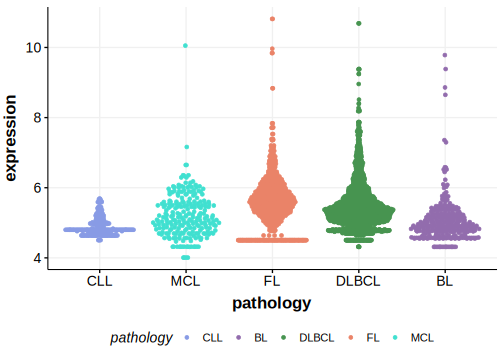

[[_TOC_]]

## Relevance tier by entity

[[include:table1_DNAH5.md]]

## Mutation incidence in large patient cohorts (GAMBL reanalysis)

|Entity|source        |frequency (%)|
|:------:|:--------------:|:-------------:|
|DLBCL |GAMBL genomes | 9.18        |
|DLBCL |Schmitz cohort|14.04        |
|DLBCL |Reddy cohort  | 6.91        |
|DLBCL |Chapuy cohort |11.54        |

## Mutation pattern and selective pressure estimates

[[include:tables/dnds_DNAH5.md]]

[[include:browser_DNAH5.md]]

## Expression

<!-- ORIGIN: morinMutationalStructuralAnalysis2013 -->
<!-- DLBCL: morinMutationalStructuralAnalysis2013 -->
<!-- MZL: jalladesExomeSequencingIdentifies2017 -->

## All Mutations

### DLBCL[@morinMutationalStructuralAnalysis2013]

[RG026](https://www.bcgsc.ca/downloads/morinlab/GAMBL/Morin_2013/RG026.html)
[RG027](https://www.bcgsc.ca/downloads/morinlab/GAMBL/Morin_2013/RG027.html)
[RG036](https://www.bcgsc.ca/downloads/morinlab/GAMBL/Morin_2013/RG036.html)
[RG130](https://www.bcgsc.ca/downloads/morinlab/GAMBL/Morin_2013/RG130.html)

[[include:mermaid_DNAH5.md]]

## References
