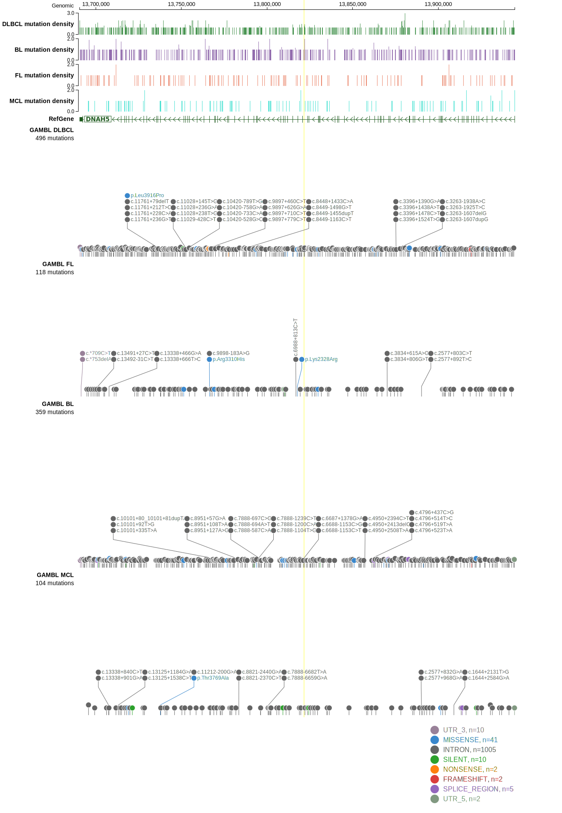

# DNAH5

## History

## Relevance tier by entity

|Entity|Tier|Description                              |
|:------:|:----:|-----------------------------------------|
||2|relevance in MZL not firmly established|
| |2   |relevance in DLBCL not firmly established|

## Mutation incidence in large patient cohorts (GAMBL reanalysis)

|Entity|source        |frequency (%)|
|:------:|:--------------:|:-------------:|
|DLBCL |GAMBL genomes | 9.18        |
|DLBCL |Schmitz cohort|14.04        |
|DLBCL |Reddy cohort  | 6.91        |
|DLBCL |Chapuy cohort |11.54        |

## Mutation pattern and selective pressure estimates

|Entity|aSHM|Significant selection|dN/dS (missense)|dN/dS (nonsense)|
|:------:|:----:|:---------------------:|:----------------:|:----------------:|
|BL    |No  |No                   |1.484           |1.096           |
|DLBCL |No  |No                   |1.720           |0.000           |
|FL    |No  |No                   |1.327           |0.000           |

View coding variants in ProteinPaint [hg19](https://morinlab.github.io/LLMPP/GAMBL/DNAH5_protein.html)  or [hg38](https://morinlab.github.io/LLMPP/GAMBL/DNAH5_protein_hg38.html)

View all variants in GenomePaint [hg19](https://morinlab.github.io/LLMPP/GAMBL/DNAH5.html)  or [hg38](https://morinlab.github.io/LLMPP/GAMBL/DNAH5_hg38.html)

## DNAH5 Expression

<!-- ORIGIN: morinMutationalStructuralAnalysis2013 -->
<!-- DLBCL: morinMutationalStructuralAnalysis2013 -->
<!-- MZL: jalladesExomeSequencingIdentifies2017 -->

## References
1.  Morin RD, Mungall K, Pleasance E, Mungall AJ, Goya R, Huff RD, Scott DW, Ding J, Roth A, Chiu R, Corbett RD, Chan FC, Mendez-Lago M, Trinh DL, Bolger-Munro M, Taylor G, Hadj Khodabakhshi A, Ben-Neriah S, Pon J, Meissner B, Woolcock B, Farnoud N, Rogic S, Lim EL, Johnson NA, Shah S, Jones S, Steidl C, Holt R, Birol I, Moore R, Connors JM, Gascoyne RD, Marra MA. Mutational and structural analysis of diffuse large B-cell lymphoma using whole-genome sequencing. Blood. 2013 Aug 15;122(7):1256–1265. PMCID: PMC3744992
2.  Jallades L, Baseggio L, Sujobert P, Huet S, Chabane K, Callet-Bauchu E, Verney A, Hayette S, Desvignes JP, Salgado D, Levy N, Béroud C, Felman P, Berger F, Magaud JP, Genestier L, Salles G, Traverse-Glehen A. Exome sequencing identifies recurrent BCOR alterations and the absence of KLF2, TNFAIP3 and MYD88 mutations in splenic diffuse red pulp small B-cell lymphoma. Haematologica. 2017 Oct;102(10):1758–1766. PMCID: PMC5622860
