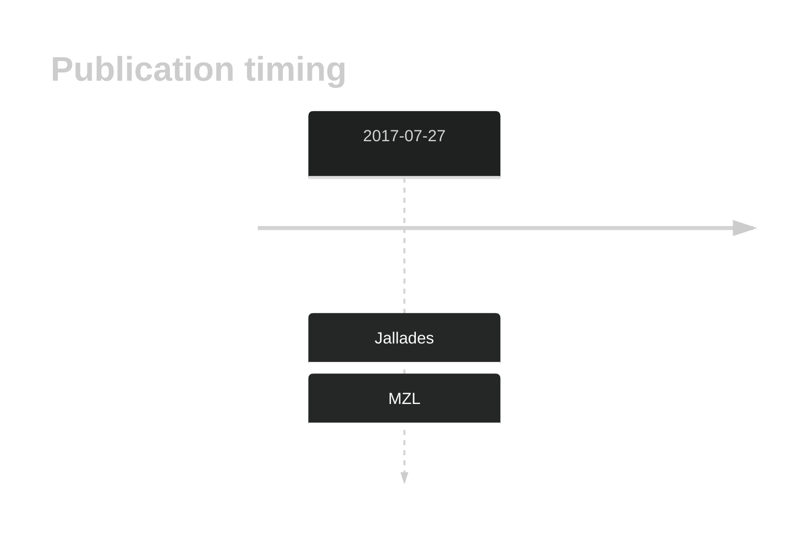

# DNAH7

## History

## Relevance tier by entity

|Entity|Tier|Description|
|:------:|:----:|--------------------------------------|
||2|relevance in MZL not firmly established[@jalladesExomeSequencingIdentifies2017]|

## Mutation incidence in large patient cohorts (GAMBL reanalysis)

|Entity|source |frequency (%)|
|:------:|:----:|:----:|
|BL|GAMBL Exome |6.897 |
|BL|GAMBL Genome |5.019 |
|DLBCL|GAMBL Exome |7.493 |
|DLBCL|GAMBL Genome |3.947 |
|FL|GAMBL Exome |3.152 |
|MCL|GAMBL Genome |0.585 |

## References

