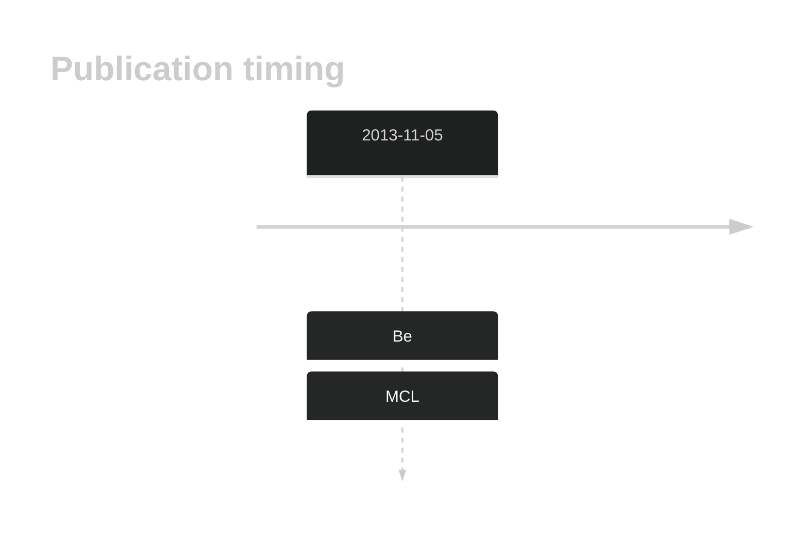

# DNAJC6

## History

## Relevance tier by entity

|Entity|Tier|Description|
|:------:|:----:|--------------------------------------|
||2|relevance in MCL not firmly established[@beaLandscapeSomaticMutations2013]|

## Mutation incidence in large patient cohorts (GAMBL reanalysis)

|Entity|source |frequency (%)|
|:------:|:----:|:----:|
|BL|GAMBL Exome |2.874 |
|BL|GAMBL Genome |0.772 |
|DLBCL|GAMBL Exome |1.509 |
|DLBCL|GAMBL Genome |0.564 |
|FL|GAMBL Exome |0.287 |

## References

