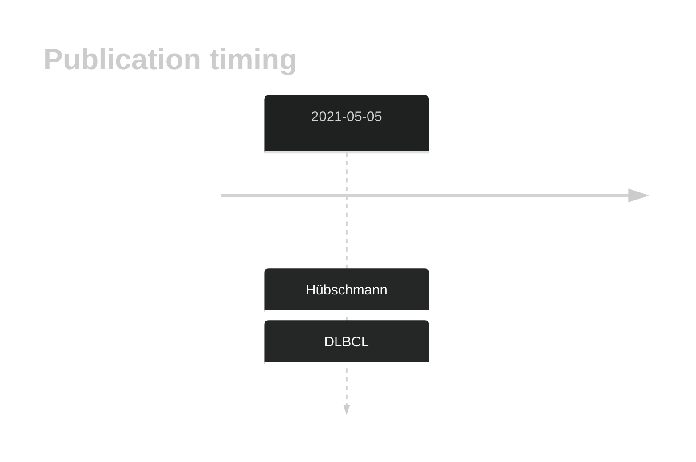
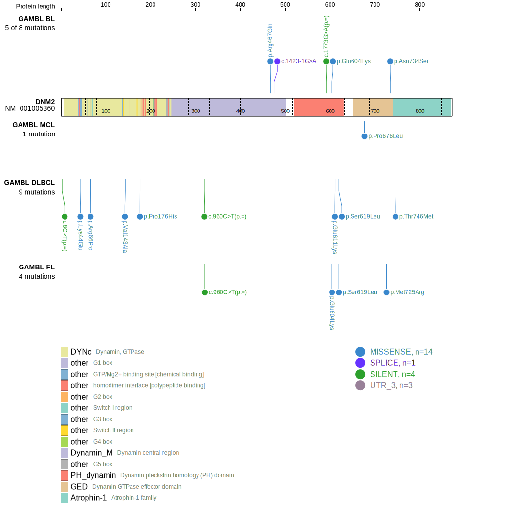
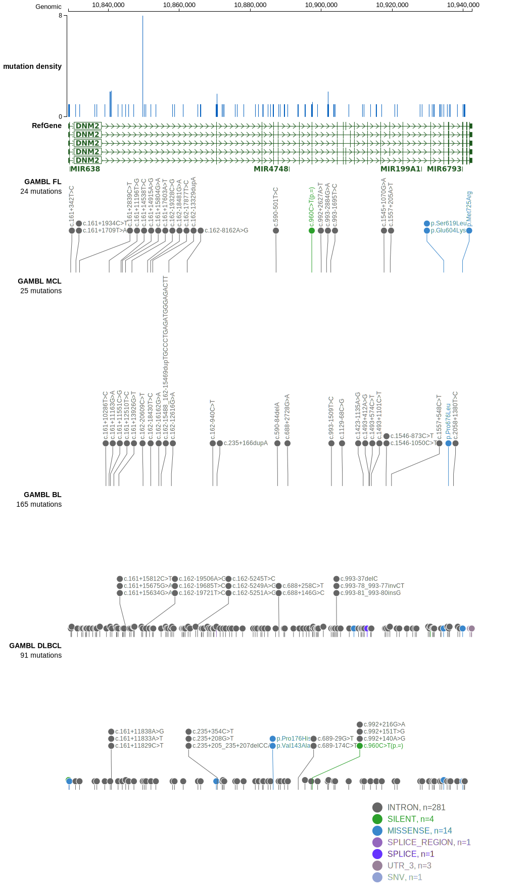

# DNM2

## History
Mutations in this gene were first described in DLBCL and FL in 2021 by Hübschmann et al.1

## Relevance tier by entity

|Entity|Tier|Description                              |
|:------:|:----:|-----------------------------------------|
| |2   |relevance in DLBCL not firmly established[@hubschmannMutationalMechanismsShaping2021b]|

## Mutation incidence in large patient cohorts (GAMBL reanalysis)

|Entity|source        |frequency (%)|
|:------:|:--------------:|:-------------:|
|DLBCL |GAMBL genomes |2.29         |
|DLBCL |Schmitz cohort|1.70         |
|DLBCL |Reddy cohort  |1.80         |
|DLBCL |Chapuy cohort |1.28         |

## Mutation pattern and selective pressure estimates

|Entity|aSHM|Significant selection|dN/dS (missense)|dN/dS (nonsense)|
|:------:|:----:|:---------------------:|:----------------:|:----------------:|
|BL    |No  |No                   | 1.878          |7.821           |
|DLBCL |No  |No                   | 4.605          |0.000           |
|FL    |No  |No                   |10.522          |0.000           |

## DNM2 Hotspots

| Chromosome |Coordinate (hg19) | ref>alt | HGVSp | 
 | :---:| :---: | :--: | :---: |
| chr19 | 10934492 | G>A | E604K |

View coding variants in ProteinPaint [hg19](https://morinlab.github.io/LLMPP/GAMBL/DNM2_protein.html)  or [hg38](https://morinlab.github.io/LLMPP/GAMBL/DNM2_protein_hg38.html)

View all variants in GenomePaint [hg19](https://morinlab.github.io/LLMPP/GAMBL/DNM2.html)  or [hg38](https://morinlab.github.io/LLMPP/GAMBL/DNM2_hg38.html)

## DNM2 Expression

## All Mutations

[SP124975](https://www.bcgsc.ca/downloads/morinlab/GAMBL/MALY/SP124975.html)
[SP116624](https://www.bcgsc.ca/downloads/morinlab/GAMBL/MALY/SP116624.html)
[SP59412](https://www.bcgsc.ca/downloads/morinlab/GAMBL/MALY/SP59412.html)
[SP124969](https://www.bcgsc.ca/downloads/morinlab/GAMBL/MALY/SP124969.html)
[SP116649](https://www.bcgsc.ca/downloads/morinlab/GAMBL/MALY/SP116649.html)
[SP124975](https://www.bcgsc.ca/downloads/morinlab/GAMBL/MALY/SP124975.html)
[SP193130](https://www.bcgsc.ca/downloads/morinlab/GAMBL/MALY/SP193130.html)

## References

<!-- ORIGIN: hubschmannMutationalMechanismsShaping2021b -->
<!-- DLBCL: hubschmannMutationalMechanismsShaping2021b -->
