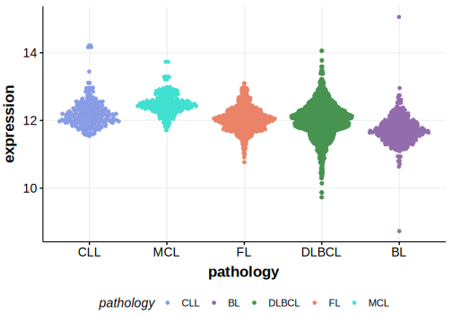

[[_TOC_]]

## Overview

Mutations in this gene were first described in DLBCL and FL in 2021 by Hübschmann et al.[@hubschmannMutationalMechanismsShaping2021]

## Relevance tier by entity

[[include:table1_DNM2.md]]

## Mutation incidence in large patient cohorts (GAMBL reanalysis)

|Entity|source        |frequency (%)|
|:------:|:--------------:|:-------------:|
|DLBCL |GAMBL genomes |2.29         |
|DLBCL |Schmitz cohort|1.70         |
|DLBCL |Reddy cohort  |1.80         |
|DLBCL |Chapuy cohort |1.28         |

## Mutation pattern and selective pressure estimates

[[include:tables/dnds_DNM2.md]]

## DNM2 Hotspots

| Chromosome |Coordinate (hg19) | ref>alt | HGVSp | 
 | :---:| :---: | :--: | :---: |
| chr19 | 10934492 | G>A | E604K |

[[include:browser_DNM2.md]]

## Expression

## All Mutations

[SP124975](https://www.bcgsc.ca/downloads/morinlab/GAMBL/MALY/SP124975.html)
[SP116624](https://www.bcgsc.ca/downloads/morinlab/GAMBL/MALY/SP116624.html)
[SP59412](https://www.bcgsc.ca/downloads/morinlab/GAMBL/MALY/SP59412.html)
[SP124969](https://www.bcgsc.ca/downloads/morinlab/GAMBL/MALY/SP124969.html)
[SP116649](https://www.bcgsc.ca/downloads/morinlab/GAMBL/MALY/SP116649.html)
[SP124975](https://www.bcgsc.ca/downloads/morinlab/GAMBL/MALY/SP124975.html)
[SP193130](https://www.bcgsc.ca/downloads/morinlab/GAMBL/MALY/SP193130.html)

[[include:tables/mermaid_DNM2.md]]

## References

<!-- ORIGIN: hubschmannMutationalMechanismsShaping2021b -->
<!-- DLBCL: hubschmannMutationalMechanismsShaping2021b -->
