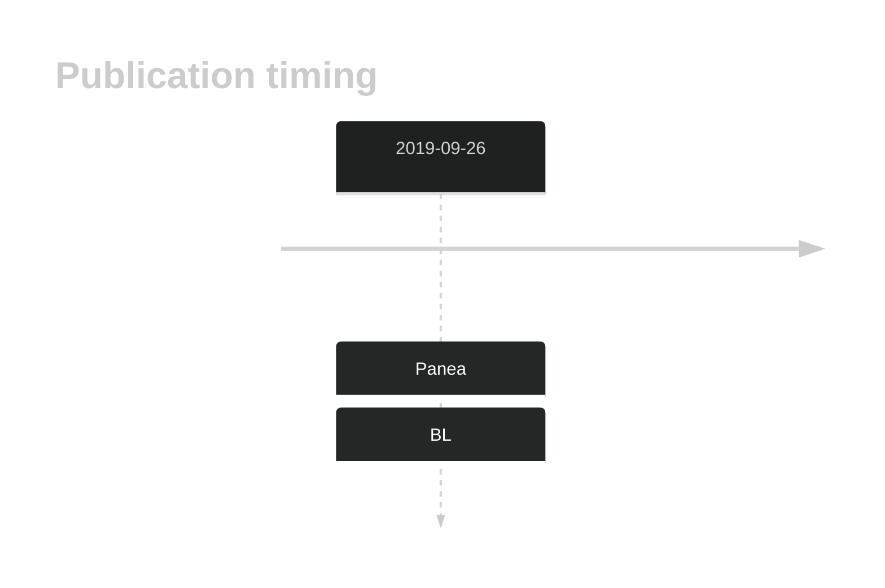

# DNMT1

## History

## Relevance tier by entity

|Entity|Tier|Description                           |
|:------:|:----:|--------------------------------------|
|    |2   |relevance in BL not firmly established|

## Mutation incidence in large patient cohorts (GAMBL reanalysis)

|Entity|source               |frequency (%)|
|:------:|:---------------------:|:-------------:|
|BL    |GAMBL genomes+capture|2.08         |
|BL    |Thomas cohort        |1.70         |
|BL    |Panea cohort         |5.00         |

## Mutation pattern and selective pressure estimates

|Entity|aSHM|Significant selection|dN/dS (missense)|dN/dS (nonsense)|
|:------:|:----:|:---------------------:|:----------------:|:----------------:|
|BL    |No  |No                   |0.947           |0.000           |
|DLBCL |No  |No                   |0.000           |6.494           |
|FL    |No  |No                   |2.053           |0.000           |

View coding variants in ProteinPaint [hg19](https://morinlab.github.io/LLMPP/GAMBL/DNMT1_protein.html)  or [hg38](https://morinlab.github.io/LLMPP/GAMBL/DNMT1_protein_hg38.html)

View all variants in GenomePaint [hg19](https://morinlab.github.io/LLMPP/GAMBL/DNMT1.html)  or [hg38](https://morinlab.github.io/LLMPP/GAMBL/DNMT1_hg38.html)

## DNMT1 Expression

## Representative Mutations

**Rating**
&starf; &star; &star; &star; &star;

**Rating**
&starf; &star; &star; &star; &star;

## References

1.  *Panea R, Love C, Shingleton JR, Reddy A, Bailey J, Moormann A, Otieno J, Ong’echa J, Oduor C, Schroêder K, Masalu N, Chao N, Agajanian M, Major M, Fedoriw Y, Richards K, Rymkiewicz G, Miles R, Alobeid B, Bhagat G, Flowers C, Ondrejka S, Hsi E, Choi W, Au-Yeung R, Hartmann W, Lenz G, Meyerson H, Lin YY, Zhuang Y, Luftig M, Waldrop A, Dave T, Thakkar D, Sahay H, Li G, Palus B, Seshadri V, Kim S, Gascoyne R, Levy S, Mukhopadhyay M, Dunson D, Dave S. The whole genome landscape of Burkitt lymphoma subtypes. Blood. 2019; *

<!-- ORIGIN: paneaWholeGenomeLandscape2019 -->
<!-- BL: paneaWholeGenomeLandscape2019 -->
