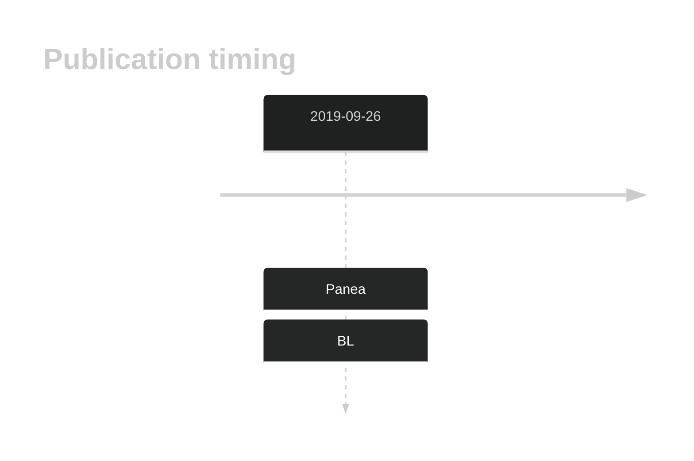

# DNMT1

<<Warn("The variants reported in this gene in BL failed QC")>>

## History

## Relevance tier by entity

|Entity|Tier|Description                           |
|:------:|:----:|--------------------------------------|
|    |3   |Retired, Failed QC[@paneaWholeGenomeLandscape2019]|

## Mutation incidence in large patient cohorts (GAMBL reanalysis)

|Entity|source               |frequency (%)|
|:------:|:---------------------:|:-------------:|
|BL    |GAMBL genomes+capture|2.08         |
|BL    |Thomas cohort        |1.70         |
|BL    |Panea cohort         |5.00         |

## Mutation pattern and selective pressure estimates

|Entity|aSHM|Significant selection|dN/dS (missense)|dN/dS (nonsense)|
|:------:|:----:|:---------------------:|:----------------:|:----------------:|
|BL    |No  |No                   |0.947           |0.000           |
|DLBCL |No  |No                   |0.000           |6.494           |
|FL    |No  |No                   |2.053           |0.000           |

View coding variants in ProteinPaint [hg19](https://morinlab.github.io/LLMPP/GAMBL/DNMT1_protein.html)  or [hg38](https://morinlab.github.io/LLMPP/GAMBL/DNMT1_protein_hg38.html)

View all variants in GenomePaint [hg19](https://morinlab.github.io/LLMPP/GAMBL/DNMT1.html)  or [hg38](https://morinlab.github.io/LLMPP/GAMBL/DNMT1_hg38.html)

## DNMT1 Expression

## Representative Mutations

**Rating**
&starf; &star; &star; &star; &star;

**Rating**
&starf; &star; &star; &star; &star;

## References

<!-- ORIGIN: paneaWholeGenomeLandscape2019 -->
<!-- BL: paneaWholeGenomeLandscape2019 -->
