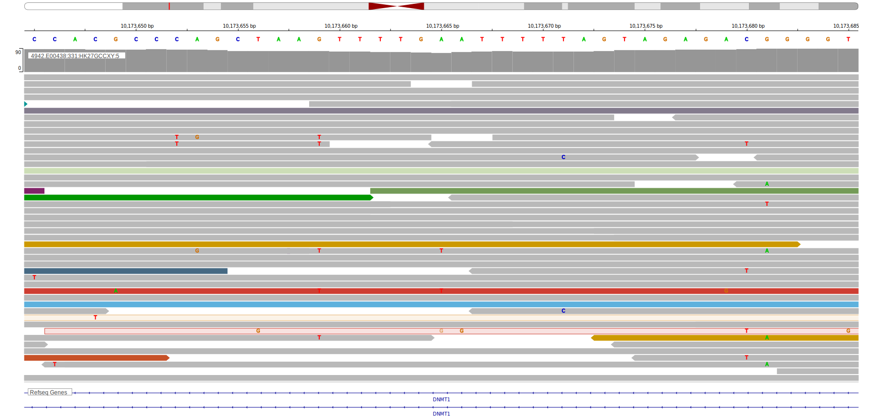

[[_TOC_]]

## Relevance tier by entity

[[include:tables/table1_DNMT1.md]]

## Warnings

<<Warn("The variants reported in this gene in BL failed QC")>>

## Mutation incidence in large patient cohorts (GAMBL reanalysis)

|Entity|source               |frequency (%)|
|:------:|:---------------------:|:-------------:|
|BL    |GAMBL genomes+capture|2.08         |
|BL    |Thomas cohort        |1.70         |
|BL    |Panea cohort         |5.00         |

## Mutation pattern and selective pressure estimates

[[include:tables/dnds_DNMT1.md]]

[[include:browser_DNMT1.md]]

## Expression

## Representative Mutations

**Rating**
&starf; &star; &star; &star; &star;

**Rating**
&starf; &star; &star; &star; &star;

[[include:tables/mermaid_DNMT1.md]]

## References

<!-- ORIGIN: paneaWholeGenomeLandscape2019 -->
<!-- BL: paneaWholeGenomeLandscape2019 -->
