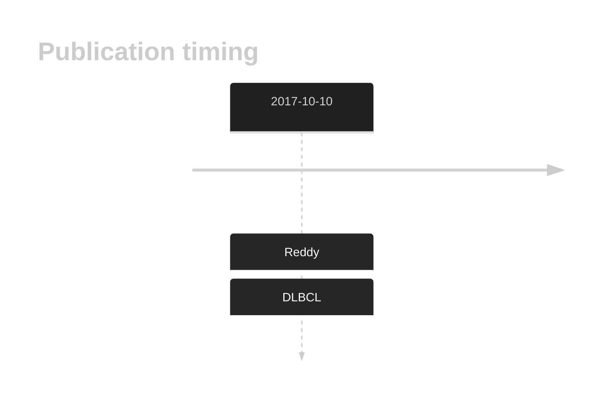
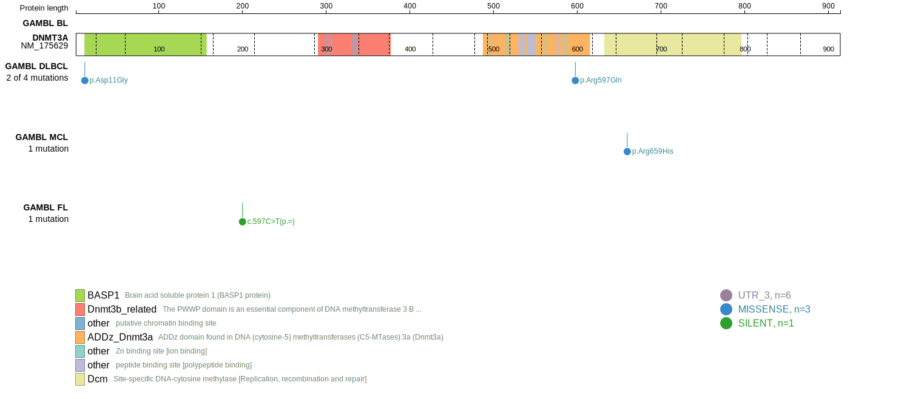
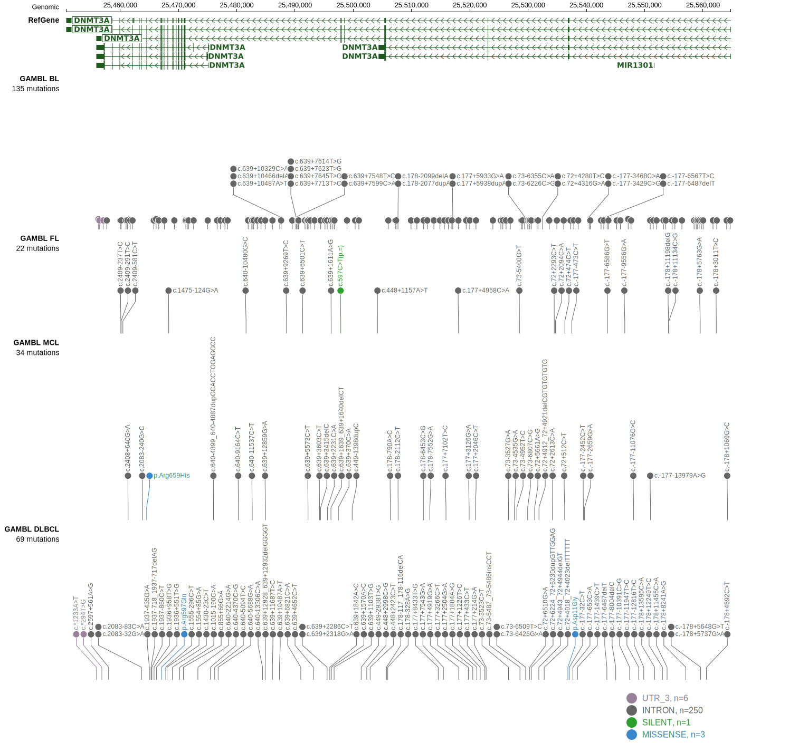

# DNMT3A

<<Warn("The variants reported in this gene in DLBCL failed QC")>>

## History

## Relevance tier by entity

|Entity|Tier|Description                              |
|:------:|:----:|-----------------------------------------|
| |3  |Retired, Failed QC[@reddyGeneticFunctionalDrivers2017]|

## Mutation incidence in large patient cohorts (GAMBL reanalysis)

|Entity|source        |frequency (%)|
|:------:|:--------------:|:-------------:|
|DLBCL |GAMBL genomes |0.76         |
|DLBCL |Schmitz cohort|2.13         |
|DLBCL |Reddy cohort  |1.40         |
|DLBCL |Chapuy cohort |1.28         |

## Mutation pattern and selective pressure estimates

|Entity|aSHM|Significant selection|dN/dS (missense)|dN/dS (nonsense)|
|:------:|:----:|:---------------------:|:----------------:|:----------------:|
|BL    |No  |No                   |0               |0               |
|DLBCL |No  |No                   |0               |0               |
|FL    |No  |No                   |0               |0               |

View coding variants in ProteinPaint [hg19](https://morinlab.github.io/LLMPP/GAMBL/DNMT3A_protein.html)  or [hg38](https://morinlab.github.io/LLMPP/GAMBL/DNMT3A_protein_hg38.html)

View all variants in GenomePaint [hg19](https://morinlab.github.io/LLMPP/GAMBL/DNMT3A.html)  or [hg38](https://morinlab.github.io/LLMPP/GAMBL/DNMT3A_hg38.html)

## DNMT3A Expression

<!-- ORIGIN: reddyGeneticFunctionalDrivers2017 -->
<!-- DLBCL: reddyGeneticFunctionalDrivers2017 -->

## References

